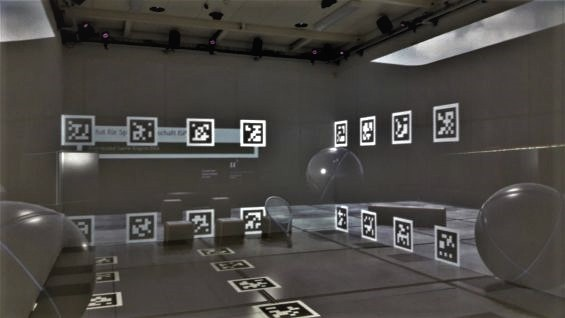

[<< Back](..)

# 5. UE4 Display Cluster in CAVE

<em>Fig. 5.1.: UE4 Display Cluster, 3D Scene in Sensorimotor Laboratory CAVE.</em>

## 5.1. Short Summary

*Distributed Real-Time Rendering in Sensorimotor Laboratory CAVE*

An Unreal Engine project based on the display cluster template "nDisplay" providing game-levels related to the Institute of Sports Science ISPW at University of Bern, more precisely for the sensorimotor lab of the institute with its five-sided CAVE. The lab integration is enabled by a newly developed messaging layer that is used to interact with an Enterprise Service Bus ESB. Custom-developed Unreal Engine plugins are used to control VR objects via the lab's experiment management system and render 360° videos and CAVE-specific 3D content. Due to the plugin-based architecture, the integration solution is modular and can also be used in other laboratories of the faculty.

* **Index Terms:** Virtual Reality, Cluster Rendering, Parallel Rendering, Real-time Rendering, CAVE, 3D, Steroscopy, 360° Video, Motion Capture, Eye Tracking, Integration

* **Technology:** Unreal Engine, UE Blueprint, UE C++-Plugin Development, UE nDisplay, Nvidia Mosaic, Nvidia Quadro with Sync, OptiTrack, PupilLabs, JSON, ZeroMQ

August 2019 - June 2021, Technology Platform for Research approved project "Distributed Game Engine DGE" at Faculty of Human Sciences on behalf of Prof. Dr. Ernst-Joachim Hossner, Institute of Sport Science ISPW, Department of Movement and Exercise Science at University of Bern

## 5.2. Insights

Documentation: **<a href="https://www.slideshare.net/secret/LJFObkfFq4WXRd" target="_blank">Report (pdf)</a>** on SlideShare

Readme:

* Unreal Engine nDisplay Project: [Sensorimotor Lab](SensorimotorLab)
* UE Blueprint Plugins:
  * [Play Area](PlayArea)
  * [Immersive Video](ImmersiveVideo)
  * [Sports Equipment](SportsEquipment)
  * [AprilTag Images](AprilTagImages)
  * [Institute of Sport Science ISPW](ISPW)
* UE C++ Code Plugins:
  * [Pupil Core](Pupil)
  * [ZeroMQ](ZeroMQ)
  * [ESB Messaging](ESBMessaging)
  * [Distributed Game Engine DGE](DGE)
* Integration Testing: [Jupyter Notebook as Messaging Endpoint](ISPW/Testing/)

## 5.3. External References

* <a href="https://www.tpf.philhum.unibe.ch/portfolio/ue4DisplayCluster" target="_blank">*UE Display Cluster in CAVE*</a>. In: Online-Portfolio of Technology Platform for Research TPF, Faculty of Human Sciences, University of Bern
* <a href="https://www.ispw.unibe.ch/research/research_equipment/sensorimotor_lab/index_eng.html" target="_blank">*Research Equipment: Sensorimotor Lab*</a>. In: Website of the Institute of Sport Science, University of Bern
* Santina Russe: <a href="https://www.horizonte-magazin.ch/2021/09/02/einblick-in-den-blick-von-topathletinnen/" target="_blank">*Der Blick von Topathletinnen wird optimiert*</a>, 02. September 2021. In: Horizonte - Das Schweizer Forschungsmagazin, Fokus: Sport im Labor (Online), Hrsg: Schweizerischer Nationalfonds zur Förderung
der wissenschaftlichen Forschung (SNF)
* Gian Paul Lozza: <a href="https://www.horizonte-magazin.ch/2021/09/02/bildreportage-vermessene-bewegungen/" target="_blank">*Fotoreportage: Die Vermessung der kleinsten Bewegungen*</a>, 02. September 2021. In: Horizonte - Das Schweizer Forschungsmagazin, Fokus: Sport im Labor (Online), Hrsg: Schweizerischer Nationalfonds zur Förderung der wissenschaftlichen Forschung (SNF)

---

[<< Back](..)
