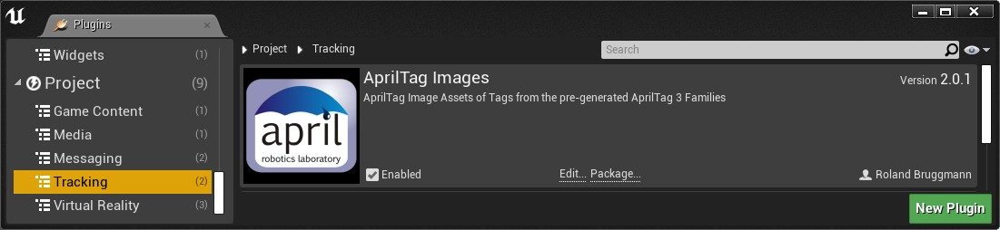

# Unreal Engine Plugin: AprilTag Images

Version: v2.0.1
<br>Author: Roland Bruggmann

## Description


A plugin providing with images of tags from the pre-generated AprilTag 3 families from AprilRobotics. These are mainly Blueprints, each with a StaticMesh Component holding a plane with an AprilTag textured material instance.

### Features

* A Tag Model: Static Mesh plane of size 0x100x100
* Textures: One Texture per AprilTag
* Material Instances: One Material Instance per AprilTag
* Blueprints: One Blueprint per AprilTag

### Contents

* Abstarct Blueprints: 1
* Blueprints: 40
* Materials: 1
* Material Instances: 40
* Meshes: 1
* Textures: 40

### Dependencies

* Platforms Tested: PC Windows 10
* Supported Engine Versions: 4.26
* See also [Changelog](CHANGELOG.md)

### Usage

Use the plugin as project plugin (folder *MyProject/Plugins*) or engine plugin (folder */Engine/Plugins/Tracking*). Add the plugin by downloading and unpackaging an archive or using git clone:

```shell
git clone https://github.com/brugr9/AprilTagImages
```



---

## Table of Contents

<!-- Start Document Outline -->

* [1. Meshes](#1-meshes)
* [2. Textures](#2-textures)
* [3. Materials](#3-materials)
	* [3.1. Opaque Material](#31-opaque-material)
	* [3.2. Material Instances](#32-material-instances)
* [4. Blueprints](#4-blueprints)
	* [4.1. Abstract Blueprint](#41-abstract-blueprint)
	* [4.2. Inherited Blueprints](#42-inherited-blueprints)
* [A. References](#a-references)

<!-- End Document Outline -->

<div style='page-break-after: always'></div>

## 1. Meshes

A Static Mesh plane named `SM_Plane100x100_OriginLeftBottom` of size 0x100x100 with origin in left bottom corner (X=0.0,Y=0.0,Z=0.0) as tag model.


## 2. Textures

Textures of images of tags from the pre-generated AprilTag 3 families.


<div style='page-break-after: always'></div>

## 3. Materials

### 3.1. Opaque Material

An Opaque Material `M_AprilTag` with a TextureSampleParameter2D-node named 'AprilTag' which is UV-mapped by TextureCoordinate.


<div style='page-break-after: always'></div>

### 3.2. Material Instances

One Material Instance per AprilTag: The parent `M_AprilTag` inherited Texture Parameter Value named 'AprilTag' is set to an AprilTag Texture.


<div style='page-break-after: always'></div>

## 4. Blueprints

### 4.1. Abstract Blueprint

The abstract Blueprint `BP_Abstract_AprilTag` holds a Static Mesh Component named 'AprilTag' which points to the Static Mesh `SM_Plane100x100_OriginLeftBottom`. Its material serves as placeholder.


### 4.2. Inherited Blueprints

One Blueprint per AprilTag: The Blueprints parent class is `BP_Abstract_AprilTag`. The Static Mesh Component Material is set to a specific AprilTag Material Instance.


## A. References

* Official Homepage of [AprilRobotics](https://april.eecs.umich.edu/)
* [Pre-generated AprilTag 3 families](https://github.com/AprilRobotics/apriltag-imgs) on github
