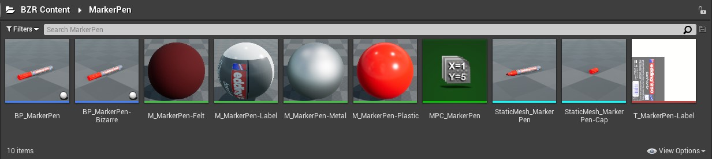

[<< Back to Main Page](..)

# Unreal Engine Plugin: Bizarre BZR

Version: v2.1.0
<br>Author: Roland Bruggmann

## Description


A Game Plugin providing with 3D Content for Dream-Like VR.

### Features

* Lighting based on ZumTobel RTX II Lamp
* Data Tracking Ability provided by an Abstract Actor accessing BP-Function-Libraries
* Five Objects in two Versions - without and with (bizarre) animation: An Art-Print, a Book, a Jacket on a Coat-Hook, a Marker-Pen, and a Telephone

<div style='page-break-after: always'></div>

### Contents

* Blueprints: 19
* Blueprint Function-Libraries: 1
* Blueprint Interfaces: 1
* Blueprint Struct: 1
* Level Sequences: 1
* Materials: 32
* Material Instances: 4
* Material Functions: 7
* Material Parameter Collections: 4
* Particle Systems: 1
* Physics Assetes: 1
* Skeletal Meshes: 1
* Skeletons: 1
* Static Meshes: 16
* Textures: 32

### C++ Classes

* Blueprint Function-Libraries: 1

### Dependencies

* Platforms Tested: PC Windows 10 (Win64)
* Supported Engine Versions: 4.26

### Usage

Use the plugin as project plugin (folder *MyProject/Plugins*). Add the plugin by downloading and unpackaging an archive or using git clone:

```shell
git clone https://github.com/brugr9/BZR.git
```


<div style='page-break-after: always'></div>

---

## Table of Contents

<!-- Start Document Outline -->

* [1. Lighting](#1-lighting)
* [2. Data Tracking](#2-data-tracking)
* [3. Bizarre Objects](#3-bizarre-objects)
  * [3.1. Art-Print](#31-art-print)
  * [3.2. Book](#32-book)
  * [3.3. Jacket](#33-jacket)
  * [3.4. Marker-Pen](#34-marker-pen)
  * [3.5. Telephone](#35-telephone)
* [A. References](#a-references)

<!-- End Document Outline -->

## 1. Lighting

Lighting based on ZumTobel RTX II Lamp.

Screenshot of Lighting Assets:


Screenshot of BP_Lamp-Room-1 Assembly 'ZumTobel RTX II':


Screenshot of BP_Lamp-Room-1 PointLight Settings:


Photograph of Real Lighting in the Laboratory and Screenshot of Virtual Lighting in Unreal Engine:


<div style='page-break-after: always'></div>

## 2. Data Tracking

Data tracking ability is provided by an Abstract Actor `Abstract_Trackable`.

Screenshot of Data Tracking Assets:


Abstract Actor `Abstract_Trackable` (cp. Class Diagram 'Module and Data Tracking'):

* Inherits Interface `Trackable` which declares method `TrackEvent`
* Implements method `TrackEvent` which makes use of BP-Function-Library method `WriteToFile`
* Implements method `OnBeginOverlap` and `OnEndOverlap` which call method `TrackEvent`

Class Diagram 'Module and Data Tracking':


Screenshot of Blueprint `Abstract_Trackable` Function `TrackEvent`:


Screenshot of Blueprint Abstract_Trackable EventGraph:


The five Bizarre Objects inherit Abstract Actor `Abstract_Trackable` and are trackable therefore (cp. Class Diagram Blueprints):

Class Diagram 'Blueprints':


Screenshot of Temporary Data Tracking Output in Unreal Editor:


Screenshot of Persistent Data Tracking Output (*.csv File):


<div style='page-break-after: always'></div>

## 3. Bizarre Objects

For information about the elaboration of the meshes as well as about the way and the implementation of the animations please consult the project documentation in the repository https://github.com/brugr9/BZR-doc.git

### 3.1. Art-Print

An Art-Print in two Versions - without and with (bizarre) animation. Screenshot of ArtPrint Assets:


Blueprint `BP_ArtPrint-Bizarre` inherits from `BP_ArtPrint` which is an `Abstract_Trackable` and holds a Static Mesh ArtPrint, cp. Screenshot of ArtPrint in Reference Viewer:


Screenshot of ArtPrint in Unreal Editor before and after starting Animation:


<div style='page-break-after: always'></div>

### 3.2. Book

A Book in two Versions - without and with (bizarre) animation. Screenshot of Book Assets:


Blueprint `BP_Book-Bizarre` inherits from `BP_Book` which is an `Abstract_Trackable` and holds a Static Mesh Book, cp. Screenshot of Book in Reference Viewer:


Screenshot of Book in Unreal Editor before and after starting Animation:


<div style='page-break-after: always'></div>

### 3.3. Jacket

A Jacket on a Coat-Hook in two Versions - without and with (bizarre) animation. Screenshot of Jacket Assets:


Blueprint `BP_Jacket-Bizarre` inherits from `BP_Jacket` and from `BP_CoatHook` which is an `Abstract_Trackable` and holds a Static Mesh Coathook, cp. Screenshot of Jacket in Reference Viewer:


Screenshot of Jacket in Unreal Editor before and after starting Animation:


<div style='page-break-after: always'></div>

### 3.4. Marker-Pen

A Marker-Pen in two Versions - without and with (bizarre) animation. Screenshot of MarkerPen Assets:



Blueprint `BP_MarkerPen-Bizarre` inherits from `BP_MarkerPen` which is an `Abstract_Trackable` and holds two Static Meshes: Cap and MarkerPen, cp. Screenshot of MarkerPen in Reference Viewer:


Screenshot of MarkerPen in Unreal Editor before and after starting Animation:


<div style='page-break-after: always'></div>

### 3.5. Telephone

A Telephone in two Versions - without and with (bizarre) animation. Screenshot of Telephone Assets:


Blueprint `BP_Telephone-Bizarre` inherits from `BP_Telephone` which is an `Abstract_Trackable` and holds three Static Meshes: Handset, Spiralcord and Telephone, cp. Screenshot of Telephone in Reference Viewer:


Screenshot of Telephone in Unreal Editor before and after starting Animation:


## A. References

* [*3D Content for Dream-Like VR*](https://www.tpf.philhum.unibe.ch/portfolio/dreamLikeVR), In: Portfolio of Technology Platform for Research TPF, Faculty of Human Sciences, University of Bern

[<< Back to Main Page](..)
