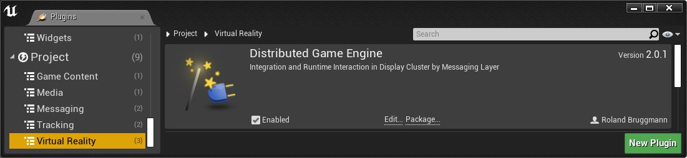
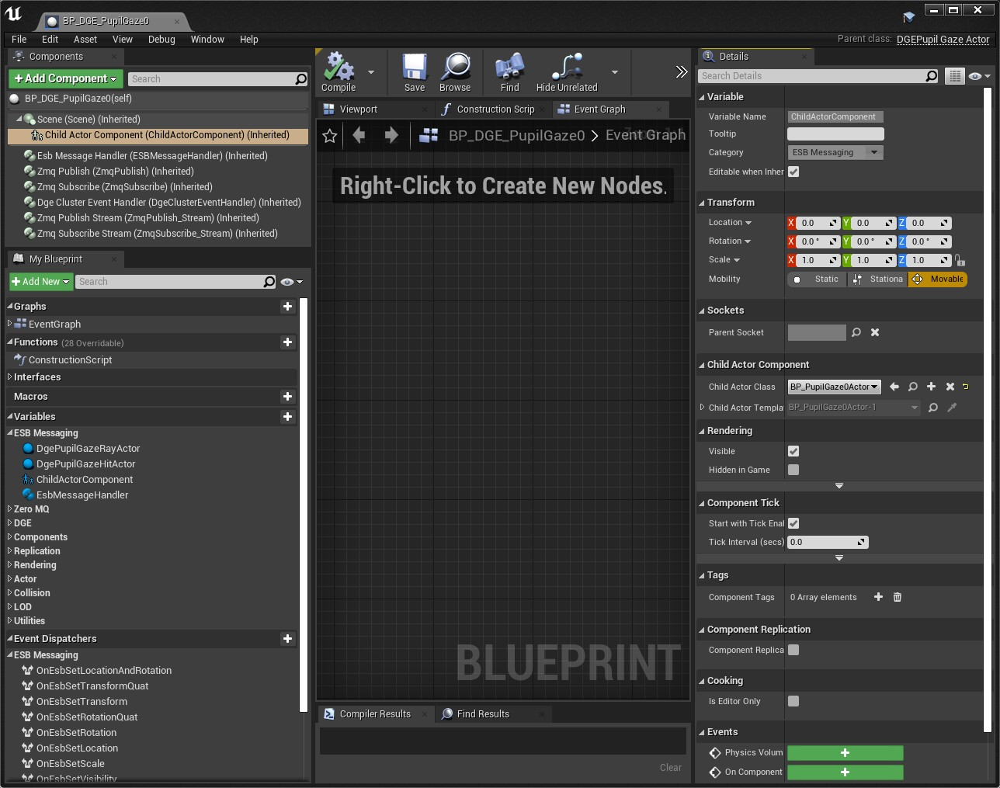

[<< Back to Portfolio Main Page](..)

# Unreal Engine Plugin: Distributed Game Engine DGE

Version: v2.0.1
<br>Author: Roland Bruggmann

## Description


A game plugin providing with Display Cluster rendering and Remote Control related assets. These are mainly Blueprints inheriting from plugin 'ESB Messaging' but customized to a distributed setup based on Unreal Display Cluster aka. nDisplay.

### Features

* Blueprints from Plugin 'ESB Messaging' customized to Distributed setup: MediaPlayer2D, MediaPlayer360, TextRender
* Blueprints from Plugin 'ESB Messaging / Pupil' customized to Distributed setup: Pupil Shape Target, Gaze, Gaze Ray and Gaze Hit
* Blueprints from Plugin 'ESB Messaging / Play Area' customized to Distributed setup: Black Shields, Clear Color, Head and Collision Warning
* Demo Actor and Demo Map

### Contents

* Blueprints: 19
* Maps: 1

### C++ Classes

* ActorComponents: 1
* Actors: 8
* BPFunctionLibrary: 1

### Dependencies

* Platforms Tested: PC Windows 10 (Win64)
* Supported Engine Versions: 4.26

The plugin was developed using Visual Studio 2019. It makes use of code and/or assets from other plugins which must also be installed (cp. package diagram):

* [ESBMessaging](../ESBMessaging) (and its dependencies)

With using this plugin also engine plugin *nDisplay* is enabled.


### Usage

Use the plugin as project plugin (folder *MyProject/Plugins*). Add the plugin by downloading and unpackaging an archive or using git clone:

```shell
git clone https://github.com/brugr9/DGE.git
```



<div style='page-break-after: always'></div>

---

## Table of Contents

<!-- Start Document Outline -->

* [1. Messaging Concept](#1-messaging-concept)
	* [1.1. Message Transport](#11-message-transport)
	* [1.2. Interfaces and JSON Message](#12-interfaces-and-json-message)
	* [1.3. JSON Cluster Event](#13-json-cluster-event)
	* [1.4 DGE Cluster Event Handler Component](#14-dge-cluster-event-handler-component)
	* [1.5. DGE Message Handler Actor](#15-dge-message-handler-actor)
		* [1.5.1. DGE TextRender Actor](#151-dge-textrender-actor)
		* [1.5.2. DGE MediaPlayer Actor](#152-dge-mediaplayer-actor)
	* [1.6. DGE Message Handler Child Actor](#16-dge-message-handler-child-actor)
		* [1.6.1. DGE Pupil Gaze Actor](#161-dge-pupil-gaze-actor)
* [2. Blueprint Function-Library](#2-blueprint-function-library)
* [3. Blueprints](#3-blueprints)
	* [3.1. BP DGE Watchdog](#31-bp-dge-watchdog)
	* [3.2. BP DGE MediaPlayer2D](#32-bp-dge-mediaplayer2d)
	* [3.3. BP DGE MediaPlayer360](#33-bp-dge-mediaplayer360)
	* [3.4. BP DGE TextRender](#34-bp-dge-textrender)
	* [3.5. BP DGE BlackShieldBack](#35-bp-dge-blackshieldback)
	* [3.6. BP DGE BlackShieldFloor](#36-bp-dge-blackshieldfloor)
	* [3.7. BP DGE BlackShieldFront](#37-bp-dge-blackshieldfront)
	* [3.8. BP DGE BlackShieldLeft](#38-bp-dge-blackshieldleft)
	* [3.9. BP DGE BlackShieldRight](#39-bp-dge-blackshieldright)
	* [3.10. BP DGE ClearColor](#310-bp-dge-clearcolor)
	* [3.11. BP DGE CollisionWarning](#311-bp-dge-collisionwarning)
	* [3.12. BP DGE Head](#312-bp-dge-head)
	* [3.13. BP DGE PupilGaze0](#313-bp-dge-pupilgaze0)
	* [3.14. BP DGE PupilGaze0Ray](#314-bp-dge-pupilgaze0ray)
	* [3.15. BP DGE PupilGaze0Hit](#315-bp-dge-pupilgaze0hit)
	* [3.16. BP DGE PupilGaze1](#316-bp-dge-pupilgaze1)
	* [3.17. BP DGE PupilGaze1Ray](#317-bp-dge-pupilgaze1ray)
	* [3.18. BP DGE PupilGaze1Hit](#318-bp-dge-pupilgaze1hit)
	* [3.19. BP DGE PupilShapeTarget](#319-bp-dge-pupilshapetarget)
* [4. Testing](#4-testing)
	* [4.1. Demo Actor and Demo Map](#41-demo-actor-and-demo-map)
	* [4.2. Packaging](#42-packaging)
	* [4.3 nDisplay Launcher](#43-ndisplay-launcher)
		* [4.3.1 Load Non Default Map](#431-load-non-default-map)
	* [4.4 Jupyter Notebook](#44-jupyter-notebook)
* [A. References](#a-references)

<!-- End Document Outline -->

<div style='page-break-after: always'></div>

## 1. Messaging Concept

The messaging concept is the same as in Plugin ESBMessaging, but extended by a nDisplay JSON Cluster Event, which distributes an ESB-Message within the display cluster.

### 1.1. Message Transport

The plugin implements the ZeroMQ PUB/SUB Pattern from Plugin 'ZeroMQ'. E.g., the demo map uses a communication channel as follows:

* Setup:
  * ESB ZeroMQ PUB-Socket connects tcp://127.0.0.1:5555
  * UE4, Display Cluster Main and Client Nodes: Start Cluster Event Listener
  * UE4, Display Cluster Main Node:
    * ZmqSubSocket (Actor) binds tcp://127.0.0.1:5555
    * ZmqSubscribe (ActorComponent) subscribes topic 'ESBEvent'
    * ZmqPubSocket (Actor) binds tcp://127.0.0.1:5556
  * ESB ZeroMQ SUB-Socket connects tcp://127.0.0.1:5556 and subscribes topic 'ESBEvent'

* Sequence:
  * ESB ZeroMQ PUB-Socket publishes message using topic 'ESBEvent'
  * UE4, Display Cluster Main Node:
    * ZmqSubSocket (Actor) receives message and notifies ZmqSubscribe (ActorComponent)
    * ZmqSubscribe (ActorComponent) filters message using topic 'ESBEvent'
    * Emit JSON Cluster Event 'ESBEvent'
  * UE4, Display Cluster Nodes (Main and Clients): Receive JSON Cluster Event 'ESBEvent'
  * UE4 BP Process Data: Deserialize message, interpret message (e.g., call function), serialize result message
  * UE4, Display Cluster Main Node:
    * ZmqPublish (ActorComponent) publishes message using topic 'ESBEvent'
    * ZmqPubSocket (Actor) publishes message
  * ESB ZeroMQ SUB-Socket receives message

Communication Diagram DGE 'ESBEvent', Display Cluster Main Node:


Communication Diagram DGE 'ESBEvent', Display Cluster Client Node:


### 1.2. Interfaces and JSON Message

The interfaces and the JSON Messages are taken from Plugin ESBMessaging. Before processing an ESB-Message it is distributed within the display cluster by a nDisplay JSON Cluster Event.

<div style='page-break-after: always'></div>

### 1.3. JSON Cluster Event

UE4 JSON Cluster Event defined by Epic Games translated to JSON schema, found in folder /Testing/Schemas: [UE4 DisplayCluster ClusterEvent v1.0, Schema](Testing/Schemas/UE4-DisplayClusterClusterEvent-v1_0.schema.json).

Example: [UE4 DisplayCluster ClusterEvent v1.0, Example](Testing/Schemas/Examples/UE4-DisplayClusterClusterEvent-v1_0.example.json)

```json
{
    "Name": "activate",
    "Type": "command",
    "Category": "particles",
    "SystemEvent": "false",
    "ShouldDiscardOnRepeat": "false",
    "Parameters": {
        "rate": "200",
        "speed": "3"
    }
}
```

UE4 JSON Cluster Event for ESBMessages declared as JSON schema, found in folder /Testing/Schemas: [UE4 DisplayCluster ClusterEvent ESBMessage v1.0, Schema](Testing/Schemas/UE4-DisplayClusterClusterEventESBMessage-v1_0.schema.json).

Example: [UE4 DisplayCluster ClusterEvent ESBMessage v1.0, Example](Testing/Schemas/Examples/UE4-DisplayClusterClusterEventESBMessage-v1_0.example.json), Parameter 'Message' transports the ESB-Message as JSON-ObjectString

```json
{
    "Name": "DGETextRender",
    "Type": "Sync",
    "Category": "ESBEvent",
    "SystemEvent": "false",
    "ShouldDiscardOnRepeat": "false",
    "Parameters": {
        "Message": "{\"ObjectName\":\"DGETextRender\",\"Function\":{\"FunctionName\":\"SetTransform\",\"Parameter\":{\"Location\":{\"X\":1,\"Y\":-3,\"Z\":2},\"Rotation\":{\"X\":0,\"Y\":0,\"Z\":0},\"Scale\":{\"X\":1,\"Y\":1,\"Z\":1}}}}"
    }
}
```

<div style='page-break-after: always'></div>

### 1.4 DGE Cluster Event Handler Component

In the display cluster an ESBMessage is distributed by calling `DGEClusterEventHandlerComponent` BlueprintCallable function node `EmitDGEClusterEvent`.
The Component  DGE ClusterEvent field values are found in `DGEClusterEventHandlerComponent` > Details > DGE (Category, Type, Name, Parameter Key). The `DGEClusterEventHandlerComponent` has also a ClusterEventListener. When receiving a cluster event, the same gets filtered with the given fields an the Parameter 'Message' is returned with the event OnDgeClusterEvent (DGEClusterEventHandler).

Screenshot DGEClusterEventHandlerComponent:


<div style='page-break-after: always'></div>

### 1.5. DGE Message Handler Actor

A `DGEMessageHandlerActor`:

* Inherits from `EsbMessageHandlerActor`:
  * Has a ZmqSubscribeComponent (Inherited)
  * Has a EsbMessageHandlerComponent (Inherited)
  * Has a ZmqPublishComponent (Inherited)
  * Implements interface EsbTransform and related Event Dispatchers (Inherited)
  * Implements interface EsbRenderProperty and related Event Dispatchers (Inherited)
* Has a DGEClusterEventHandlerComponent

`DGEMessageHandlerActor` inheriting classes:

* `DGETextRenderActor`, implements additionally interface EsbTextRender and related Event Dispatchers
* `DGEMediaPlayerActor`, implements additionally interface EsbMediaPlayer and related Event Dispatchers
* `DGEMessageHandlerChildActor`, has a ChildActorComponent

Screenshot Blueprint `DGEMessageHandlerActor`:


<div style='page-break-after: always'></div>

Class Diagram `DGEMessageHandlerActor`:


The event-dispatchers are implemented as *dynamic multicast delegates* which can be bound several times at the same time (multicast) and may be used in C++ as well as in Blueprints, both (dynamic) (cp. table 'Overview Event-Dispatcher Macros'):


<div style='page-break-after: always'></div>

#### 1.5.1. DGE TextRender Actor

A `DGETextRenderActor`:

* Inherits from `DGEMessageHandlerActor`:
  * Has a ZmqSubscribeComponent (Inherited)
  * Has a DGEClusterEventHandlerComponent (Inherited)
  * Has a EsbMessageHandlerComponent (Inherited)
  * Has a ZmqPublishComponent (Inherited)
  * Implements interface EsbTransform and related Event Dispatchers (Inherited)
  * Implements interface EsbRenderProperty and related Event Dispatchers (Inherited)
* Implements additionally interface EsbTextRender and related Event Dispatchers

##### 1.5.1.1. UE4 TextRender Alignment

Change of horizontal and/or vertical alignment results in a visually moving center of the text as the alignment is in relation to the TextRender pivot (cp. screenshots below).

Screenshots of TextRender: 1) horizontal alignment 'left' combined with vertical alignment 'bottom' (default); 2) horizontal alignment 'center' combined with vertical alignment 'center'; 3) horizontal alignment 'right' combined with vertical alignment 'top':

  

#### 1.5.2. DGE MediaPlayer Actor

A `DGEMediaPlayerActor`:

* Inherits from `DGEMessageHandlerActor`:
  * Has a ZmqSubscribeComponent (Inherited)
  * Has a DGEClusterEventHandlerComponent (Inherited)
  * Has a ZmqPublishComponent (Inherited)
  * Implements interface EsbTransform and related Event Dispatchers (Inherited)
  * Implements interface EsbRenderProperty and related Event Dispatchers (Inherited)
* Implements additionally interface EsbMediaPlayer and related Event Dispatchers

<div style='page-break-after: always'></div>

##### 1.5.2.1. UE4 MediaPlayer State Machine

Behavior of UE4 MediaPlayer:

* States: Closed, Paused, Playing
* Transitions: OpenFile, Play, Pause, Seek, Close, EndReached (auto)

Transition table:

* Closed -- OpenFile --> Paused (with the new file openned)
* Closed -- Seek --> Closed
* Closed -- Play --> Closed
* Closed -- Pause --> Closed
* Closed -- Close --> Closed
* Paused -- OpenFile --> Paused (with the new file openned)
* Paused -- Seek --> Paused (at seeked position)
* Paused -- Play --> Playing
* Paused -- Pause --> Paused
* Paused -- Close --> Closed
* Playing -- OpenFile --> Paused (with the new file openned)
* Playing -- Seek --> Playing (with starting from seeked position)
* Playing -- Play --> Playing
* Playing -- Pause --> Paused
* Playing -- Close --> Closed
* Playing -- EndReached (auto) --> Paused (with the file still openned)

State Diagram 'MediaPlayer':


<div style='page-break-after: always'></div>

##### 1.5.2.2. UE4 MediaPlayer Playback Synchronisation

UE4 MediaPlayer ***does not synchronise*** video playback in the display cluster. Therefore the start of video playback may be synced by a workaround-sequence:

* OpenFile, Play, Pause, Seek -> "synchronizes" start point

For short videos this may work - but after a couple of seconds the playback will be out of sync. Therefore video playback synchronisation by video streaming is recommended.

###### 1.5.2.2.1. Professional approach by Epic Games

* [UE Documentation: Professional Video I/O](https://docs.unrealengine.com/en-US/WorkingWithMedia/ProVideoIO/index.html), see also Youtube [Genlock, Timecode & Sync for Virtual Production with Unreal (Panel Discussion) 24.07.2020](https://www.youtube.com/watch?v=BVLMyp0Kicw)
* Blackmagic Hardware and UE4-Plugin; see [Blackmagic Video I/O Quick Start](https://docs.unrealengine.com/en-US/WorkingWithMedia/ProVideoIO/BlackmagicQuickStart/index.html)
* Blackmagic Design is using [Nvidia GPUdirect](https://developer.nvidia.com/gpudirect) technology (cp. Nvidia: [GPUDirect for Video](https://developer.nvidia.com/gpudirectforvideo), and Blackmagic Design: [`DeNA Uses DeckLink 4K Extreme 12G with SDK for 4K VR Streaming System`](https://www.blackmagicdesign.com/media/release/20181122-01))

See also:

Generator Locking (Genlock) is a common technique where the video output of one source or a specific reference signal from a signal generator is used to synchronize other picture sources together. The aim in video applications is to ensure the coincidence of signals in time at a combining or switching point. When video instruments are synchronized in this way, they are said to be generator-locked, or genlocked (cp. Ward14). For this purpose a SampleClock is used. Its TimeCode is distributed over network by SMPTE timecode protocol. 

* Ward, Peter (2014): *Timecode versus Sync: How They Differ and Why it Matters*, In: Explora Blog; URL: https://www.bhphotovideo.com/explora/video/tips-and-solutions/timecode-versus-sync-how-they-differ-and-why-it-matters

###### 1.5.2.2.2. VLCMedia Multicast and Netsync

VLC as Streaming Server and [UE4-Plugin VlcMedia](https://github.com/ue4plugins/VlcMedia) as stream consumer (replace `<VlcStreamingServerIP>` by IP of choice):

* VLC Streaming Server: VLC-Multicast (cp. [Live Streaming over RTP using VLC](https://www.bogotobogo.com/VideoStreaming/VLC/How_to_Streaming_Live_Network_rtp.php)):
  * `vlc -vvv file:///c:/videos/clips/test.mp4 --ttl="5" --sout "#transcode{vcodec=h264, acodec=mpga, ab=128, channels=2, samplerate=44100, scodec=none }:gather:rtp{ dst=<VlcStreamingServerIP>, port=1234, mux=ts, ttl=5} :no-sout-all :sout-keep"`
* UE4 Display Cluster Main Node:
  * `vlc rtp://@<VlcStreamingServerIP>:1234 --fullscreen --control netsync --netsync-master`
* UE4 Display Cluster Client Nodes:
  * `vlc rtp://@<VlcStreamingServerIP>:1234 --fullscreen --control netsync --netsync-master-ip <UE4DisplayClusterMainNodeIP>`

<div style='page-break-after: always'></div>

### 1.6. DGE Message Handler Child Actor

A `DGEMessageHandlerChildActor`:

* Inherits from `DGEMessageHandlerActor`:
  * Has a ZmqSubscribeComponent (Inherited)
  * Has a DGEClusterEventHandlerComponent (Inherited)
  * Has a ZmqPublishComponent (Inherited)
  * Implements interface EsbTransform and related Event Dispatchers (Inherited)
  * Implements interface EsbRenderProperty and related Event Dispatchers (Inherited)
* Has a ChildActorComponent

`DGEMessageHandlerChildActor` inheriting classes:

* `DGEPupilGazeActor`, ChildActorComponent's Child Actor Class is `PupilGazeActor`
* `DGEPupilGazeRayActor`, ChildActorComponent's Child Actor Class is `PupilGazeRayActor`
* `DGEPupilGazeHitActor`, ChildActorComponent's Child Actor Class is `PupilGazeHitActor`
* `DGEPupilShapeTargetActor`, ChildActorComponent's Child Actor Class is `PupilShapeTargetActor`

Screenshot Blueprint DGEMessageHandlerChildActor:


<div style='page-break-after: always'></div>

#### 1.6.1. DGE Pupil Gaze Actor

A `DGEPupilGazeActor`:

* Inherits from `DGEMessageHandlerChildActor`
  * Has a ZmqSubscribeComponent (Inherited)
  * Has a DGEClusterEventHandlerComponent (Inherited)
  * Has a ZmqPublishComponent (Inherited)
  * Implements interface EsbTransform and related Event Dispatchers (Inherited)
  * Implements interface EsbRenderProperty and related Event Dispatchers (Inherited)
* Has additionally a ZmqSubscribeComponent (data stream)
* Has additionally a ZmqPublishComponent (data stream)
* Has A `DGEPupilGazeRayActor`, which inherits from class `DGEMessageHandlerChildActor`, ChildActorComponent's Child Actor Class is `PupilGazeRayActor`
* Has A `DGEPupilGazeHitActor`, which inherits from class `DGEMessageHandlerChildActor`, ChildActorComponent's Child Actor Class is `PupilGazeHitActor`
* Overrides interface EsbTransform and related Event Dispatchers
* Overrides interface EsbRenderProperty and related Event Dispatchers

Screenshot Blueprint DGEPupilGazeActor:



<div style='page-break-after: always'></div>

Class Diagram `DGEPupilGazeActor`:


##### 1.6.1.1. Trace for Hit Generation

On `DGEPupilGazeActor` calling function *SetLocationAndRotation*, *SetTransformQuat*, *SetTransform*, *SetLocation*, *SetRotation* or *SetRotationQuat*, the `APupilGazeActor` private function `Trace` is triggered which performs a ray-tracing trying to generate a hit (channel visibility) and updates following ChildActorComponent values:

* `PupilGazeRayActor`: Location , Rotation, Scale (X only, distance from GazeActor to GazeHitActor)
* `PupilGazeHitActor`: Location, Rotation

In case of a hit the objects are updated using values from the hit-result. If no hit was obtained, the objects are updated with values from the trace end.

<div style='page-break-after: always'></div>

## 2. Blueprint Function-Library

The Blueprint Function-Library provides with two functions

* Context-Menu *DGE > Display Cluster*:
  * Get DisplayCluster MainNode Host
  * Is DisplayCluster MainNode

Screenshot Blueprint Function-Library:


<div style='page-break-after: always'></div>

## 3. Blueprints

### 3.1. BP DGE Watchdog

* Folder: DGE Content/Blueprints
* Parent Class: BP_ESB_Watchdog

Screenshot Blueprint BP_DGE_Watchdog:


### 3.2. BP DGE MediaPlayer2D

* Folder: DGE Content / Blueprints / MessageHandlerActor
* Parent Class: DGEMediaPlayerActor
* Customized Values:
  * Scene, Scale: (X=100.000000,Y=100.000000,Z=100.000000)
  * ChildActorComponent:
    * Transform, Scale: (X=0.010000,Y=0.010000,Z=0.010000)
    * Child Actor Component, Child Actor Class: BP_MediaPlayer2DVideoActor
  * EsbMessageHandler: Handled Object Name 'MediaPlayer2D'
  * Has additionally a ZmqPublishComponent 'ZmqPublish_RenderTick': Topic 'RenderTick'
  * ESB Messaging, implemented Interfaces FunctionNames: SetLocationAndRotation, SetTransformQuat, SetTransform, SetLocation, SetRotation, SetRotationQuat, SetScale, SetVisibility, SetColor, SetMaterial, OpenFile, Play, Pause, Seek, Close

Please consider:

* SetMaterial; Parameter, Material: ClearColor, MediaTexture
* See also [UE4 MediaPlayer State Machine](#1521-ue4-mediaplayer-state-machine)

<div style='page-break-after: always'></div>

### 3.3. BP DGE MediaPlayer360

* Folder: DGE Content / Blueprints / MessageHandlerActor
* Parent Class: DGEMediaPlayerActor
* Customized Values:
  * Scene, Scale: (X=100.000000,Y=100.000000,Z=100.000000)
  * ChildActorComponent:
    * Transform, Scale: (X=0.010000,Y=0.010000,Z=0.010000)
    * Child Actor Component, Child Actor Class: BP_MediaPlayer360DegVideoActor
  * EsbMessageHandler: Handled Object Name 'MediaPlayer360'
  * Has additionally a ZmqPublishComponent 'ZmqPublish_RenderTick': Topic 'RenderTick'
  * ESB Messaging, implemented Interfaces FunctionNames: SetLocationAndRotation, SetTransformQuat, SetTransform, SetLocation, SetRotation, SetRotationQuat, SetScale, SetVisibility, SetColor, SetMaterial, OpenFile, Play, Pause, Seek, Close

Please consider:

* SetMaterial; Parameter, Material: ClearColor, MediaTexture
* See also [UE4 MediaPlayer State Machine](#1521-ue4-mediaplayer-state-machine)

### 3.4. BP DGE TextRender

* Folder: DGE Content / Blueprints / MessageHandlerActor
* Parent Class: DGETextRenderActor
* Customized Values:
  * Scene, Scale: (X=100.000000,Y=100.000000,Z=100.000000)
  * TextRenderComponent, Transform:
    * Rotation: (X=0.000000,Y=0.000000,Z=180.000000)
    * Scale: (X=0.010000,Y=0.010000,Z=0.010000)
  * EsbMessageHandler: Handled Object Name 'TextRender'
  * DgeClusterEventHandler: Dge Cluster Event Fields, Name 'TextRender'
  * ESB Messaging, implemented Interfaces FunctionNames: SetLocationAndRotation, SetTransformQuat, SetTransform, SetLocation, SetRotation, SetRotationQuat, SetScale, SetVisibility, SetText, SetFormatText, SetFontColor

Please consider:

* SetFontColor: Alpha value is not respected by the text material
* SetFormatText: See also [UE4 TextRender Alignment](#1511-ue4-textrender-alignment)

### 3.5. BP DGE BlackShieldBack

* Folder: DGE Content / Blueprints / MessageHandlerActor / PlayArea
* Parent Class: DGEMessageHandlerChildActor
* Customized Values:
  * Scene, Scale: (X=100.000000,Y=100.000000,Z=100.000000)
  * ChildActorComponent:
    * Transform, Scale: (X=0.010000,Y=0.010000,Z=0.010000)
    * Child Actor Component, Child Actor Class: BP_PlayArea_BlackShieldBack
  * EsbMessageHandler: Handled Object Name 'BlackShieldBack'
  * DgeClusterEventHandler: Dge Cluster Event Fields, Name 'BlackShieldBack'
  * ESB Messaging, implemented Interfaces FunctionNames: SetLocationAndRotation, SetTransformQuat, SetTransform, SetLocation, SetRotation, SetRotationQuat, SetScale, SetVisibility

### 3.6. BP DGE BlackShieldFloor

* Folder: DGE Content / Blueprints / MessageHandlerActor / PlayArea
* Parent Class: DGEMessageHandlerChildActor
* Customized Values:
  * Scene, Scale: (X=100.000000,Y=100.000000,Z=100.000000)
  * ChildActorComponent:
    * Transform, Scale: (X=0.010000,Y=0.010000,Z=0.010000)
    * Child Actor Component, Child Actor Class: BP_PlayArea_BlackShieldFloor
  * EsbMessageHandler: Handled Object Name 'BlackShieldFloor'
  * DgeClusterEventHandler: Dge Cluster Event Fields, Name 'BlackShieldFloor'
  * ESB Messaging, implemented Interfaces FunctionNames: SetLocationAndRotation, SetTransformQuat, SetTransform, SetLocation, SetRotation, SetRotationQuat, SetScale, SetVisibility

### 3.7. BP DGE BlackShieldFront

* Folder: DGE Content / Blueprints / MessageHandlerActor / PlayArea
* Parent Class: DGEMessageHandlerChildActor
* Customized Values:
  * Scene, Scale: (X=100.000000,Y=100.000000,Z=100.000000)
  * ChildActorComponent:
    * Transform, Scale: (X=0.010000,Y=0.010000,Z=0.010000)
    * Child Actor Component, Child Actor Class: BP_PlayArea_BlackShieldFront
  * EsbMessageHandler: Handled Object Name 'BlackShieldFront'
  * DgeClusterEventHandler: Dge Cluster Event Fields, Name 'BlackShieldFront'
  * ESB Messaging, implemented Interfaces FunctionNames: SetLocationAndRotation, SetTransformQuat, SetTransform, SetLocation, SetRotation, SetRotationQuat, SetScale, SetVisibility

### 3.8. BP DGE BlackShieldLeft

* Folder: DGE Content / Blueprints / MessageHandlerActor / PlayArea
* Parent Class: DGEMessageHandlerChildActor
* Customized Values:
  * Scene, Scale: (X=100.000000,Y=100.000000,Z=100.000000)
  * ChildActorComponent:
    * Transform, Scale: (X=0.010000,Y=0.010000,Z=0.010000)
    * Child Actor Component, Child Actor Class: BP_PlayArea_BlackShieldLeft
  * EsbMessageHandler: Handled Object Name 'BlackShieldLeft'
  * DgeClusterEventHandler: Dge Cluster Event Fields, Name 'BlackShieldLeft'
  * ESB Messaging, implemented Interfaces FunctionNames: SetLocationAndRotation, SetTransformQuat, SetTransform, SetLocation, SetRotation, SetRotationQuat, SetScale, SetVisibility

### 3.9. BP DGE BlackShieldRight

* Folder: DGE Content / Blueprints / MessageHandlerActor / PlayArea
* Parent Class: DGEMessageHandlerChildActor
* Customized Values:
  * Scene, Scale: (X=100.000000,Y=100.000000,Z=100.000000)
  * ChildActorComponent:
    * Transform, Scale: (X=0.010000,Y=0.010000,Z=0.010000)
    * Child Actor Component, Child Actor Class: BP_PlayArea_BlackShieldRight
  * EsbMessageHandler: Handled Object Name 'BlackShieldRight'
  * DgeClusterEventHandler: Dge Cluster Event Fields, Name 'BlackShieldRight'
  * ESB Messaging, implemented Interfaces FunctionNames: SetLocationAndRotation, SetTransformQuat, SetTransform, SetLocation, SetRotation, SetRotationQuat, SetScale, SetVisibility

### 3.10. BP DGE ClearColor

* Folder: DGE Content / Blueprints / MessageHandlerActor / PlayArea
* Parent Class: DGEMessageHandlerChildActor
* Customized Values:
  * Scene, Scale: (X=100.000000,Y=100.000000,Z=100.000000)
  * ChildActorComponent:
    * Transform, Scale: (X=0.010000,Y=0.010000,Z=0.010000)
    * Child Actor Component, Child Actor Class: BP_PlayArea_ClearColor
  * EsbMessageHandler: Handled Object Name 'ClearColor'
  * DgeClusterEventHandler: Dge Cluster Event Fields, Name 'ClearColor'
  * ESB Messaging, implemented Interfaces FunctionNames: SetLocationAndRotation, SetTransformQuat, SetTransform, SetLocation, SetRotation, SetRotationQuat, SetScale, SetVisibility (BP Override), SetColor (BP Override)

Please consider:

* SetVisibility (BP Override): Disables / enables also collision (query only, no physics collision)
* SetColor: Alpha value is not respected by the material

### 3.11. BP DGE CollisionWarning

* Folder: DGE Content / Blueprints / MessageHandlerActor / PlayArea
* Parent Class: DGEMessageHandlerChildActor
* Customized Values:
  * Scene, Scale: (X=100.000000,Y=100.000000,Z=100.000000)
  * ChildActorComponent:
    * Transform, Scale: (X=0.010000,Y=0.010000,Z=0.010000)
    * Child Actor Component, Child Actor Class: BP_PlayArea_CollisionWarning
  * EsbMessageHandler: Handled Object Name 'CollisionWarning'
  * DgeClusterEventHandler: Dge Cluster Event Fields, Name 'CollisionWarning'
  * ESB Messaging, implemented Interfaces FunctionNames: SetLocationAndRotation, SetTransformQuat, SetTransform, SetLocation, SetRotation, SetRotationQuat, SetScale, SetVisibility (BP Override)

### 3.12. BP DGE Head

* Folder: DGE Content / Blueprints / MessageHandlerActor / PlayArea
* Parent Class: DGEMessageHandlerChildActor
* Customized Values:
  * Scene, Scale: (X=100.000000,Y=100.000000,Z=100.000000)
  * ChildActorComponent:
    * Transform, Scale: (X=0.010000,Y=0.010000,Z=0.010000)
    * Child Actor Component, Child Actor Class: BP_PlayArea_Head
  * EsbMessageHandler: Handled Object Name 'Head'
  * DgeClusterEventHandler: Dge Cluster Event Fields, Name 'Head'
  * Has additionally a ZmqSubscribeComponent 'ZmqSubscribe_Stream': Topic 'ESBEvent'
  * ESB Messaging, implemented Interfaces FunctionNames: SetLocationAndRotation, SetTransformQuat, SetTransform, SetLocation, SetRotation, SetRotationQuat, SetScale, SetVisibility (BP Override)
  * ESB Messaging, Unbinds all Events from Event Dispatchers: OnSetLocationAndRotation, OnSetTransformQuat, OnSetTransform, OnSetLocation, OnSetRotation, OnSetRotationQuat

### 3.13. BP DGE PupilGaze0

* Folder: DGE Content / Blueprints / MessageHandlerActor / Pupil
* Parent Class: DGEPupilGazeActor
* Customized Values:
  * ChildActorComponent, Child Actor Class: BP_PupilGaze0Actor
  * EsbMessageHandler: Handled Object Name 'PupilGaze0'
  * DgeClusterEventHandler: Dge Cluster Event Fields, Name 'PupilGaze0'
  * ESB Messaging, implemented Interfaces FunctionNames: SetLocationAndRotation, SetTransformQuat, SetTransform, SetLocation, SetRotation, SetRotationQuat, SetScale, SetVisibility, SetColor

Please consider:

* SetColor: Alpha value is not respected by the ray or hit material
* See also [Trace for Hit Generation](#1611-trace-for-hit-generation)

### 3.14. BP DGE PupilGaze0Ray

* Folder: DGE Content / Blueprints / MessageHandlerActor / Pupil
* Parent Class: DGEPupilGazeRayActor
* Customized Values:
  * ChildActorComponent, Child Actor Class: BP_PupilGaze0Ray
  * EsbMessageHandler: Handled Object Name 'PupilGaze0Ray'
  * DgeClusterEventHandler: Dge Cluster Event Fields, Name 'PupilGaze0Ray'
  * ESB Messaging, implemented Interfaces FunctionNames: SetVisibility, SetColor

Please consider:

* SetColor: Alpha value is not respected by the ray material
* See also [Trace for Hit Generation](#1611-trace-for-hit-generation)

### 3.15. BP DGE PupilGaze0Hit

* Folder: DGE Content / Blueprints / MessageHandlerActor / Pupil
* Parent Class: DGEPupilGazeHitActor
* Customized Values:
  * ChildActorComponent, Child Actor Class: BP_PupilGaze0Hit
  * EsbMessageHandler: Handled Object Name 'PupilGaze0Hit'
  * DgeClusterEventHandler: Dge Cluster Event Fields, Name 'PupilGaze0Hit'
  * ESB Messaging, implemented Interfaces FunctionNames: SetVisibility, SetColor

Please consider:

* Pupil SetColor: Alpha value is not respected by the hit material
* See also [Trace for Hit Generation](#1611-trace-for-hit-generation)

### 3.16. BP DGE PupilGaze1

* Folder: DGE Content / Blueprints / MessageHandlerActor / Pupil
* Parent Class: DGEPupilGazeActor
* Customized Values:
  * ChildActorComponent, Child Actor Class: BP_PupilGaze1Actor
  * EsbMessageHandler: Handled Object Name 'PupilGaze1'
  * DgeClusterEventHandler: Dge Cluster Event Fields, Name 'PupilGaze1'
  * ESB Messaging, implemented Interfaces FunctionNames: SetLocationAndRotation, SetTransformQuat, SetTransform, SetLocation, SetRotation, SetRotationQuat, SetScale, SetVisibility, SetColor

Please consider:

* SetColor: Alpha value is not respected by the ray or hit material
* See also [Trace for Hit Generation](#1611-trace-for-hit-generation)

### 3.17. BP DGE PupilGaze1Ray

* Folder: DGE Content / Blueprints / MessageHandlerActor / Pupil
* Parent Class: DGEPupilGazeRayActor
* Customized Values:
  * ChildActorComponent, Child Actor Class: BP_PupilGaze1Ray
  * EsbMessageHandler: Handled Object Name 'PupilGaze1Ray'
  * DgeClusterEventHandler: Dge Cluster Event Fields, Name 'PupilGaze1Ray'
  * ESB Messaging, implemented Interfaces FunctionNames: SetVisibility, SetColor

Please consider:

* SetColor: Alpha value is not respected by the ray material
* See also [Trace for Hit Generation](#1611-trace-for-hit-generation)

### 3.18. BP DGE PupilGaze1Hit

* Folder: DGE Content / Blueprints / MessageHandlerActor / Pupil
* Parent Class: DGEPupilGazeHitActor
* Customized Values:
  * ChildActorComponent, Child Actor Class: BP_PupilGaze1Hit
  * EsbMessageHandler: Handled Object Name 'PupilGaze1Hit'
  * DgeClusterEventHandler: Dge Cluster Event Fields, Name 'PupilGaze1Hit'
  * ESB Messaging, implemented Interfaces FunctionNames: SetVisibility, SetColor

Please consider:

* SetColor: Alpha value is not respected by the hit material
* See also [Trace for Hit Generation](#1611-trace-for-hit-generation)

### 3.19. BP DGE PupilShapeTarget

* Folder: DGE Content / Blueprints / MessageHandlerActor / Pupil
* Parent Class: DGEPupilGazeActor
* Customized Values:
  * ChildActorComponent, Child Actor Class: BP_PupilShapeTarget
  * EsbMessageHandler: Handled Object Name 'PupilShapeTarget'
  * DgeClusterEventHandler: Dge Cluster Event Fields, Name 'PupilShapeTarget'
  * ESB Messaging, implemented Interfaces FunctionNames: SetLocationAndRotation, SetTransformQuat, SetTransform, SetLocation, SetRotation, SetRotationQuat, SetScale, SetVisibility (BP Override), SetMaterial

Please consider:

* SetVisibility (BP Override): Disables / enables also collision (query only, no physics collision)
* SetMaterial; Parameter, Material: CircleBlack, CircleRed, CrossBlack, CrossRed, PointBlack, PointRed, PupilLabsCalibrationMarker, PupilLabsCalibrationStopMarker

<div style='page-break-after: always'></div>

## 4. Testing

### 4.1. Demo Actor and Demo Map

Blueprint ESBMessaging Demo Actor `BP_DGE_DemoActor`:

* Folder: DGE Content/Demo/Blueprints/
* Parent Class: Actor
* Scene Components:
  * DefaultSceneRoot with
    * MeshComponent: Cube
      * TextRenderComponent: TextRender
      * ChildActorComponent: BP_MediaPlayer2DVideoActor
    * SpotLightComponent: SpotLight
* Actor Components:
  * Has a ZmqSubscribeComponent
  * Has a DGEClusterEventHandlerComponent
  * Has a EsbMessageHandlerComponent
  * Has a ZmqPublishComponent
* Interfaces:
  * Implements interface EsbTransform (Blueprint, Event Graph)
  * Implements interface EsbRenderProperty (Blueprint, Event Graph)
  * Implements interface EsbTextRender (Blueprint, Event Graph)
  * Implements interface EsbMediaPlayer (Blueprint, Event Graph)

Screenshot of Blueprint `BP_DGE_DemoActor`


<div style='page-break-after: always'></div>

Map `Map_DGE_Demo`, World Outliner:

* Has ZmqSubSocketActor (default values)
* Has ZmqPubSocketActor (default values, but Link Info: Port 5556)
* Has ZmqContextActor, with Zmq Socket Actors assigned: ZmqSubSocketActor, ZmqSubSocketActor
* Has BP_DGE_DemoActor
  * with ZmqSubscribe > Zmq Sub Socket Actor: ZmqSubSocketActor
  * with ZmqPublish > Zmq Pub Socket Actor: ZmqPubSocketActor
* Has BP_DGE_Watchdog, with ZmqPublish > Zmq Pub Socket Actor: ZmqPubSocketActor
* Has DisplayClusterRootActor, Preview Config File: `/MyProject /Content /ExampleConfigs /cave_5_sides.cfg`

Screenshot of `Map_DGE_Demo`:


<div style='page-break-after: always'></div>

In the ESBMessaging demo map `Map_DGE_Demo` LevelBlueprint the ZeroMQ-Sockets of ZmqSubSocketActor and ZmqPubSocketActor are bound. Finally a timer triggered event starts to call ZmqSubSocketActor function Receive every millisecond.

Screenshot of `Map_DGE_Demo` LevelBlueprint:


### 4.2. Packaging

Brief instruction: Packaging, e.g., a shipping build (cp. [Packaging Projects](https://docs.unrealengine.com/en-US/Basics/Projects/Packaging/)):

1. Project Settings > Project > Maps & Modes > Default Maps > Game Default Map: `Map_DGE_Demo`
2. File > Package Project > Build Configuration > Shipping
3. File > Package Project > Windows (64-bit)
4. Point to a folder of your choice

In the folder of your choice a folder 'WindowsNoEditor' is created containing the executable file (*.exe).

### 4.3 nDisplay Launcher

The UE4 DisplayCluster aka nDisplay configuration files may be found in Folder `MyProject/Content/ExampleConfigs`. nDisplay config files *.cfg are edited using a text editor of choice (cp. Unreal Engine Documentation [nDisplay Configuration File Reference](https://docs.unrealengine.com/en-US/WorkingWithMedia/nDisplay/Configuration/index.html)).

Brief instruction: Run a display cluster game unwrapped locally on your machine (cp. [nDisplay Quick Start](https://docs.unrealengine.com/en-US/WorkingWithMedia/nDisplay/QuickStart/)):

1. Find and launch nDisplay Listener and nDisplay Launcher (folder 'C: \Program Files \Epic Games \UE\ _4.26 \Engine \Binaries \DotNET' or similar)
2. In nDisplay Launcher, Tab 'Launcher', List of Applications > Click Button 'Add': Point to the shipping build executable '*.exe' in folder 'WindowsNoEditor'
3. In nDisplay Launcher, Tab 'Launcher', Config Files Dropdown > Click Button 'Add': Point to a Display Config, e.g., `MyProject \Content \ExampleConfigs \cave_5_sides_unwrap.cfg`
4. Click Button 'Run'

Screenshot of nDisplay Listener:


Screenshot of nDisplay Launcher:


Screenshot of nDisplay Unwrap:


#### 4.3.1 Load Non Default Map

To load a map other than the default one, e.g., map "My_Other_Map", in nDisplay Launcher enter the following custom command line arguments (cp. Unreal Engine Documentation, [Command Line Arguments](https://docs.unrealengine.com/en-US/Programming/Basics/CommandLineArguments/index.html)):

`/Game/Maps/My_Other_Map`

### 4.4 Jupyter Notebook

For testing purpose plugin ESBMessaging provides with Jupyter Notebooks:

* esb-zmq-pub.ipynb: Sending messages using ZeroMQ PUB-Socket(s)
* esb-zmq-sub.ipynb: Receiving messages using ZeroMQ SUB-Socket(s)

Please find instructions on how to install Anaconda and setup Jupyter Notebook in plugin ESBMessaging folder 'Testing'.

Screenshot of Jupyter Notebook ESBMessaging ZeroMQ Publish:


## A. References

* Unreal Engine Documentation:
  * [Rendering to Multiple Displays with nDisplay](https://docs.unrealengine.com/en-US/WorkingWithMedia/nDisplay/index.html), In: *Working with Media*
  * [Using Cluster Events](https://docs.unrealengine.com/en-US/WorkingWithMedia/nDisplay/ClusterEvents/index.html), In: *Working with Media > Rendering to Multiple Displays with nDisplay*
* JSON Schema Specification:
  * [Homepage of JSON Schema](https://json-schema.org/)
  * [Understanding JSON Schema 7.0](https://json-schema.org/understanding-json-schema/index.html)
* Technology Platform for Research TPF: [UE4 Display Cluster in CAVE](https://www.tpf.philhum.unibe.ch/portfolio/ue4DisplayCluster), Faculty of Human Sciences, University of Bern

[<< Back to Portfolio Main Page](..)
