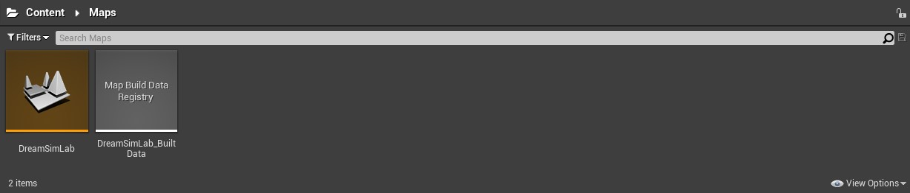
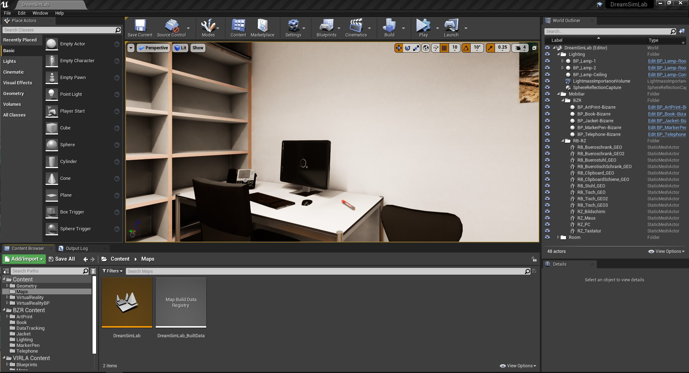
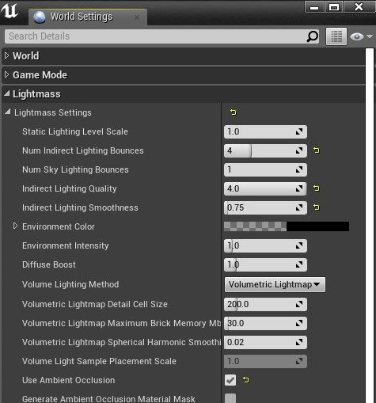

[<< Back to Main Page](..)

# Unreal Engine Project: Dream Simulation Lab

Version: v2.1.0
<br>Author: Roland Bruggmann

## Description



A project based on UE template 'Virtual Reality' providing with Institute of Psychology related maps, more precise for the Dream Simulation Laboratory with its Room D268. This project was elaborated as TPF approved project '3D Content for Dream-Like VR - Modelling and Animation of Bizarre 3D Objects for Use in a Dream-Like Virtual Environment' (aka BZR).

### Features

* Maps: DreamSimLab which is a digital twin of Institue of Psychology's Virtual Reality Lab Room D268 supplemented with actors from plugin BZR.

### Contents

* Maps: 1
* Map Build Data Registry: 1

### Important Notes

* Platforms Tested: PC Windows
* Supported Engine Versions: 4.26

---

## Table of Contents

<!-- Start Document Outline -->

* [1. Usage](#1-usage)
  * [1.1. Dependencies](#11-dependencies)
  * [1.2. Installation](#12-installation)
* [2. Map DreamSimLab](#2-dreamsimlab)
* [A. References](#a-references)

<!-- End Document Outline -->

<div style='page-break-after: always'></div>

## 1. Usage

### 1.1. Dependencies

The project was developed using

* Windows 10
* Visual Studio 2019
* Unreal Engine 4.26
* UE Project Template 'Virtual Reality'

The project makes use of plugin [BZR](../BZR) and [VIRLA](../VIRLA).

### 1.2. Installation

Download the project using git -- the plugins are included as git submodules:

```shell
git clone --recursive https://github.com/brugr9/DreamSimLab.git
cd DreamSimLab
git submodule update --recursive
```

<div style='page-break-after: always'></div>

## 2. Map DreamSimLab

The map `DreamSimLab` is a copy from plugin VIRLA's map `RaumBern` supplemented with actors from plugin BZR:

* ArtPrint (Bizarre)
* Book (Bizarre)
* Jacket (Bizarre)
* MarkerPen (Bizarre)
* Telephone (Bizarre)
* Corridor and Room Lamps

Screenshot of Map DreamSimLab:



Screenshot of WorldSettings Lightmass:



## A. References

### Project

* <a href="https://www.slideshare.net/secret/lUQIwIEFTZYEq" target="_blank">Project Report (pdf)</a> on Slide Share
* <a href="https://www.tpf.philhum.unibe.ch/portfolio/dreamLikeVR" target="_blank">*3D Content for Dream-like VR*</a>. In: Online-Portfolio of Technology Platform for Research TPF, Faculty of Human Sciences, University of Bern
* <a href="https://www.rts.ch/play/tv/redirect/detail/12161998?startTime=358)" target="_blank">*Le pouvoir de l'imaginaire*</a>. In: *Faut pas croire*, émission du 01.05.2021 (video playback start time 5:58), Play RTS, Radio Télevision Suisse
* Denzer, Simone; Diezig, Sarah; Achermann, Peter; König, Thomas; Mast, Fred W. (2022). <a href="https://boris.unibe.ch/165396/" target="_blank">*BizarreVR: Dream-like bizarreness in immersive virtual reality induced changes in conscious experience of reality while leaving spatial presence intact*</a>. In: Consciousness and cognition, 99, p. 103283. Elsevier <a href="http://dx.doi.org/10.1016/j.concog.2022.103283" target="_blank">10.1016/j.concog.2022.103283</a>

### Lab and Research

* <a href="https://www.kog.psy.unibe.ch/forschung/labors/virtual_reality_lab/index_ger.html" target="_blank">*Virtual-Reality-Lab*</a>. In: Webpages of Institute of Psychology, Division of Cognitive Psychology, Perception and Research Methods, University of Bern
* <a href="https://www.sleep.unibe.ch/research/projects/reality_monitoring_in_sleep_psychosis_and_virtual_reality/index_eng.html" target="_blank">*Reality-monitoring in sleep, psychosis, and virtual reality*</a>. In: Website of *"Decoding Sleep"* - Interfaculty Research Cooperation of Department of Psychology and Hospital of Psychiatry, University of Bern

[<< Back to Main Page](..)
