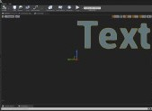
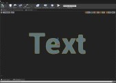

# Unreal Engine Plugin: ESB Messaging

Version: v2.0.1
<br>Author: Roland Bruggmann

## Description


A game plugin providing with remote control related assets for UE4 integration and runtime interaction. These are mainly Blueprints designed as messaging layer to an Enterprise Service Bus ESB where UE4 acts as message endpoint.

### Features

* Blueprint with a messaging layer: TextRender
* Blueprints from Plugin 'ImmersiveVideo' enhanced with a messaging layer: MediaPlayer2D, MediaPlayer360
* Blueprints from Plugin 'Pupil' enhanced with a messaging layer: ShapeTarget, Gaze, GazeRay and GazeHit
* Blueprints from Plugin 'PlayArea' enhanced with a messaging layer: BlackShields, ClearColor, Head and CollisionWarning
* Demo Actor and Demo Maps
* Plugin Settings

### Contents

* Blueprints: 20
* Maps: 2

### C++ Classes

* Interfaces: 4
* ActorComponents: 1
* Actors: 8
* PluginSettings: 1
* BPFunctionLibrary: 1

### Dependencies

* Platforms Tested: PC Windows 10 (Win64)
* Supported Engine Versions: 4.26

The plugin was developed using Visual Studio 2019. It makes use of code and/or assets from other plugins which must also be installed (cp. package diagram):

* [ZeroMQ](../ZeroMQ)
* [Pupil](../Pupil)
* [PlayArea](../PlayArea)
* [ImmersiveVideo](../ImmersiveVideo)

With using this plugin also engine plugins *MediaIOFramework*, *MediaFrameworkUtilities* and *WmfMedia* are enabled.


### Usage

Use the plugin as project plugin (folder *MyProject/Plugins*). Add the plugin by downloading and unpackaging an archive or using git clone:

```shell
git clone https://github.com/brugr9/ESBMessaging.git
```

Find the file `MyProject /Plugins /ESBMessaging /Config /DefaultESBMessaging.ini` and copy-paste its lines to file `MyProject /Config /DefaultEngine.ini`.


<div style='page-break-after: always'></div>

---

## Table of Contents

<!-- Start Document Outline -->

* [1. Messaging Concept](#1-messaging-concept)
	* [1.1. Message Transport](#11-message-transport)
	* [1.2. Interfaces](#12-interfaces)
		* [1.2.1. Interface EsbTransform](#121-interface-esbtransform)
		* [1.2.2. Interface EsbRenderProperty](#122-interface-esbrenderproperty)
		* [1.2.3. Interface EsbTextRender](#123-interface-esbtextrender)
		* [1.2.4. Interface EsbMediaPlayer](#124-interface-esbmediaplayer)
	* [1.3. JSON Message](#13-json-message)
		* [1.3.1. Interface EsbTransform](#131-interface-esbtransform)
		* [1.3.2. Interface EsbRenderProperty](#132-interface-esbrenderproperty)
		* [1.3.3. Interface EsbTextRender](#133-interface-esbtextrender)
		* [1.3.4. Interface EsbMediaPlayer](#134-interface-esbmediaplayer)
		* [1.3.5. Interface Result Messages](#135-interface-result-messages)
	* [1.4 ESB Message Handler Component](#14-esb-message-handler-component)
	* [1.5. ESB Message Handler Actor](#15-esb-message-handler-actor)
		* [1.5.1. ESB TextRender Actor](#151-esb-textrender-actor)
		* [1.5.2. ESB MediaPlayer Actor](#152-esb-mediaplayer-actor)
	* [1.6. ESB Message Handler Child Actor](#16-esb-message-handler-child-actor)
		* [1.6.1. ESB Pupil Gaze Actor](#161-esb-pupil-gaze-actor)
* [2. Plugin Settings and BP Function-Library](#2-plugin-settings-and-bp-function-library)
	* [2.1. Plugin Settings](#21-plugin-settings)
	* [2.2. BP Function-Library](#22-bp-function-library)
* [3. Blueprints](#3-blueprints)
	* [3.1. BP ESB Watchdog](#31-bp-esb-watchdog)
	* [3.2. BP ESB MediaPlayer2D](#32-bp-esb-mediaplayer2d)
	* [3.3. BP ESB MediaPlayer360](#33-bp-esb-mediaplayer360)
	* [3.4. BP ESB TextRender](#34-bp-esb-textrender)
	* [3.5. BP ESB BlackShieldBack](#35-bp-esb-blackshieldback)
	* [3.6. BP ESB BlackShieldFloor](#36-bp-esb-blackshieldfloor)
	* [3.7. BP ESB BlackShieldFront](#37-bp-esb-blackshieldfront)
	* [3.8. BP ESB BlackShieldLeft](#38-bp-esb-blackshieldleft)
	* [3.9. BP ESB BlackShieldRight](#39-bp-esb-blackshieldright)
	* [3.10. BP ESB ClearColor](#310-bp-esb-clearcolor)
	* [3.11. BP ESB CollisionWarning](#311-bp-esb-collisionwarning)
	* [3.12. BP ESB Head](#312-bp-esb-head)
	* [3.13. BP ESB PupilGaze0](#313-bp-esb-pupilgaze0)
	* [3.14. BP ESB PupilGaze0Ray](#314-bp-esb-pupilgaze0ray)
	* [3.15. BP ESB PupilGaze0Hit](#315-bp-esb-pupilgaze0hit)
	* [3.16. BP ESB PupilGaze1](#316-bp-esb-pupilgaze1)
	* [3.17. BP ESB PupilGaze1Ray](#317-bp-esb-pupilgaze1ray)
	* [3.18. BP ESB PupilGaze1Hit](#318-bp-esb-pupilgaze1hit)
	* [3.19. BP ESB PupilShapeTarget](#319-bp-esb-pupilshapetarget)
* [4. Testing](#4-testing)
	* [4.1. Demo Actor and Demo Map](#41-demo-actor-and-demo-map)
	* [4.2. Packaging](#42-packaging)
	* [4.3. Jupyter Notebook](#43-jupyter-notebook)
* [A. References](#a-references)

<!-- End Document Outline -->

## 1. Messaging Concept

### 1.1. Message Transport

The plugin implements the ZeroMQ PUB/SUB Pattern from Plugin 'ZeroMQ'. E.g., the demo map uses a communication channel as follows:

* Setup:
  * ESB ZeroMQ PUB-Socket connects tcp://127.0.0.1:5555
  * UE4 ZmqSubSocket (Actor) binds tcp://127.0.0.1:5555
  * UE4 ZmqSubscribe (ActorComponent) subscribes topic 'ESBEvent'
  * UE4 ZmqPubSocket (Actor) binds tcp://127.0.0.1:5556
  * ESB ZeroMQ SUB-Socket connects tcp://127.0.0.1:5556 and subscribes topic 'ESBEvent'
* Sequence:
  * ESB ZeroMQ PUB-Socket publishes message using topic 'ESBEvent'
  * UE4 ZmqSubSocket (Actor) receives message and notifies ZmqSubscribe (ActorComponent)
  * UE4 ZmqSubscribe (ActorComponent) filters message using topic 'ESBEvent'
  * UE4 BP Process Data: Deserialize message, interpret message (e.g., call function), serialize result message
  * UE4 ZmqPublish (ActorComponent) publishes message using topic 'ESBEvent'
  * UE4 ZmqPubSocket (Actor) publishes message
  * ESB ZeroMQ SUB-Socket receives message

Communication Diagram 'ESBEvent':


### 1.2. Interfaces

The messaging layer defines four interfaces: `EsbTransform`, `EsbRenderProperty`, `EsbTextRender` and `EsbMediaPlayer`.

<div style='page-break-after: always'></div>

#### 1.2.1. Interface EsbTransform

Function declarations:

* SetTransformQuat
* SetTransform
* SetScale
* SetRotationQuat
* SetRotation
* SetLocationAndRotation
* SetLocation

Screenshot of Interface EsbTransform functions and Blueprint overrides:


#### 1.2.2. Interface EsbRenderProperty

Function declarations:

* SetVisibility
* SetMaterial
* SetColor

Screenshot of Interface EsbRenderProperty functions and Blueprint overrides:


<div style='page-break-after: always'></div>

#### 1.2.3. Interface EsbTextRender

Function declarations:

* SetText
* SetFormatText
* SetFontColor

Screenshot of Interface EsbTextRender functions and Blueprint overrides:


#### 1.2.4. Interface EsbMediaPlayer

Function declarations:

* OpenFile
* Play
* Pause
* Seek
* Close

Screenshot of Interface EsbMediaPlayer functions and Blueprint overrides:


<div style='page-break-after: always'></div>

### 1.3. JSON Message

Interface messages are declared as JSON Schema version 7.0, to be found in folder Testing/Schemas: [UE4-ESBMessage-v1_0.schema.json](Testing/Schemas/UE4-ESBMessage-v1_0.schema.json).

#### 1.3.1. Interface EsbTransform

Examples:

* Function [SetTransformQuat](Testing/Schemas/Examples/UE4-ESBMessage-v1_0.example.Transform.SetTransformQuat.json):

```json
{
    "ObjectName": "DemoActor",
    "Function": {
        "FunctionName": "SetTransformQuat",
        "Parameter": {
            "Location": {
                "X": 1.0,
                "Y": -3.0,
                "Z": 2.0
            },
            "Rotation": {
                "X": 0.1,
                "Y": 0.2,
                "Z": 0.3,
                "W": 1.0
            },
            "Scale": {
                "X": 0.024,
                "Y": 0.024,
                "Z": 0.024
            }
        }
    }
}
```

* Function [SetTransform](Testing/Schemas/Examples/UE4-ESBMessage-v1_0.example.Transform.SetTransform.json):

```json
{
    "ObjectName": "DemoActor",
    "Function": {
        "FunctionName": "SetTransform",
        "Parameter": {
            "Location": {
                "X": 1.0,
                "Y": -3.0,
                "Z": 2.0
            },
            "Rotation": {
                "X": 0.0,
                "Y": 0.0,
                "Z": 0.0
            },
            "Scale": {
                "X": 1.0,
                "Y": 1.0,
                "Z": 1.0
            }
        }
    }
}
```

* Function [SetScale](Testing/Schemas/Examples/UE4-ESBMessage-v1_0.example.Transform.SetScale.json):

```json
{
    "ObjectName": "DemoActor",
    "Function": {
        "FunctionName": "SetScale",
        "Parameter": {
            "Scale": {
                "X": 1.0,
                "Y": 2.0,
                "Z": 1.0
            }
        }
    }
}
```

* Function [SetRotationQuat](Testing/Schemas/Examples/UE4-ESBMessage-v1_0.example.Transform.SetRotationQuat.json):

```json
{
    "ObjectName": "DemoActor",
    "Function": {
        "FunctionName": "SetRotationQuat",
        "Parameter": {
            "Rotation": {
                "X": 0.5,
                "Y": 0.6,
                "Z": 0.7,
                "W": 1.0
            }
        }
    }
}
```

<div style='page-break-after: always'></div>

* Function [SetRotation](Testing/Schemas/Examples/UE4-ESBMessage-v1_0.example.Transform.SetRotation.json):

```json
{
    "ObjectName": "DemoActor",
    "Function": {
        "FunctionName": "SetRotation",
        "Parameter": {
            "Rotation": {
                "X": 45.0,
                "Y": 0.0,
                "Z": 0.0
            }}}}
```

* Function [SetLocationAndRotation](Testing/Schemas/Examples/UE4-ESBMessage-v1_0.example.Transform.SetLocationAndRotation.json):

```json
{
    "ObjectName": "DemoActor",
    "Function": {
        "FunctionName": "SetLocationAndRotation",
        "Parameter": {
            "Location": {
                "X": 1.0,
                "Y": -3.0,
                "Z": 2.0
            },
            "Rotation": {
                "X": 0.0,
                "Y": 0.0,
                "Z": 0.0,
                "W": 1.0
            }}}}
```

* Function [SetLocation](Testing/Schemas/Examples/UE4-ESBMessage-v1_0.example.Transform.SetLocation.json):

```json
{
    "ObjectName": "DemoActor",
    "Function": {
        "FunctionName": "SetLocation",
        "Parameter": {
            "Location": {
                "X": 1.1,
                "Y": -3.2,
                "Z": 1.7
            }}}}
```

<div style='page-break-after: always'></div>

#### 1.3.2. Interface EsbRenderProperty

Examples:

* Function [SetVisibility](Testing/Schemas/Examples/UE4-ESBMessage-v1_0.example.RenderProperty.SetVisibility.json):

```json
{
    "ObjectName": "DemoActor",
    "Function": {
        "FunctionName": "SetVisibility",
        "Parameter": {
            "Visibility": true
        }
    }
}
```

* Function [SetMaterial](Testing/Schemas/Examples/UE4-ESBMessage-v1_0.example.RenderProperty.SetMaterial.json):

```json
{
    "ObjectName": "DemoActor",
    "Function": {
        "FunctionName": "SetMaterial",
        "Parameter": {
            "Material": "PupilLabsCalibrationMarker"
        }
    }
}
```

* Function [SetColor](Testing/Schemas/Examples/UE4-ESBMessage-v1_0.example.RenderProperty.SetColor.json):

```json
{
    "ObjectName": "DemoActor",
    "Function": {
        "FunctionName": "SetColor",
        "Parameter": {
            "Color": {
                "R": 0.5,
                "G": 1.0,
                "B": 0.0,
                "A": 1.0
            }
        }
    }
}
```

<div style='page-break-after: always'></div>

#### 1.3.3. Interface EsbTextRender

Examples:

* Function [SetText](Testing/Schemas/Examples/UE4-ESBMessage-v1_0.example.TextRender.SetText.json):

```json
{
    "ObjectName": "DemoActor",
    "Function": {
        "FunctionName": "SetText",
        "Parameter": {
            "Text": "Unreal Engine Integration by ESB Messaging"
        }
    }
}
```

* Function [SetFormatText](Testing/Schemas/Examples/UE4-ESBMessage-v1_0.example.TextRender.SetFormatText.json):

```json
{
    "ObjectName": "DemoActor",
    "Function": {
        "FunctionName": "SetFormatText",
        "Parameter": {
            "HorizontalAlignment": "Center",
            "VerticalAlignment": "Center",
            "FontSize": 26
        }
    }
}
```

* Function [SetFontColor](Testing/Schemas/Examples/UE4-ESBMessage-v1_0.example.TextRender.SetFontColor.json):

```json
{
    "ObjectName": "DemoActor",
    "Function": {
        "FunctionName": "SetFontColor",
        "Parameter": {
            "FontColor": {
                "R": 0.5,
                "G": 1.0,
                "B": 0.0,
                "A": 1.0
            }
        }
    }
}
```

<div style='page-break-after: always'></div>

#### 1.3.4. Interface EsbMediaPlayer

Examples:

* Function [OpenFile](Testing/Schemas/Examples/UE4-ESBMessage-v1_0.example.MediaPlayer.OpenFile.json):

```json
{
    "ObjectName": "DemoActor",
    "Function": {
        "FunctionName": "OpenFile",
        "Parameter": {
            "Path": "C:\\Users\\MyUser\\Documents\\Unreal Projects\\MyProject\\Plugins\\ESBMessaging\\Testing\\Media\\LedScreenTestPattern.mp4"
        }
    }
}
```

* Function [Play](Testing/Schemas/Examples/UE4-ESBMessage-v1_0.example.MediaPlayer.Play.json):

```json
{
    "ObjectName": "DemoActor",
    "Function": {
        "FunctionName": "Play",
        "Parameter": {}
    }
}
```

* Function [Pause](Testing/Schemas/Examples/UE4-ESBMessage-v1_0.example.MediaPlayer.Pause.json):

```json
{
    "ObjectName": "DemoActor",
    "Function": {
        "FunctionName": "Pause",
        "Parameter": {
            "PlaybackTime": "00T00:00:03.000"
        }
    }
}
```

<div style='page-break-after: always'></div>

* Function [Seek](Testing/Schemas/Examples/UE4-ESBMessage-v1_0.example.MediaPlayer.Seek.json):

```json
{
    "ObjectName": "DemoActor",
    "Function": {
        "FunctionName": "Seek",
        "Parameter": {
            "PlaybackTime": "00T00:00:03.000"
        }
    }
}
```

* Function [Close](Testing/Schemas/Examples/UE4-ESBMessage-v1_0.example.MediaPlayer.Close.json):

```json
{
    "ObjectName": "DemoActor",
    "Function": {
        "FunctionName": "Close",
        "Parameter": {}
    }
}
```

<div style='page-break-after: always'></div>

#### 1.3.5. Interface Result Messages

Also interface result messages are declared as JSON Schema version 7.0, to be found in folder Testing/Schemas: [UE4-ESBMessageResult-v1_0.schema.json](Testing/Schemas/UE4-ESBMessageResult-v1_0.schema.json).

Examples:

* [ESBMessage Result v1.0, Example 'Watchdog_SetVisibility_Success'](Testing/Schemas/Examples/UE4-ESBMessageResult-v1_0.example.Watchdog_SetVisibility_Success.json):

```json
{
      "topic": "Watchdog_SetVisibility_Success",
      "payload":
      {
            "call":
            {
                  "objectName": "Watchdog",
                  "functionName": "SetVisibility"
            },
            "result":
            {
                  "returnValue": "Success",
                  "info": "",
                  "dateTimeUTC": "2021.05.27-14.42.59",
                  "millisecond": 145
            }
      }
}
```

* [ESBMessage Result v1.0, Example 'DemoActor_SetTransform_Success'](Testing/Schemas/Examples/UE4-ESBMessageResult-v1_0.example.DemoActor_SetTransform_Success.json):

```json
{
      "topic": "DemoActor_SetTransform_Success",
      "payload":
      {
            "call":
            {
                  "objectName": "DemoActor",
                  "functionName": "SetTransform"
            },
            "result":
            {
                  "returnValue": "Success",
                  "info": "",
                  "dateTimeUTC": "2021.05.27-14.43.32",
                  "millisecond": 377
            }
      }
}
```

<div style='page-break-after: always'></div>

* [ESBMessage Result v1.0, Example 'DemoActor_SetTransformQuat_Success'](Testing/Schemas/Examples/UE4-ESBMessageResult-v1_0.example.DemoActor_SetTransformQuat_Success.json) (ESBMessage Result with PupilHitResult):

```json
{
      "topic": "DemoActor_SetTransformQuat_Success",
      "payload":
      {
            "call":
            {
                  "objectName": "DemoActor",
                  "functionName": "SetTransformQuat"
            },
            "result":
            {
                  "returnValue": "Success",
                  "info": "Function executed.",
                  "dateTimeUTC": "2021.06.17-11.25.50",
                  "millisecond": 225,
                  "pupilHitResult":
                  {
                        "eyeLocation":
                        {
                              "x": 0,
                              "y": -0,
                              "z": 0
                        },
                        "eyeRotation":
                        {
                              "x": 0.014739572070538998,
                              "y": 0.012784205377101898,
                              "z": 0.38275140523910522,
                              "w": 0.9236452579498291
                        },
                        "isHit": true,
                        "hitResult":
                        {
                              "bBlockingHit": true,
                              "bStartPenetrating": true,
                              "faceIndex": -1,
                              "time": 0,
                              "distance": 0,
                              "location":
                              {
                                    "x": 0,
                                    "y": -0,
                                    "z": 0.5
                              },
                              "impactPoint":
                              {
                                    "x": -10,
                                    "y": 10,
                                    "z": 9.9182125268271193e-07
                              },
                              "normal":
                              {
                                    "x": 0,
                                    "y": -0,
                                    "z": 1
                              },
                              "impactNormal":
                              {
                                    "x": 0,
                                    "y": -0,
                                    "z": 1
                              },
                              "traceStart":
                              {
                                    "x": 0,
                                    "y": -0,
                                    "z": 0.5
                              },
                              "traceEnd":
                              {
                                    "x": 0,
                                    "y": -0,
                                    "z": 0
                              },
                              "penetrationDepth": 4950,
                              "item": -1,
                              "elementIndex": 0,
                              "physMaterial": "None",
                              "actor": "StaticMeshActor'/ESBMessaging/Demo/Maps/UEDPIE_0_Map_ESB_Demo.Map_ESB_Demo:PersistentLevel.Plane_2'",
                              "component": "StaticMeshComponent'/ESBMessaging/Demo/Maps/UEDPIE_0_Map_ESB_Demo.Map_ESB_Demo:PersistentLevel.Plane_2.StaticMeshComponent0'",
                              "boneName": "None",
                              "myBoneName": "None"
                        }
                  }
            }
      }
}
```

<div style='page-break-after: always'></div>

### 1.4 ESB Message Handler Component

An ESBMessaging interface function may be called by handing over a JSON-ObjectString message to the `EbsMessageHandlerComponent` by calling function `HandleMessage` which deserialises the message and calls the desired function. Sequence by function call `HandleMessage`:

1. Deserialize message which is assumed to be a JSON-ObjectString to a JSON-Object.
2. In JSON-Object find field `ObjectName`, if value equals to 'EbsMessageHandlerComponent' > Details Panel > ESBMessaging > 'Handled Object Name' (Default value: 'DemoActor'): continue processing.
3. In JSON-Object find and branch on field `FunctionName` and call an interface bundled evaluation method.
4. In the interface bundled evaluation method switch on `FunctionName`.
5. Within switch-case statement: in JSON-Object find field `Parameter`, process them to UE values, do some transformation eventually (RHS-to-LHS or unit scale) and pass the values calling a function declared by interface.

Screenshot EsbMessageHandlerComponent BlueprintCallable Function Node `HandleMessage`:


The component provides also with BlueprintCallable interface bundled function nodes to serialize interface result messages as JSON-ObjectString:

* `SerializeTransformResultMessage`
* `SerializeTransformHitResultMessage`
* `SerializeRenderPropertyResultMessage`
* `SerializeTextRenderResultMessage`
* `SerializeMediaPlayerResultMessage`

Screenshot EsbMessageHandlerComponent BlueprintCallable Serialize Function Nodes:


Furthermore the component provides with BlueprintReadOnly `EsbMessageHandlerMessages` (cp. screenshot):


<div style='page-break-after: always'></div>

### 1.5. ESB Message Handler Actor

An `EsbMessageHandlerActor`:

* Has a `ZmqSubscribeComponent`
* Has a `EsbMessageHandlerComponent`
* Has a `ZmqPublishComponent`
* Implements interface `EsbTransform` and related Event Dispatchers
* Implements interface `EsbRenderProperty` and related Event Dispatchers

`EsbMessageHandlerActor` inheriting classes:

* `EsbTextRenderActor`, implements additionally interface `EsbTextRender` and related Event Dispatchers
* `EsbMediaPlayerActor`, implements additionally interface `EsbMediaPlayer` and related Event Dispatchers
* `EsbMessageHandlerChildActor`, has a ChildActorComponent

Screenshot Blueprint EsbMessageHandlerActor:


<div style='page-break-after: always'></div>

Class Diagram `EsbMessageHandlerActor`:


The event-dispatchers are implemented as *dynamic multicast delegates* which can be bound several times at the same time (multicast) and may be used in C++ as well as in Blueprints, both (dynamic) (cp. table 'Overview Event-Dispatcher Macros'):


#### 1.5.1. ESB TextRender Actor

An `EsbTextRenderActor`:

* Inherits from `EsbMessageHandlerActor`:
  * Has a `ZmqSubscribeComponent` (Inherited)
  * Has a `EsbMessageHandlerComponent` (Inherited)
  * Has a `ZmqPublishComponent` (Inherited)
  * Implements interface `EsbTransform` and related Event Dispatchers (Inherited)
  * Implements interface `EsbRenderProperty` and related Event Dispatchers (Inherited)
* Implements additionally interface `EsbTextRender` and related Event Dispatchers

##### 1.5.1.1. UE4 TextRender Alignment

Change of horizontal and/or vertical alignment results in a visually moving center of the text as the alignment is in relation to the TextRender pivot (cp. screenshots below).

Screenshots of TextRender: 1) horizontal alignment 'left' combined with vertical alignment 'bottom' (default); 2) horizontal alignment 'center' combined with vertical alignment 'center'; 3) horizontal alignment 'right' combined with vertical alignment 'top':

  

#### 1.5.2. ESB MediaPlayer Actor

An `EsbMediaPlayerActor`:

* Inherits from `EsbMessageHandlerActor`:
  * Has a `ZmqSubscribeComponent` (Inherited)
  * Has a `EsbMessageHandlerComponent` (Inherited)
  * Has a `ZmqPublishComponent` (Inherited)
  * Implements interface `EsbTransform` and related Event Dispatchers (Inherited)
  * Implements interface `EsbRenderProperty` and related Event Dispatchers (Inherited)
* Implements additionally interface `EsbMediaPlayer` and related Event Dispatchers

<div style='page-break-after: always'></div>

##### 1.5.2.1. UE4 MediaPlayer State Machine

Behavior of UE4 MediaPlayer:

* States: Closed, Paused, Playing
* Transitions: OpenFile, Play, Pause, Seek, Close, EndReached (auto)

Transition table:

* Closed -- OpenFile --> Paused (with the new file openned)
* Closed -- Seek --> Closed
* Closed -- Play --> Closed
* Closed -- Pause --> Closed
* Closed -- Close --> Closed
* Paused -- OpenFile --> Paused (with the new file openned)
* Paused -- Seek --> Paused (at seeked position)
* Paused -- Play --> Playing
* Paused -- Pause --> Paused
* Paused -- Close --> Closed
* Playing -- OpenFile --> Paused (with the new file openned)
* Playing -- Seek --> Playing (with starting from seeked position)
* Playing -- Play --> Playing
* Playing -- Pause --> Paused
* Playing -- Close --> Closed
* Playing -- EndReached (auto) --> Paused (with the file still openned)

State Diagram 'MediaPlayer':


<div style='page-break-after: always'></div>

### 1.6. ESB Message Handler Child Actor

An `EsbMessageHandlerChildActor`:

* Inherits from `EsbMessageHandlerActor`:
  * Has a `ZmqSubscribeComponent` (Inherited)
  * Has a `EsbMessageHandlerComponent` (Inherited)
  * Has a `ZmqPublishComponent` (Inherited)
  * Implements interface `EsbTransform` and related Event Dispatchers (Inherited)
  * Implements interface `EsbRenderProperty` and related Event Dispatchers (Inherited)
* Has a ChildActorComponent

`EsbMessageHandlerChildActor` inheriting classes:

* `EsbPupilGazeActor`, ChildActorComponent's Child Actor Class is `PupilGazeActor`
* `EsbPupilGazeRayActor`, ChildActorComponent's Child Actor Class is `PupilGazeRayActor`
* `EsbPupilGazeHitActor`, ChildActorComponent's Child Actor Class is `PupilGazeHitActor`
* `EsbPupilShapeTargetActor`, ChildActorComponent's Child Actor Class is `PupilShapeTargetActor`

Screenshot Blueprint EsbMessageHandlerChildActor:


<div style='page-break-after: always'></div>

#### 1.6.1. ESB Pupil Gaze Actor

An `EsbPupilGazeActor`:

* Inherits from `EsbMessageHandlerChildActor`
  * Has a `ZmqSubscribeComponent` (Inherited)
  * Has a `EsbMessageHandlerComponent` (Inherited)
  * Has a `ZmqPublishComponent` (Inherited)
  * Implements interface `EsbTransform` and related Event Dispatchers (Inherited)
  * Implements interface `EsbRenderProperty` and related Event Dispatchers (Inherited)
* Has additionally a `ZmqSubscribeComponent` (data stream)
* Has additionally a `ZmqPublishComponent` (data stream)
* Has an `EsbPupilGazeRayActor`, which inherits from class `EsbMessageHandlerChildActor`, ChildActorComponent's Child Actor Class is `PupilGazeRayActor`
* Has an `EsbPupilGazeHitActor`, which inherits from class `EsbMessageHandlerChildActor`, ChildActorComponent's Child Actor Class is `PupilGazeHitActor`
* Overrides interface `EsbTransform` and related Event Dispatchers
* Overrides interface `EsbRenderProperty` and related Event Dispatchers

Screenshot Blueprint EsbPupilGazeActor:


<div style='page-break-after: always'></div>

Class Diagram `EsbPupilGazeActor`:


##### 1.6.1.1. Trace for Hit Generation

On `EsbPupilGazeActor` calling function *SetLocationAndRotation*, *SetTransformQuat*, *SetTransform*, *SetLocation*, *SetRotation* or *SetRotationQuat*, the `APupilGazeActor` private function `Trace` is triggered which performs a ray-tracing trying to generate a hit (channel visibility) and updates following ChildActorComponent values:

* `PupilGazeRayActor`: Location , Rotation, Scale (X only, distance from GazeActor to GazeHitActor)
* `PupilGazeHitActor`: Location, Rotation

In case of a hit the objects are updated using values from the hit-result. If no hit was obtained, the objects are updated with values from the trace end.

<div style='page-break-after: always'></div>

## 2. Plugin Settings and BP Function-Library

### 2.1. Plugin Settings

* Transformation:
  * *Input Coordinate System Type*: Enterprise Service Bus ESB, Input Coordinate System Type
    * The (orthonormal) basis of UE is a left handed coordinate system LHS.
    * It is assumed the (orthonormal) basis of ESB and UE have its origin (0/0/0) in the same point both, with Z-axis in up-direction.
  * *Input Unit Factor*: Input Unit Factor in \[UU/EsbU\] (Unreal Unit per ESB Unit)
    * e.g., if Input Unit Factor is 100.0 UU/EsbU
    * 1.0 EsbU * 100.0 UU/EsbU = 100.0 UU
* Messaging:
  * *ESBMessage Result, Header Delimiter*
* Transport:
  * *Endpoint IP ESB*: Endpoint IP where the Enterprise Service Bus ESB lives
  * *Endpoint IP UE*: Endpoint IP where the Unreal Engine UE application lives

Screenshot Plugin Settings:


<div style='page-break-after: always'></div>

### 2.2. BP Function-Library
The ESB Blueprint Function-Library provides with functions to access the plugin settings values as follows:

* Context Menu *ESB Messaging > Transformation*:
  * Get ESB Input Coordinate System Type
  * Get ESB Input Unit Factor
* Context Menu *ESB Messaging > Transport*:
  * Get Endpoint IP ESB
  * Get Endpoint IP UE

Screenshot Blueprint Function-Library:


<div style='page-break-after: always'></div>

## 3. Blueprints

### 3.1. BP ESB Watchdog

* Folder: ESBMessaging Content / Blueprints
* Parent Class: Actor
* Customized Values:
  * Has a ZmqPublishComponent 'ZmqPublish': Topic 'ESBEvent'
  * EsbMessageHandler: Handled Object Name 'Watchdog'

Screenshot Blueprint BP_ESB_Watchdog:


<div style='page-break-after: always'></div>

### 3.2. BP ESB MediaPlayer2D

* Folder: ESBMessaging Content / Blueprints / MessageHandlerActor
* Parent Class: [ESB MediaPlayer Actor](#152-esb-mediaplayer-actor)
* Customized Values:
  * Scene, Scale: (X=100.000000,Y=100.000000,Z=100.000000)
  * ChildActorComponent:
    * Transform, Scale: (X=0.010000,Y=0.010000,Z=0.010000)
    * Child Actor Component, Child Actor Class: BP_MediaPlayer2DVideoActor
  * EsbMessageHandler: Handled Object Name 'MediaPlayer2D'
  * Has additionally a `ZmqPublishComponent` named 'ZmqPublish_RenderTick': Topic is 'RenderTick'
  * ESB Messaging, implemented Interfaces FunctionNames: SetLocationAndRotation, SetTransformQuat, SetTransform, SetLocation, SetRotation, SetRotationQuat, SetScale, SetVisibility, SetColor, SetMaterial, OpenFile, Play, Pause, Seek, Close

Please consider:

* SetMaterial; Parameter, Material: ClearColor, MediaTexture
* See also [UE4 MediaPlayer State Machine](#1521-ue4-mediaplayer-state-machine)

Screenshot Blueprint BP_ESB_MediaPlayer2D:


<div style='page-break-after: always'></div>

### 3.3. BP ESB MediaPlayer360

* Folder: ESBMessaging Content / Blueprints / MessageHandlerActor
* Parent Class: [ESBMediaPlayerActor](#152-esb-mediaplayer-actor)
* Customized Values:
  * Scene, Scale: (X=100.000000,Y=100.000000,Z=100.000000)
  * ChildActorComponent:
    * Transform, Scale: (X=0.010000,Y=0.010000,Z=0.010000)
    * Child Actor Component, Child Actor Class: BP_MediaPlayer360DegVideoActor
  * EsbMessageHandler: Handled Object Name 'MediaPlayer360'
  * Has additionally a `ZmqPublishComponent` 'ZmqPublish_RenderTick': Topic is 'RenderTick'
  * ESB Messaging, implemented Interfaces FunctionNames: SetLocationAndRotation, SetTransformQuat, SetTransform, SetLocation, SetRotation, SetRotationQuat, SetScale, SetVisibility, SetColor, SetMaterial, OpenFile, Play, Pause, Seek, Close

Please consider:

* SetMaterial; Parameter, Material: ClearColor, MediaTexture
* See also [UE4 MediaPlayer State Machine](#1521-ue4-mediaplayer-state-machine)

Screenshot Blueprint BP_ESB_MediaPlayer360:


<div style='page-break-after: always'></div>

### 3.4. BP ESB TextRender

* Folder: ESBMessaging Content / Blueprints / MessageHandlerActor
* Parent Class: [EsbTextRenderActor](#151-esb-textrender-actor)
* Customized Values:
  * Scene, Scale: (X=100.000000,Y=100.000000,Z=100.000000)
  * TextRenderComponent, Transform:
    * Rotation: (X=0.000000,Y=0.000000,Z=180.000000)
    * Scale: (X=0.010000,Y=0.010000,Z=0.010000)
  * EsbMessageHandler: Handled Object Name 'TextRender'
  * ESB Messaging, implemented Interfaces FunctionNames: SetLocationAndRotation, SetTransformQuat, SetTransform, SetLocation, SetRotation, SetRotationQuat, SetScale, SetVisibility, SetText, SetFormatText, SetFontColor

Please consider:

* SetFontColor: Alpha value is not respected by the text material
* SetFormatText: See also [UE4 TextRender Alignment](#1511-ue4-textrender-alignment)

Screenshot Blueprint BP_ESB_TextRender:


<div style='page-break-after: always'></div>

### 3.5. BP ESB BlackShieldBack

* Folder: ESBMessaging Content / Blueprints / MessageHandlerActor / PlayArea
* Parent Class: [EsbMessageHandlerChildActor](#16-esb-message-handler-child-actor)
* Customized Values:
  * Scene, Scale: (X=100.000000,Y=100.000000,Z=100.000000)
  * ChildActorComponent:
    * Transform, Scale: (X=0.010000,Y=0.010000,Z=0.010000)
    * Child Actor Component, Child Actor Class: BP_PlayArea_BlackShieldBack
  * EsbMessageHandler: Handled Object Name 'BlackShieldBack'
  * ESB Messaging, implemented Interfaces FunctionNames: SetLocationAndRotation, SetTransformQuat, SetTransform, SetLocation, SetRotation, SetRotationQuat, SetScale, SetVisibility

Screenshot Blueprint BP_ESB_BlackShieldBack:


### 3.6. BP ESB BlackShieldFloor

* Folder: ESBMessaging Content / Blueprints / MessageHandlerActor / PlayArea
* Parent Class: [EsbMessageHandlerChildActor](#16-esb-message-handler-child-actor)
* Customized Values:
  * Scene, Scale: (X=100.000000,Y=100.000000,Z=100.000000)
  * ChildActorComponent:
    * Transform, Scale: (X=0.010000,Y=0.010000,Z=0.010000)
    * Child Actor Component, Child Actor Class: BP_PlayArea_BlackShieldFloor
  * EsbMessageHandler: Handled Object Name 'BlackShieldFloor'
  * ESB Messaging, implemented Interfaces FunctionNames: SetLocationAndRotation, SetTransformQuat, SetTransform, SetLocation, SetRotation, SetRotationQuat, SetScale, SetVisibility

### 3.7. BP ESB BlackShieldFront

* Folder: ESBMessaging Content / Blueprints / MessageHandlerActor / PlayArea
* Parent Class: [EsbMessageHandlerChildActor](#16-esb-message-handler-child-actor)
* Customized Values:
  * Scene, Scale: (X=100.000000,Y=100.000000,Z=100.000000)
  * ChildActorComponent:
    * Transform, Scale: (X=0.010000,Y=0.010000,Z=0.010000)
    * Child Actor Component, Child Actor Class: BP_PlayArea_BlackShieldFront
  * EsbMessageHandler: Handled Object Name 'BlackShieldFront'
  * ESB Messaging, implemented Interfaces FunctionNames: SetLocationAndRotation, SetTransformQuat, SetTransform, SetLocation, SetRotation, SetRotationQuat, SetScale, SetVisibility

### 3.8. BP ESB BlackShieldLeft

* Folder: ESBMessaging Content / Blueprints / MessageHandlerActor / PlayArea
* Parent Class: [EsbMessageHandlerChildActor](#16-esb-message-handler-child-actor)
* Customized Values:
  * Scene, Scale: (X=100.000000,Y=100.000000,Z=100.000000)
  * ChildActorComponent:
    * Transform, Scale: (X=0.010000,Y=0.010000,Z=0.010000)
    * Child Actor Component, Child Actor Class: BP_PlayArea_BlackShieldLeft
  * EsbMessageHandler: Handled Object Name 'BlackShieldLeft'
  * ESB Messaging, implemented Interfaces FunctionNames: SetLocationAndRotation, SetTransformQuat, SetTransform, SetLocation, SetRotation, SetRotationQuat, SetScale, SetVisibility

### 3.9. BP ESB BlackShieldRight

* Folder: ESBMessaging Content / Blueprints / MessageHandlerActor / PlayArea
* Parent Class: [EsbMessageHandlerChildActor](#16-esb-message-handler-child-actor)
* Customized Values:
  * Scene, Scale: (X=100.000000,Y=100.000000,Z=100.000000)
  * ChildActorComponent:
    * Transform, Scale: (X=0.010000,Y=0.010000,Z=0.010000)
    * Child Actor Component, Child Actor Class: BP_PlayArea_BlackShieldRight
  * EsbMessageHandler: Handled Object Name 'BlackShieldRight'
  * ESB Messaging, implemented Interfaces FunctionNames: SetLocationAndRotation, SetTransformQuat, SetTransform, SetLocation, SetRotation, SetRotationQuat, SetScale, SetVisibility

<div style='page-break-after: always'></div>

### 3.10. BP ESB ClearColor

* Folder: ESBMessaging Content / Blueprints / MessageHandlerActor / PlayArea
* Parent Class: [EsbMessageHandlerChildActor](#16-esb-message-handler-child-actor)
* Customized Values:
  * Scene, Scale: (X=100.000000,Y=100.000000,Z=100.000000)
  * ChildActorComponent:
    * Transform, Scale: (X=0.010000,Y=0.010000,Z=0.010000)
    * Child Actor Component, Child Actor Class: BP_PlayArea_ClearColor
  * EsbMessageHandler: Handled Object Name 'ClearColor'
  * ESB Messaging, implemented Interfaces FunctionNames: SetLocationAndRotation, SetTransformQuat, SetTransform, SetLocation, SetRotation, SetRotationQuat, SetScale, SetVisibility (BP Override), SetColor (BP Override)

Please consider:

* SetVisibility (BP Override): Disables / enables also collision (query only, no physics collision)
* SetColor: Alpha value is not respected by the material

Screenshot Blueprint BP_ESB_ClearColor:


<div style='page-break-after: always'></div>

### 3.11. BP ESB CollisionWarning

* Folder: ESBMessaging Content / Blueprints / MessageHandlerActor / PlayArea
* Parent Class: [EsbMessageHandlerChildActor](#16-esb-message-handler-child-actor)
* Customized Values:
  * Scene, Scale: (X=100.000000,Y=100.000000,Z=100.000000)
  * ChildActorComponent:
    * Transform, Scale: (X=0.010000,Y=0.010000,Z=0.010000)
    * Child Actor Component, Child Actor Class: BP_PlayArea_CollisionWarning
  * EsbMessageHandler: Handled Object Name 'CollisionWarning'
  * ESB Messaging, implemented Interfaces FunctionNames: SetLocationAndRotation, SetTransformQuat, SetTransform, SetLocation, SetRotation, SetRotationQuat, SetScale, SetVisibility (BP Override)

Screenshot Blueprint BP_ESB_CollisionWarning:


<div style='page-break-after: always'></div>

### 3.12. BP ESB Head

* Folder: ESBMessaging Content / Blueprints / MessageHandlerActor / PlayArea
* Parent Class: [EsbMessageHandlerChildActor](#16-esb-message-handler-child-actor)
* Customized Values:
  * Scene, Scale: (X=100.000000,Y=100.000000,Z=100.000000)
  * ChildActorComponent:
    * Transform, Scale: (X=0.010000,Y=0.010000,Z=0.010000)
    * Child Actor Component, Child Actor Class: BP_PlayArea_Head
  * EsbMessageHandler: Handled Object Name 'Head'
  * Has additionally a ZmqSubscribeComponent 'ZmqSubscribe_Stream': Topic 'ESBEvent'
  * ESB Messaging, implemented Interfaces FunctionNames: SetLocationAndRotation, SetTransformQuat, SetTransform, SetLocation, SetRotation, SetRotationQuat, SetScale, SetVisibility (BP Override)
  * ESB Messaging, Unbinds all Events from Event Dispatchers: OnSetLocationAndRotation, OnSetTransformQuat, OnSetTransform, OnSetLocation, OnSetRotation, OnSetRotationQuat

Screenshot Blueprint BP_ESB_Head:


<div style='page-break-after: always'></div>

### 3.13. BP ESB PupilGaze0

* Folder: ESBMessaging Content / Blueprints / MessageHandlerActor / Pupil
* Parent Class: [EsbPupilGazeActor](#161-esb-pupil-gaze-actor)
* Customized Values:
  * ChildActorComponent, Child Actor Class: BP_PupilGaze0Actor
  * EsbMessageHandler: Handled Object Name 'PupilGaze0'
  * ESB Messaging, implemented Interfaces FunctionNames: SetLocationAndRotation, SetTransformQuat, SetTransform, SetLocation, SetRotation, SetRotationQuat, SetScale, SetVisibility, SetColor

Please consider:

* SetColor: Alpha value is not respected by the ray or hit material
* See also [Trace for Hit Generation](#1611-trace-for-hit-generation)

Screenshot Blueprint BP_ESB_PupilGaze0:


<div style='page-break-after: always'></div>

### 3.14. BP ESB PupilGaze0Ray

* Folder: ESBMessaging Content / Blueprints / MessageHandlerActor / Pupil
* Parent Class: EsbPupilGazeRayActor
* Customized Values:
  * ChildActorComponent, Child Actor Class: BP_PupilGaze0Ray
  * EsbMessageHandler: Handled Object Name 'PupilGaze0Ray'
  * ESB Messaging, implemented Interfaces FunctionNames: SetVisibility, SetColor

Please consider:

* SetColor: Alpha value is not respected by the ray material
* See also [Trace for Hit Generation](#1611-trace-for-hit-generation)

Screenshot Blueprint BP_ESB_PupilGaze0Ray:


<div style='page-break-after: always'></div>

### 3.15. BP ESB PupilGaze0Hit

* Folder: ESBMessaging Content / Blueprints / MessageHandlerActor / Pupil
* Parent Class: EsbPupilGazeHitActor
* Customized Values:
  * ChildActorComponent, Child Actor Class: BP_PupilGaze0Hit
  * EsbMessageHandler: Handled Object Name 'PupilGaze0Hit'
  * ESB Messaging, implemented Interfaces FunctionNames: SetVisibility, SetColor

Please consider:

* Pupil SetColor: Alpha value is not respected by the hit material
* See also [Trace for Hit Generation](#1611-trace-for-hit-generation)

Screenshot Blueprint BP_ESB_PupilGaze0Hit:


<div style='page-break-after: always'></div>

### 3.16. BP ESB PupilGaze1

* Folder: ESBMessaging Content / Blueprints / MessageHandlerActor / Pupil
* Parent Class: [EsbPupilGazeActor](#161-esb-pupil-gaze-actor)
* Customized Values:
  * ChildActorComponent, Child Actor Class: BP_PupilGaze1Actor
  * EsbMessageHandler: Handled Object Name 'PupilGaze1'
  * ESB Messaging, implemented Interfaces FunctionNames: SetLocationAndRotation, SetTransformQuat, SetTransform, SetLocation, SetRotation, SetRotationQuat, SetScale, SetVisibility, SetColor

Please consider:

* SetColor: Alpha value is not respected by the ray or hit material
* See also [Trace for Hit Generation](#1611-trace-for-hit-generation)

### 3.17. BP ESB PupilGaze1Ray

* Folder: ESBMessaging Content / Blueprints / MessageHandlerActor / Pupil
* Parent Class: EsbPupilGazeRayActor
* Customized Values:
  * ChildActorComponent, Child Actor Class: BP_PupilGaze1Ray
  * EsbMessageHandler: Handled Object Name 'PupilGaze1Ray'
  * ESB Messaging, implemented Interfaces FunctionNames: SetVisibility, SetColor

Please consider:

* SetColor: Alpha value is not respected by the ray material
* See also [Trace for Hit Generation](#1611-trace-for-hit-generation)

### 3.18. BP ESB PupilGaze1Hit

* Folder: ESBMessaging Content / Blueprints / MessageHandlerActor / Pupil
* Parent Class: EsbPupilGazeHitActor
* Customized Values:
  * ChildActorComponent, Child Actor Class: BP_PupilGaze1Hit
  * EsbMessageHandler: Handled Object Name 'PupilGaze1Hit'
  * ESB Messaging, implemented Interfaces FunctionNames: SetVisibility, SetColor

Please consider:

* SetColor: Alpha value is not respected by the hit material
* See also [Trace for Hit Generation](#1611-trace-for-hit-generation)


<div style='page-break-after: always'></div>

### 3.19. BP ESB PupilShapeTarget

* Folder: ESBMessaging Content / Blueprints / MessageHandlerActor / Pupil
* Parent Class: [EsbPupilGazeActor](#161-esb-pupil-gaze-actor)
* Customized Values:
  * ChildActorComponent, Child Actor Class: BP_PupilShapeTarget
  * EsbMessageHandler: Handled Object Name 'PupilShapeTarget'
  * ESB Messaging, implemented Interfaces FunctionNames: SetLocationAndRotation, SetTransformQuat, SetTransform, SetLocation, SetRotation, SetRotationQuat, SetScale, SetVisibility (BP Override), SetMaterial

Please consider:

* SetVisibility (BP Override): Disables / enables also collision (query only, no physics collision)
* SetMaterial; Parameter, Material: CircleBlack, CircleRed, CrossBlack, CrossRed, PointBlack, PointRed, PupilLabsCalibrationMarker, PupilLabsCalibrationStopMarker

Screenshot Blueprint BP_ESB_PupilShapeTarget:


<div style='page-break-after: always'></div>

## 4. Testing

### 4.1. Demo Actor and Demo Map

Blueprint ESBMessaging Demo Actor `BP_ESB_DemoActor`:

* Folder: ESBMessaging Content/Demo/Blueprints/
* Parent Class: Actor
* Scene Components:
  * DefaultSceneRoot with
    * MeshComponent: Cube
      * TextRenderComponent: TextRender
      * ChildActorComponent: BP_MediaPlayer2DVideoActor
    * SpotLightComponent: SpotLight
* Actor Components:
  * Has a ZmqSubscribeComponent
  * Has a EsbMessageHandlerComponent
  * Has a ZmqPublishComponent
* Interfaces:
  * Implements interface `EsbTransform` (Blueprint, Event Graph)
  * Implements interface `EsbRenderProperty` (Blueprint, Event Graph)
  * Implements interface EsbTextRender (Blueprint, Event Graph)
  * Implements interface EsbMediaPlayer (Blueprint, Event Graph)

Screenshot of Blueprint 'BP_ESB_DemoActor'


<div style='page-break-after: always'></div>

Map `Map_ESB_Demo`, World Outliner:

* Has a `ZmqSubSocketActor` named 'ZmqSubSocketActor' (default values)
* Has a `ZmqPubSocketActor` named 'ZmqPubSocketActor' (default values, but Link Info: Port 5556)
* Has a `ZmqContextActor` named 'ZmqContextActor', with Zmq-Socket-Actors assigned: 'ZmqSubSocketActor', 'ZmqSubSocketActor'
* Has a BP_ESB_Watchdog, with ZmqPublish > Zmq Pub Socket Actor: ZmqPubSocketActor
* Has a BP_ESB_DemoActor
  * with ZmqSubscribe > Zmq Sub Socket Actor: ZmqSubSocketActor
  * with ZmqPublish > Zmq Pub Socket Actor: ZmqPubSocketActor

Screenshot of `Map_ESB_Demo`:


In the ESBMessaging demo map `Map_ESB_Demo` LevelBlueprint the ZeroMQ-Sockets of ZmqSubSocketActor and ZmqPubSocketActor are bound. Finally a timer triggered event starts to call ZmqSubSocketActor function Receive every millisecond.

Screenshot of `Map_ESB_Demo` LevelBlueprint:


<div style='page-break-after: always'></div>

### 4.2. Packaging

Brief instruction: Packaging, e.g., a shipping build (cp. [Packaging Projects](https://docs.unrealengine.com/en-US/Basics/Projects/Packaging/)):

1. Project Settings > Project > Maps & Modes > Default Maps > Game Default Map: `Map_ESB_Demo`
2. File > Package Project > Build Configuration > Shipping
3. File > Package Project > Windows (64-bit)
4. Point to a folder of your choice

In the folder of your choice a folder 'WindowsNoEditor' is created containing the executable file (*.exe).

### 4.3. Jupyter Notebook

For testing purpose this plugin provides with Jupyter Notebooks:

* esb-zmq-pub.ipynb: Sending messages using ZeroMQ PUB-Socket(s)
* esb-zmq-sub.ipynb: Receiving messages using ZeroMQ SUB-Socket(s)

Please find instructions on how to install Anaconda and setup Jupyter Notebook in folder [Testing](Testing).

Screenshot of Jupyter Notebook ESBMessaging ZeroMQ Publish:


<div style='page-break-after: always'></div>

## A. References

### Enterprise Service Bus ESB

* Article [Enterprise Service Bus](https://en.wikipedia.org/wiki/Enterprise_service_bus), In: *Wikipedia*
* MuleSoft: [What is an ESB?](https://www.mulesoft.com/resources/esb/what-esb)
* Article [Messaging Patterns: Message Endpoint](https://www.enterpriseintegrationpatterns.com/patterns/messaging/MessageEndpoint.html), In: *enterpriseintegrationpatterns.com*

### JSON Schema Specification

* [Homepage of JSON Schema](https://json-schema.org/)
* [Understanding JSON Schema 7.0](https://json-schema.org/understanding-json-schema/index.html)

### Unreal Engine Documentation

* Interfaces:
  * [Interfaces](https://docs.unrealengine.com/en-US/ProgrammingAndScripting/GameplayArchitecture/Interfaces/) (C++), In: *Programming and Scripting > Gameplay Architecture*
  * [Blueprint Interface](https://docs.unrealengine.com/en-US/ProgrammingAndScripting/Blueprints/UserGuide/Types/Interface/), In: *Programming and Scripting > Blueprint Visual Scripting > Specialized Node Groups > Types of Blueprints*
  * [Implementing Blueprint Interfaces](https://docs.unrealengine.com/en-US/ProgrammingAndScripting/Blueprints/UserGuide/Types/Interface/UsingInterfaces/), In: *Programming and Scripting > Blueprint Visual Scripting > Specialized Node Groups > Types of Blueprints > Blueprint Interface*
* Event Dispatchers:
  * [Event Dispatchers](https://docs.unrealengine.com/en-US/ProgrammingAndScripting/Blueprints/UserGuide/EventDispatcher/), In: *Programming and Scripting > Blueprint Visual Scripting > Specialized Node Groups*
  * [Event Dispatchers](https://docs.unrealengine.com/en-US/ProgrammingAndScripting/Blueprints/BP_HowTo/EventDispatcher/), In: *Programming and Scripting > Blueprint Visual Scripting > Blueprints - How Tos*
* Trace:
  * [Single Line Trace (Raycast) by Channel](https://docs.unrealengine.com/en-US/InteractiveExperiences/Tracing/HowTo/SingleLineTraceByChannel/), In: *Making Interactive Experiences > Traces with Raycasts > Traces How to Guides*
