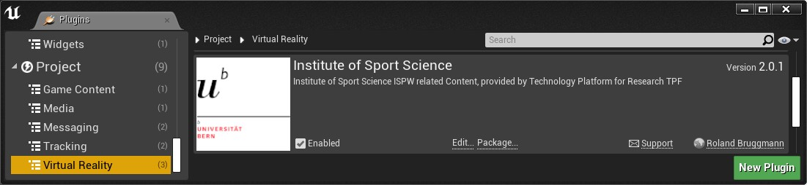
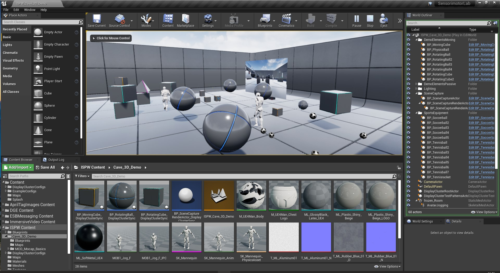
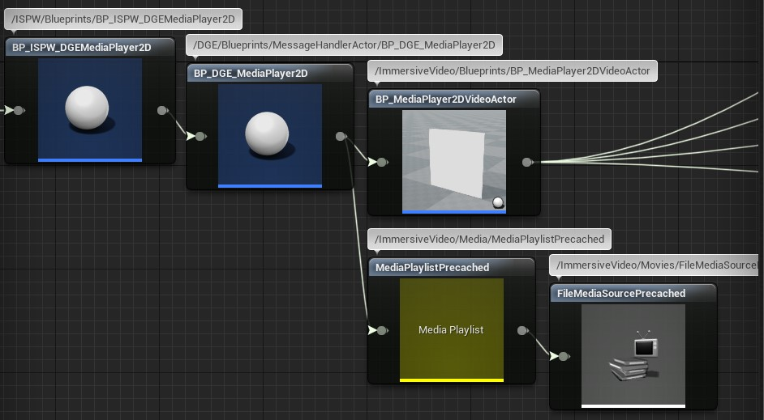
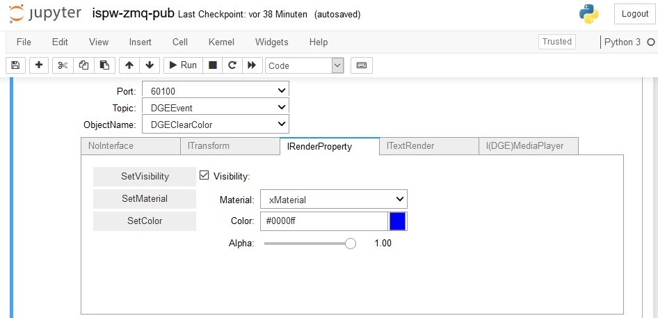

# Unreal Engine Plugin: Institute of Sport Science ISPW

Version: v2.0.1
<br>Author: Roland Bruggmann

## Description


A game plugin providing with Institute of Sport Science ISPW related assets. These are mainly Blueprints inheriting from plugin 'Distributed Game Engine DGE' but customized to environments of the ISPW, especially the Sensorimotor Laboratory with its five sided CAVE.

### Features

* A CAVE model: Static mesh of size 1100x600x420 with inverted normals and 22 locator sockets (origin, centroid, etc.)
* Plugin 'DGE' Blueprints customized to ISPW setup: MediaPlayer2D, MediaPlayer360, TextRender, Watchdog
* Plugin 'DGE / Pupil' Blueprints customized to ISPW setup: Pupil Shape Targets, Gaze, Gaze Ray and Gaze Hit
* Plugin 'DGE / Play Area' Blueprints customized to ISPW CAVE setup: Black Shields, Clear Color, Head and Collision Warning
* Blueprints customized to ISPW CAVE setup: April Tags, Color Checker
* ISPW CAVE Template Map
* Display Cluster Configurations with Simple Projection for development and EasyBlend for production

### Contents

* Blueprints: 28
* Display Cluster Configurations: 7 (no assets but *.cfg)
* Maps: 2
* Materials: 2
* Meshes: 2
* Textures: 1

### Dependencies

* Platforms Tested: PC Windows 10 (Win64)
* Supported Engine Versions: 4.26

The plugin was developed using Visual Studio 2019. It makes use of code and/or assets from other plugins which must also be installed (cp. package diagram):

* Plugin [AprilTag Images](../AprilTagImages) as well as plugin [Sports Equipment](../SportsEquipment)
* [Distributed Game Engine DGE](../DGE) and its depepndencies

Package Diagram:


### Usage

Use the plugin as project plugin (folder *MyProject/Plugins*). Add the plugin by downloading and unpackaging an archive or using git clone:

```shell
git clone https://github.com/brugr9/ISPW.git
```

To create a new level running in the SenorimotorLab CAVE copy the template map to the project content folder.



---

## Table of Contents
<!-- Start Document Outline -->

* [Table of Contents](#table-of-contents)
* [1. ISPW CAVE](#1-ispw-cave)
  * [1.1. Handedness and Units](#11-handedness-and-units)
  * [1.2. Real CAVE and Virtual Twin](#12-real-cave-and-virtual-twin)
* [2. Maps](#2-maps)
  * [2.1. Map ISPW Cave 3D Demo](#21-map-ispw-cave-3d-demo)
  * [2.2. Map ISPW Cave 360DegVideo](#22-map-ispw-cave-360degvideo)
    * [2.2.1 Message Transport](#221-message-transport)
    * [2.2.2 Level Blueprint](#222-level-blueprint)
* [3. Blueprints](#3-blueprints)
  * [3.1. BP ISPW DGEMediaPlayer2D](#31-bp-ispw-dgemediaplayer2d)
  * [3.2. BP ISPW DGEMediaPlayer360](#32-bp-ispw-dgemediaplayer360)
  * [3.3. BP ISPW Cave DGEMediaPlayer360](#33-bp-ispw-cave-dgemediaplayer360)
    * [Example Result Messages](#example-result-messages)
  * [3.4. BP ISPW DGETextRender](#34-bp-ispw-dgetextrender)
  * [3.5. BP ISPW DGEWatchdog](#35-bp-ispw-dgewatchdog)
  * [3.6. BP ISPW Cave DGEAprilTags](#36-bp-ispw-cave-dgeapriltags)
  * [3.7. BP ISPW Cave DGEColorChecker](#37-bp-ispw-cave-dgecolorchecker)
  * [3.8. BP ISPW Cave DGEClearColor](#38-bp-ispw-cave-dgeclearcolor)
  * [3.9. BP ISPW Cave DGEBlackShieldBack](#39-bp-ispw-cave-dgeblackshieldback)
  * [3.10. BP ISPW Cave DGEBlackShieldFloor](#310-bp-ispw-cave-dgeblackshieldfloor)
  * [3.11. BP ISPW Cave DGEBlackShieldFront](#311-bp-ispw-cave-dgeblackshieldfront)
  * [3.12. BP ISPW Cave DGEBlackShieldLeft](#312-bp-ispw-cave-dgeblackshieldleft)
  * [3.13. BP ISPW Cave DGEBlackShieldRight](#313-bp-ispw-cave-dgeblackshieldright)
  * [3.14. BP ISPW DGEHead](#314-bp-ispw-dgehead)
  * [3.15. BP ISPW Cave DGECollisionWarning](#315-bp-ispw-cave-dgecollisionwarning)
  * [3.16. BP ISPW DGEPupilGaze0](#316-bp-ispw-dgepupilgaze0)
  * [3.17. BP ISPW DGEPupilGaze0Ray](#317-bp-ispw-dgepupilgaze0ray)
  * [3.18. BP ISPW DGEPupilGaze0Hit](#318-bp-ispw-dgepupilgaze0hit)
  * [3.19. BP ISPW DGEPupilGaze1](#319-bp-ispw-dgepupilgaze1)
  * [3.20. BP ISPW DGEPupilGaze1Ray](#320-bp-ispw-dgepupilgaze1ray)
  * [3.21. BP ISPW DGEPupilGaze1Hit](#321-bp-ispw-dgepupilgaze1hit)
  * [3.22. BP ISPW DGEPupilShapeTarget](#322-bp-ispw-dgepupilshapetarget)
  * [3.23. BP ISPW DGEPupilShapeTarget HeadProjection](#323-bp-ispw-dgepupilshapetarget-headprojection)
* [4. Testing](#4-testing)
  * [4.1 Display Cluster Configuration](#41-display-cluster-configuration)
    * [Config Files](#config-files)
  * [4.2. Packaging](#42-packaging)
  * [4.3 nDisplay Launcher](#43-ndisplay-launcher)
    * [4.3.1 Load Non Default Map](#431-load-non-default-map)
    * [4.3.2 Test Pattern](#432-test-pattern)
  * [4.4 Jupyter Notebook](#44-jupyter-notebook)
* [A. References](#a-references)

<!-- End Document Outline -->
<div style='page-break-after: always'></div>

## 1. ISPW CAVE

### 1.1. Handedness and Units

Handedness:

* Enterprise Service Bus ESB:
  * The (orthonormal) basis of ESB is a right handed coordinate system RHS (by ISPW convention); Therefore: Project Settings > Plugins > ESB Messaging > Transformation > Input Coordinate System Type: RHS
  * RHS: X+ is 'Front', Y+ is 'Left', Z+ is 'Up' (by ISPW convention)
* Unreal Engine:
  * The (orthonormal) basis of UE is a left handed coordinate system LHS
  * LHS: X+ is 'Front', Y+ is 'Right', Z+ is 'Up' (by ISPW convention)

Units:

* Location / Rotation / Scale in Unreal Units UU
* 1m in reality is represented by 100 UU (by ISPW convention); Therefore: Project Settings > Plugins > ESB Messaging > Transformation > Input Unit Factor: 100.0

Screenshot of Project Settings, Plugin ESBMessaging:


<div style='page-break-after: always'></div>

### 1.2. Real CAVE and Virtual Twin

* The (orthonormal) basis of ESB and UE have its origin (0/0/0) in the same point both, with Z-axis in up-direction.
* The real CAVE front left bottom corner is defined as origin (by ISPW convention) which is virtually represented by location (X=0.0,Y=0.0,Z=0.0) in UU
* Concrete:
  * The real CAVE cuboid measures -11m x 6m x 4.2m, virtually represented by a StaticMesh of dimension (X=-1100.0,Y=600.0,Z=420.0) in UU (see 'Screenshot of StaticMesh SM_ISPW_Cave_InverseNormals')
  * The real CAVE centroid is found at point -5.5m x 3m x 2.1m, virtually represented by location (X=-550.0,Y=300.0,Z=210.0) in UU
* Light up tub:
  * The real CAVE projectors light up a tub of size -11m x 6m x 3.75m, its virtual dimension is (X=-1100.0,Y=600.0,Z=375.0) in UU; the nDisplay configurations viewport dimensions are based on this tub - especially the height is decisive
  * The tub centroid is found at point -5.5m x 3m x 1.875m (cp. nDisplay configurations)

Screenshot of CAVE model StaticMesh SM_ISPW_Cave_InverseNormals with 22 named locator sockets:


<div style='page-break-after: always'></div>

## 2. Maps

### 2.1. Map ISPW Cave 3D Demo

The map `ISPW_Cave_3D_Demo` is intended to demonstrate the real-time rendering of 3D content in mono but also in stereo mode and the perception of the same using shutter glasses in the ISPW SenorimotorLab CAVE:

* Six 'RotatingBall's and 'RotatingCube's were placed in the CAVE's corners or in the left and right side wall halfes respectively to test or demonstrate the display cluster synchronization.
* The map also demonstrates real-time physics rendering when an active 'MovingCube' collides with a passive 'PhysicsBall' - both are fixed to move in the YZ-plane. The soccerballs and tennisballs from the plugin 'SportsEquipment' are jumping individually due to their physical materials.
* Furthermore the map demonstrates animation by one avatar walking and a second one running.
* The possibilities of screen capture and rendering from the 'ImmersiveVideo' plugin are also demonstrated by pointing a camera into the room from the front and projecting the image onto a virtual screen on the right.

To create a new SenorimotorLab CAVE level for 3D real-time rendering demonstration copy the template map `ISPW_Cave_3D_Demo` into your project content folder. Please remark: The level as is **does not support ESB-Messaging**.

Screenshot of map ISPW_Cave_3D_Demo in the UE4 Editor:



<div style='page-break-after: always'></div>

### 2.2. Map ISPW Cave 360DegVideo

The map `ISPW_Cave_360DegVideo` provides with lab integration enabled by a newly developed messaging layer which allow VR-objects to be controlled by the lab's experiment management system and CAVE-specific content to be rendered:

* DGE-Plugin Blueprints customized to ISPW setup: MediaPlayer2D, MediaPlayer360, TextRender, Watchdog
* Pupil-Plugin Blueprints customized to ISPW setup: Pupil Shape Targets, Gaze, Gaze Ray and Gaze Hit
* Play-Area-Plugin Blueprints customized to ISPW CAVE setup: Black Shields, Clear Color, Head and Collision Warning
* Further Blueprints customized to ISPW CAVE setup: April Tags, Color Checker

To create a new SenorimotorLab CAVE level supporting ESB-Messaging and 360° Video Playback copy the template map `ISPW_Cave_360DegVideo` into your project content folder.

Screenshot of map ISPW_Cave_360DegVideo in the UE4 Editor:


<div style='page-break-after: always'></div>

#### 2.2.1 Message Transport

The map implements the ZeroMQ PUB/SUB Pattern from Plugin 'ESB-Messaging' using communication channels as follows:

*  Enterprise Service Bus ESB with 10 ZeroMQ Sockets
  * 5 ZeroMQ PUB-Sockets: one of each connects port 60100 - 60104
  * 5 ZeroMQ SUB-Sockets: one of each connects port 60000 - 60003 and binds port 60004
*  UE4 with 10 ZmqSocket-Actors
  * 5 ZmqSubSockets (Actors): one of each binds port 60100 - 60104 (IP from DisplayCluster config, 'Display Cluster Main Node Host')
  * 5 ZmqPubSockets (Actors): one of each binds ports 60000 - 60003 (IP from DisplayCluster config, 'Display Cluster Main Node Host') and connects port 60004 (IP: Value from Project Settings, Plugin ESBMessaging,  'Endpoint IP ESB'; cp. Screenshot of Project Settings, Plugin ESBMessaging)

Screenshot of Project Settings, Plugin ESBMessaging:


##### 2.2.1.1. Communication Channel 'Event'

* Setup:
  * ESB ZeroMQ SUB-Socket connects port 60000 and subscribes topic 'DGEEvent'
  * ESB ZeroMQ PUB-Socket connects port 60100
  * UE4 ZmqPubSocket (Actor) binds port 60000
  * UE4 ZmqSubSocket (Actor) binds port 60100
  * UE4 ZmqSubscribe (ActorComponent) subscribes topic 'DGEEvent'
* Sequence:
  * ESB ZeroMQ PUB-Socket connected to port 60100 publishes message using topic 'DGEEvent'
  * UE4 ZmqSubSocket (Actor) bound to port 60100 receives message and notifies ZmqSubscribe (ActorComponent)
  * UE4 ZmqSubscribe (ActorComponent) filters message using topic 'DGEEvent'
  * UE4 BP Process Data: Deserialize message, interpret message (e.g., call function), serialize result message
  * UE4 ZmqPublish (ActorComponent) publishes message using topic 'DGEEvent'
  * UE4 ZmqPubSocket (Actor) bound to port 60000 publishes message
  * ESB ZeroMQ SUB-Socket connected to port 60000 receives message

Communication Diagram 'Event':


##### 2.2.1.2. Communication Channel Datastream 'EyeLeft'

* Setup:
  * ESB ZeroMQ SUB-Socket connects port 60001 and subscribes topic 'DGEEyeGazeHitLeft'
  * ESB ZeroMQ PUB-Socket connects port 60101
  * UE4 ZmqPubSocket (Actor) binds port 60001
  * UE4 ZmqSubSocket (Actor) binds port 60101
  * UE4 ZmqSubscribe (ActorComponent) subscribes topic 'DGEEyeLeft'
* Sequence:
  * ESB ZeroMQ PUB-Socket connected to port 60101 publishes message using topic 'DGEEyeLeft' (ESBMessaging Interface EsbTransform)
  * UE4 ZmqSubSocket (Actor) bound to port 60101 receives message and notifies ZmqSubscribe (ActorComponent)
  * UE4 ZmqSubscribe (ActorComponent) filters message using topic 'DGEEyeLeft'
  * UE4 BP Process Data: Deserialize message, interpret message (e.g., call function), serialize result message
  * UE4 ZmqPublish (ActorComponent) publishes message using topic 'DGEEyeGazeHitLeft'
  * UE4 ZmqPubSocket (Actor) bound to port 60001 publishes message
  * ESB ZeroMQ SUB-Socket connected to port 60001 receives message

Communication Diagram 'Datastream EyeLeft':


##### 2.2.1.3. Communication Channel Datastream 'EyeRight'

* Setup:
  * ESB ZeroMQ SUB-Socket connects port 60002 and subscribes topic 'DGEEyeGazeHitRight'
  * ESB ZeroMQ PUB-Socket connects port 60102
  * UE4 ZmqPubSocket (Actor) binds port 60002
  * UE4 ZmqSubSocket (Actor) binds port 60102
  * UE4 ZmqSubscribe (ActorComponent) subscribes topic 'DGEEyeRight'
* Sequence:
  * ESB ZeroMQ PUB-Socket connected to port 60102 publishes message using topic 'DGEEyeRight' (ESBMessaging Interface EsbTransform)
  * UE4 ZmqSubSocket (Actor) bound to port 60102 receives message and notifies ZmqSubscribe (ActorComponent)
  * UE4 ZmqSubscribe (ActorComponent) filters message using topic 'DGEEyeRight'
  * UE4 BP Process Data: Deserialize message, interpret message (e.g., call function), serialize result message
  * UE4 ZmqPublish (ActorComponent) publishes message using topic 'DGEEyeGazeHitRight'
  * UE4 ZmqPubSocket (Actor) bound to port 60002 publishes message
  * ESB ZeroMQ SUB-Socket connected to port 60002 receives message

Communication Diagram 'Datastream EyeRight':


##### 2.2.1.4. Communication Channel Datastream 'Head'

* Setup:
  * ESB ZeroMQ PUB-Socket connects port 60103
  * UE4 ZmqSubSocket (Actor) binds port 60103
  * UE4 ZmqSubscribe (ActorComponent) subscribes topic 'DGEHead'
* Sequence:
  * ESB ZeroMQ PUB-Socket connected to port 60103 publishes message using topic 'DGEHead' (ESBMessaging Interface EsbTransform)
  * UE4 ZmqSubSocket (Actor) bound to port 60103 receives message and notifies ZmqSubscribe (ActorComponent)
  * UE4 ZmqSubscribe (ActorComponent) filters message using topic 'DGEHead'
  * UE4 BP Process Data: Deserialize message, interpret message (e.g., call function)

Communication Diagram 'Datastream Head':


<div style='page-break-after: always'></div>

##### 2.2.1.5. Communication Channel Datastream 'HeadProjection'

* Setup:

  * ESB ZeroMQ PUB-Socket connects port 60104
  * UE4 ZmqSubSocket (Actor) binds port 60104
  * UE4 ZmqSubscribe (ActorComponent) subscribes topic 'DGEHeadProjection'
* Sequence:
  * ESB ZeroMQ PUB-Socket connected to port 60104 publishes message using topic 'DGEHeadProjection' (ESBMessaging Interface EsbTransform)
  * UE4 ZmqSubSocket (Actor) bound to port 60104 receives message and notifies ZmqSubscribe (ActorComponent)
  * UE4 ZmqSubscribe (ActorComponent) filters message using topic 'DGEHeadProjection'
  * UE4 BP Process Data: Deserialize message, interpret message (e.g., call function)

Communication Diagram 'Datastream HeadProjection':


##### 2.2.1.6. Communication Channel Datastream 'Watchdog'

* Setup:
  * ESB ZeroMQ SUB-Socket connects port 60003 and subscribes topic 'DGEWatchdog'
  * UE4 ZmqPubSocket (Actor) binds port 60003
* Sequence:
  * UE4 BP Process Data: Serialize message
  * UE4 ZmqPublish (ActorComponent) publishes message using topic 'DGEWatchdog'
  * UE4 ZmqPubSocket (Actor) bound to port 60003 publishes message
  * ESB ZeroMQ SUB-Socket connected to port 60003 receives message

Communication Diagram 'Datastream Watchdog':


<div style='page-break-after: always'></div>

##### 2.2.1.7. Communication Channel Datastream 'VideoRenderTick 360Deg'

* Setup:
  * ESB ZeroMQ SUB-Socket connects port 60004 and subscribes topic 'DGE360DegVideoRenderTick'
  * UE4 ZmqPubSocket (Actor) binds port 60004
* Sequence:
  * UE4 BP Process Data: Serialize message
  * UE4 ZmqPublish (ActorComponent) publishes message using topic 'DGE360DegVideoRenderTick'
  * UE4 ZmqPubSocket (Actor) bound to port 60004 publishes message
  * ESB ZeroMQ SUB-Socket connected to port 60004 receives message

Communication Diagram 'Datastream VideoRenderTick 360Deg':


##### 2.2.1.8. Communication Channel Datastream 'VideoRenderTick Planar'

* Setup:
  * ESB ZeroMQ SUB-Socket connects port 60004 and subscribes topic 'DGEPlanarDegVideoRenderTick'
  * UE4 ZmqPubSocket (Actor) binds port 60004
* Sequence:
  * UE4 BP Process Data: Serialize message
  * UE4 ZmqPublish (ActorComponent) publishes message using topic 'DGEPlanarDegVideoRenderTick'
  * UE4 ZmqPubSocket (Actor) bound to port 60004 publishes message
  * ESB ZeroMQ SUB-Socket connected to port 60004 receives message

Communication Diagram 'Datastream VideoRenderTick Planar':


<div style='page-break-after: always'></div>

#### 2.2.2 Level Blueprint

* Entry Point **BeginPlay**: Branch on 'Is DisplayCluster Main Node'?
* Case *True* (Main Node):
  * *Link ZmqSockets*:
    * Configure ZmqSocket Link: Value LinkInfo.Host becomes 'Display Cluster Main Node Host' (Value from Display Cluster Configuration) or 'Endpoint IP ESB' (Value from Project Settings, Plugin ESBMessaging)
    * Initialise Context and Sockets
    * ZmqSocketActors: Bind or Connect
  * *Sockets Linked*: For every ESBMessageHandlerActor interpret message (e.g., call function) 'CustomEventOnZmqSocketsLinked'
  * *Timer Based Receive*: Start calling ZmqSubSocketActor's function 'Receive' every millisecond
* Case *False* (Client Nodes):
  * *ZmqPubSocketActor_60004 Temporarily Connect*:
    * Configure ZmqSocketActor's LinkInfo.Host: 'Endpoint IP ESB' (Value from Project Settings, Plugin ESBMessaging)
    * Initialise Context and Sockets
    * ZmqPubSocketActor_60004: Connect

Screenshot of map ISPW_Cave_360DegVideo Level Blueprint in UE4 Editor:


<div style='page-break-after: always'></div>

## 3. Blueprints

An overview of Blueprints and handled object names (Actor-Component ESBMessageHandler, Handled ObjectName) and supported function names (ESBMessaging Interfaces) or expected responses respectively may be found in table 'ISPW ObjectNames and Interface Functions':


### 3.1. BP ISPW DGEMediaPlayer2D

* Folder: Content / Blueprints
* Parent Class: DGE / Content / Blueprints / MessageHandlerActor / BP_DGE_MediaPlayer2D
* Customized Values:
  * Scene, Scale: (X=100.000000,Y=100.000000,Z=100.000000)
  * ChildActor MediaPlayer2D, Scale: (X=0.010000,Y=0.010000,Z=0.010000)
  * ZmqSubscribe: Topic 'DGEEvent'
  * ZmqPublish: Topic 'DGEEvent'
  * ZmqPublish\_RenderTick: Topic 'DGEPlanarVideoRenderTick'
  * EsbMessageHandler: Handled Object Name 'DGEPlanarVideo'
  * ESB Messaging, implemented Interfaces FunctionNames: SetLocationAndRotation, SetTransformQuat, SetTransform, SetLocation, SetRotation, SetRotationQuat, SetScale, SetVisibility, SetColor, SetMaterial^1, OpenFile, Play, Pause, Seek, Close
  * 1) Material: ClearColor, MediaTexture

See also Plugin ESBMessaging documentation, section "UE4 MediaPlayer as State Machine".

<div style='page-break-after: always'></div>

Screenshot of BP_ISPW_DGEMediaPlayer2D in ReferenceViewer:



Customized Blueprint values in map ISPW_Cave_360DegVideo (Path DGE / BP_ISPW_DGEMediaPlayer2D):

* Scene:
  * Location: (X=2.400000,Y=0.000000,Z=0.000000)
  * Scale: (X=1.000000,Y=600.000000,Z=375.000000)
* ZmqSubscribe, Zmq Sub Socket Actor: ZmqSubSocketActor\_60100
* ZmqPublish, Zmq Pub Socket Actor: ZmqPubSocketActor\_60000
* ZmqPublish\_RenderTick, Zmq Pub Socket Actor: ZmqPubSocketActor\_60004

Communication Diagram Event:


Communication Diagram Datastream RenderTick:


<div style='page-break-after: always'></div>

### 3.2. BP ISPW DGEMediaPlayer360

* Folder: Content / Blueprints
* Parent Class: DGE / Content / Blueprints / MessageHandlerActor / BP_DGE_MediaPlayer360
* Customized Values:
  * Scene, Scale: (X=100.000000,Y=100.000000,Z=100.000000)
  * ChildActor MediaPlayer360, Scale: (X=0.010000,Y=0.010000,Z=0.010000)
  * ZmqPublish: Topic 'DGEEvent'
  * ZmqSubscribe: Topic 'DGEEvent'
  * ZmqPublish\_RenderTick: Topic 'DGE360DegVideoRenderTick'
  * EsbMessageHandler: Handled Object Name 'DGE360DegVideo'
  * ESB Messaging, implemented Interfaces FunctionNames: SetLocationAndRotation, SetTransformQuat, SetTransform, SetLocation, SetRotation, SetRotationQuat, SetScale, SetVisibility, SetColor, SetMaterial^1, OpenFile, Play, Pause, Seek, Close
  * 1) Material: ClearColor, MediaTexture

Screenshot of BP_ISPW_DGEMediaPlayer360 in ReferenceViewer:


<div style='page-break-after: always'></div>

### 3.3. BP ISPW Cave DGEMediaPlayer360

* Folder: Content / Blueprints
* Parent Class: BP_ISPW_DGEMediaPlayer360
* Customized Values:
  * Scene, Scale: (X=2800.000000,Y=2800.000000,Z=2800.000000) ^1

1) The screen of DGEMediaPlayer360 is a sphere. The screen sphere encases the CAVE cuboid. The sphere and the cuboid should never intersect. The center of the sphere corresponds to the position of the camera, which is moved by a MoCap tracked person inside the CAVE. Assuming that the center of the sphere is always inside the cuboid, the radius of the sphere must therefore be at least equal to the space diagonal of the cuboid. The cuboid space diagonal measures sqrt((1100.0 UU)^2 + (600.0 UU)^2 + (420.0 UU)^2) = 1321.51 UU which, rounded up, gives a value of 1400.0 UU. Used as sphere radius results in a sphere diameter of 2800.0 UU.

#### Example Result Messages

* DGE360DegVideo_OpenFile: [Error](Testing/Schemas/Examples/UE4-ESBMessageDGEEventResult-v1_0.example.DGE360DegVideo_OpenFile_Error.json), [Success](Testing/Schemas/Examples/UE4-ESBMessageDGEEventResult-v1_0.example.DGE360DegVideo_OpenFile_Success.json)
* DGE360DegVideo_Play: [Success](Testing/Schemas/Examples/UE4-ESBMessageDGEEventResult-v1_0.example.DGE360DegVideo_Play_Success.json), [Warning](Testing/Schemas/Examples/UE4-ESBMessageDGEEventResult-v1_0.example.DGE360DegVideo_Play_Warning.json)
* DGE360DegVideo_Pause: [Success](Testing/Schemas/Examples/UE4-ESBMessageDGEEventResult-v1_0.example.DGE360DegVideo_Pause_Success.json), [Warning](Testing/Schemas/Examples/UE4-ESBMessageDGEEventResult-v1_0.example.DGE360DegVideo_Pause_Warning.json)
* DGE360DegVideo_Seek: [Success](Testing/Schemas/Examples/UE4-ESBMessageDGEEventResult-v1_0.example.DGE360DegVideo_Seek_Success.json)
* DGE360DegVideo_Close: [Success](Testing/Schemas/Examples/UE4-ESBMessageDGEEventResult-v1_0.example.DGE360DegVideo_Close_Success.json)

See also Plugin ESBMessaging documentation, section "UE4 MediaPlayer as State Machine".

Screenshot of BP_ISPW_Cave_DGEMediaPlayer360 in ReferenceViewer:


Customized Blueprint values in map ISPW_Cave_360DegVideo (Path DGE / BP_ISPW_Cave_DGEMediaPlayer360):

* ZmqSubscribe, Zmq Sub Socket Actor: ZmqSubSocketActor\_60100
* ZmqPublish, Zmq Pub Socket Actor: ZmqPubSocketActor\_60000
* ZmqPublish\_RenderTick, Zmq Pub Socket Actor: ZmqPubSocketActor\_60004

Communication Diagram Event:


Communication Diagram Datastream RenderTick:


<div style='page-break-after: always'></div>

### 3.4. BP ISPW DGETextRender

* Folder: Content / Blueprints
* Parent Class: DGE / Content / Blueprints / MessageHandlerActor / BP_DGE_TextRender
* Customized Values:
  * Scene, Scale: (X=100.000000,Y=100.000000,Z=100.000000)
  * ChildActorComponent, Scale: (X=0.010000,Y=0.010000,Z=0.010000)
  * ZmqSubscribe: Topic 'DGEEvent'
  * ZmqPublish: Topic 'DGEEvent'
  * EsbMessageHandler: Handled Object Name 'DGETextRender'
  * ESB Messaging, implemented Interfaces FunctionNames: SetLocationAndRotation, SetTransformQuat, SetTransform, SetLocation, SetRotation, SetRotationQuat, SetScale, SetVisibility, SetText, SetFormatText, SetFontColor

Please consider:

* SetFormatText: Change of horizontal and/or vertical alignment relates to the text pivot, which results in a visually moving center of the text (cp. documentation plugin 'ESBMessaging').

Screenshot of BP_ISPW_DGETextRender in ReferenceViewer:


Customized Blueprint values in map ISPW_Cave_360DegVideo (Path DGE / BP_ISPW_DGETextRender):

* Scene, Rendering, Visible: false
* TextRender Component, Rendering, Visible: false
* ZmqSubscribe, Zmq Sub Socket Actor: ZmqSubSocketActor\_60100
* ZmqPublish, Zmq Pub Socket Actor: ZmqPubSocketActor\_60000

Communication Diagram Event:


<div style='page-break-after: always'></div>

### 3.5. BP ISPW DGEWatchdog

* Folder: Content / Blueprints
* Parent Class: ESBMessaging / Content / Blueprints / BP_ESB_Watchdog
* Customized Values:
  * ZmqPublish: Topic 'DGEWatchdog'
  * EsbMessageHandler: Handled Object Name 'DGEWatchdog'

Screenshot of BP_ISPW_DGEWatchdog in ReferenceViewer:


Customized Blueprint values in map ISPW_Cave_360DegVideo (Path DGE / BP_ISPW_DGEWatchdog):

* ZmqPublish, Zmq Pub Socket Actor: ZmqPubSocketActor\_60003

Communication Diagram Datastream Watchdog:


<div style='page-break-after: always'></div>

### 3.6. BP ISPW Cave DGEAprilTags

* Folder: Content / Blueprints / PlayArea
* Parent Class: DGEMessageHandlerActor
* Customized Values:
  * Scene, Scale: (X=1095.600000,Y=597.600000,Z=418.320000) ; cp. Table 'ISPW PlayArea-Objects Location and Scale'
  * StaticMeshComponent, Scale: (X=0.000910,Y=0.001667,Z=0.002381) (values derived from 1/1100, 1/600, 1/420)
  * ZmqSubscribe: Topic 'DGEEvent'
  * ZmqPublish: Topic 'DGEEvent'
  * EsbMessageHandler: Handled Object Name 'DGEAprilTags'
  * ESB Messaging, implemented Interfaces FunctionNames: SetLocationAndRotation, SetTransformQuat, SetTransform, SetLocation, SetRotation, SetRotationQuat, SetScale, SetVisibility

Table 'ISPW PlayArea-Objects Location and Scale':


The Blueprint makes use of CAVE model StaticMesh which provides with locator sockets, see screenshot of StaticMesh SM_ISPW_Cave_InverseNormals:


<div style='page-break-after: always'></div>

Screenshot of BP_ISPW_Cave_DGEAprilTags with bundled AprilTag 36_11 Images in ReferenceViewer:


Customized Blueprint values in map ISPW_Cave_360DegVideo (Path DGE / PlayArea / BP_ISPW_Cave_DGEAprilTags):

* Scene:
  * Location: (X=-2.200000,Y=1.200000,Z=0.840000) ; cp. Table 'ISPW PlayArea-Objects Location and Scale'
  * Rendering, Visible: false
* StaticMesh, Rendering, Visible: false
* Child Actor Components, Rendering, Visible: false
* ZmqSubscribe, Zmq Sub Socket Actor: ZmqSubSocketActor\_60100
* ZmqPublish, Zmq Pub Socket Actor: ZmqPubSocketActor\_60000

Communication Diagram Event:


<div style='page-break-after: always'></div>

### 3.7. BP ISPW Cave DGEColorChecker

* Folder: Content / Blueprints / PlayArea
* Parent Class: DGEMessageHandlerActor
* Customized Values:
  * Scene, Scale: (X=1097.800000,Y=598.800000,Z=419.160000) ; cp. Table 'ISPW PlayArea-Objects Location and Scale'
  * StaticMeshComponent, Scale: (X=0.000910,Y=0.001667,Z=0.002381) (values derived from 1/1100, 1/600, 1/420)
  * ZmqSubscribe: Topic 'DGEEvent'
  * ZmqPublish: Topic 'DGEEvent'
  * EsbMessageHandler: Handled Object Name 'DGEColorChecker'
  * ESB Messaging, implemented Interfaces FunctionNames: SetLocationAndRotation, SetTransformQuat, SetTransform, SetLocation, SetRotation, SetRotationQuat, SetScale, SetVisibility

Table 'ISPW PlayArea-Objects Location and Scale':


The Blueprint makes use of CAVE model StaticMesh which provides with locator sockets, see screenshot of StaticMesh SM_ISPW_Cave_InverseNormals:


<div style='page-break-after: always'></div>

Screenshot of BP_ISPW_Cave_DGEColorChecker in ReferenceViewer:


Customized Blueprint values in map ISPW_Cave_360DegVideo (Path DGE / PlayArea / BP_ISPW_Cave_DGEColorChecker):

* Scene:
  * Location: (X=-1.100000,Y=0.600000,Z=0.420000) ; cp. Table 'ISPW PlayArea-Objects Location and Scale'
  * Rendering, Visible: false
* StaticMesh, Rendering, Visible: false
* Child Actor Components, Rendering, Visible: false
* ZmqSubscribe, Zmq Sub Socket Actor: ZmqSubSocketActor\_60100
* ZmqPublish, Zmq Pub Socket Actor: ZmqPubSocketActor\_60000

Communication Diagram Event:


<div style='page-break-after: always'></div>

### 3.8. BP ISPW Cave DGEClearColor

* Folder: Content / Blueprints / PlayArea
* Parent Class: DGE / Content / Blueprints / MessageHandlerActor / PlayArea / BP_DGE_ClearColor
* Customized Values:
  * Scene, Scale: (X=1104.400000,Y=602.400000,Z=421.680000) ; cp. Table 'ISPW PlayArea-Objects Location and Scale'
  * ChildActorComponent, Scale: (X=0.010000,Y=0.010000,Z=0.010000)
  * ZmqSubscribe: Topic 'DGEEvent'
  * ZmqPublish: Topic 'DGEEvent'
  * EsbMessageHandler: Handled Object Name 'DGEClearColor'
  * ESB Messaging, implemented Interfaces FunctionNames: SetLocationAndRotation, SetTransformQuat, SetTransform, SetLocation, SetRotation, SetRotationQuat, SetScale, SetVisibility, SetColor

Table 'ISPW PlayArea-Objects Location and Scale':


Screenshot of BP_ISPW_Cave_DGEClearColor in ReferenceViewer:


Customized Blueprint values in map ISPW_Cave_360DegVideo (Path DGE / PlayArea / BP_ISPW_Cave_DGEClearColor):

* Scene:
  * Location: (X=2.200000,Y=-1.200000,Z=-0.840000) ; cp. Table 'ISPW PlayArea-Objects Location and Scale'
* ZmqSubscribe, Zmq Sub Socket Actor: ZmqSubSocketActor\_60100
* ZmqPublish, Zmq Pub Socket Actor: ZmqPubSocketActor\_60000

Communication Diagram Event:


### 3.9. BP ISPW Cave DGEBlackShieldBack

* Folder: Content / Blueprints / PlayArea
* Parent Class: DGE / Content / Blueprints / MessageHandlerActor / PlayArea / BP_DGE_BlackShieldBack
* Customized Values:
  * Scene, Scale: (X=1100.000000,Y=600.000000,Z=420.000000) ; cp. Table 'ISPW PlayArea-Objects Location and Scale'
  * ChildActorComponent, Scale: (X=0.010000,Y=0.010000,Z=0.010000)
  * ZmqSubscribe: Topic 'DGEEvent'
  * ZmqPublish: Topic 'DGEEvent'
  * EsbMessageHandler: Handled Object Name 'DGEBlackShieldBoxWallBack'
  * ESB Messaging, implemented Interfaces FunctionNames: SetLocationAndRotation, SetTransformQuat, SetTransform, SetLocation, SetRotation, SetRotationQuat, SetScale, SetVisibility

Table 'ISPW PlayArea-Objects Location and Scale':


<div style='page-break-after: always'></div>

Screenshot of BP_ISPW_Cave_DGEBlackShieldBack in ReferenceViewer:


Customized Blueprint values in map ISPW_Cave_360DegVideo (Path DGE / PlayArea / BlackShield / BP_ISPW_Cave_DGEBlackShieldBack):

* Scene:
  * Location: (X=-1100.000000,Y=0.000000,Z=0.000000)
  * Rendering, Visible: false
* Child Actor Component, Rendering, Visible: false
* ZmqSubscribe, Zmq Sub Socket Actor: ZmqSubSocketActor\_60100
* ZmqPublish, Zmq Pub Socket Actor: ZmqPubSocketActor\_60000

Communication Diagram Event:


<div style='page-break-after: always'></div>

### 3.10. BP ISPW Cave DGEBlackShieldFloor

* Folder: Content / Blueprints / PlayArea
* Parent Class: DGE / Content / Blueprints / MessageHandlerActor / PlayArea / BP_DGE_BlackShieldFloor
* Customized Values:
  * Scene, Scale: (X=1100.000000,Y=600.000000,Z=420.000000) ; cp. Table 'ISPW PlayArea-Objects Location and Scale'
  * ChildActorComponent, Scale: (X=0.010000,Y=0.010000,Z=0.010000)
  * ZmqSubscribe: Topic 'DGEEvent'
  * ZmqPublish: Topic 'DGEEvent'
  * EsbMessageHandler: Handled Object Name 'DGEBlackShieldBoxFloor'
  * ESB Messaging, implemented Interfaces FunctionNames: SetLocationAndRotation, SetTransformQuat, SetTransform, SetLocation, SetRotation, SetRotationQuat, SetScale, SetVisibility

Table 'ISPW PlayArea-Objects Location and Scale':


Customized Blueprint values in map ISPW_Cave_360DegVideo (Path DGE / PlayArea / BlackShield / BP_ISPW_Cave_DGEBlackShieldFloor):

* Scene, Rendering, Visible: false
* Child Actor Component, Rendering, Visible: false
* ZmqSubscribe, Zmq Sub Socket Actor: ZmqSubSocketActor\_60100
* ZmqPublish, Zmq Pub Socket Actor: ZmqPubSocketActor\_60000

Communication Diagram Event:


<div style='page-break-after: always'></div>

### 3.11. BP ISPW Cave DGEBlackShieldFront

* Folder: Content / Blueprints / PlayArea
* Parent Class: DGE / Content / Blueprints / MessageHandlerActor / PlayArea / BP_DGE_BlackShieldFront
* Customized Values:
  * Scene, Scale: (X=1100.000000,Y=600.000000,Z=420.000000) ; cp. Table 'ISPW PlayArea-Objects Location and Scale'
  * ChildActorComponent, Scale: (X=0.010000,Y=0.010000,Z=0.010000)
  * ZmqSubscribe: Topic 'DGEEvent'
  * ZmqPublish: Topic 'DGEEvent'
  * EsbMessageHandler: Handled Object Name 'DGEBlackShieldBoxWallFront'
  * ESB Messaging, implemented Interfaces FunctionNames: SetLocationAndRotation, SetTransformQuat, SetTransform, SetLocation, SetRotation, SetRotationQuat, SetScale, SetVisibility

Table 'ISPW PlayArea-Objects Location and Scale':


Customized Blueprint values in map ISPW_Cave_360DegVideo (Path DGE / PlayArea / BlackShield / BP_ISPW_Cave_DGEBlackShieldFront):

* Scene, Rendering, Visible: false
* Child Actor Component, Rendering, Visible: false
* ZmqSubscribe, Zmq Sub Socket Actor: ZmqSubSocketActor\_60100
* ZmqPublish, Zmq Pub Socket Actor: ZmqPubSocketActor\_60000

Communication Diagram Event:


<div style='page-break-after: always'></div>

### 3.12. BP ISPW Cave DGEBlackShieldLeft

* Folder: Content / Blueprints / PlayArea
* Parent Class: DGE / Content / Blueprints / MessageHandlerActor / PlayArea / BP_DGE_BlackShieldLeft
* Customized Values:
  * Scene, Scale: (X=1100.000000,Y=600.000000,Z=420.000000) ; cp. Table 'ISPW PlayArea-Objects Location and Scale'
  * ChildActorComponent, Scale: (X=0.010000,Y=0.010000,Z=0.010000)
  * ZmqSubscribe: Topic 'DGEEvent'
  * ZmqPublish: Topic 'DGEEvent'
  * EsbMessageHandler: Handled Object Name 'DGEBlackShieldBoxWallLeft'
  * ESB Messaging, implemented Interfaces FunctionNames: SetLocationAndRotation, SetTransformQuat, SetTransform, SetLocation, SetRotation, SetRotationQuat, SetScale, SetVisibility

Table 'ISPW PlayArea-Objects Location and Scale':


Customized Blueprint values in map ISPW_Cave_360DegVideo (Path DGE / PlayArea / BlackShield / BP_ISPW_Cave_DGEBlackShieldLeft):

* Scene, Rendering, Visible: false
* Child Actor Component, Rendering, Visible: false
* ZmqSubscribe, Zmq Sub Socket Actor: ZmqSubSocketActor\_60100
* ZmqPublish, Zmq Pub Socket Actor: ZmqPubSocketActor\_60000

Communication Diagram Event:


<div style='page-break-after: always'></div>

### 3.13. BP ISPW Cave DGEBlackShieldRight

* Folder: Content / Blueprints / PlayArea
* Parent Class: DGE / Content / Blueprints / MessageHandlerActor / PlayArea / BP_DGE_BlackShieldRight
* Customized Values:
  * Scene, Scale: (X=1100.000000,Y=600.000000,Z=420.000000) ; cp. Table 'ISPW PlayArea-Objects Location and Scale'
  * ChildActorComponent, Scale: (X=0.010000,Y=0.010000,Z=0.010000)
  * ZmqSubscribe: Topic 'DGEEvent'
  * ZmqPublish: Topic 'DGEEvent'
  * EsbMessageHandler: Handled Object Name 'DGEBlackShieldBoxWallRight'
  * ESB Messaging, implemented Interfaces FunctionNames: SetLocationAndRotation, SetTransformQuat, SetTransform, SetLocation, SetRotation, SetRotationQuat, SetScale, SetVisibility

Table 'ISPW PlayArea-Objects Location and Scale':


Customized Blueprint values in map ISPW_Cave_360DegVideo (Path DGE / PlayArea / BlackShield / BP_ISPW_Cave_DGEBlackShieldRight):

* Scene:
  * Location: (X=0.000000,Y=600.000000,Z=0.000000)
  * Rendering, Visible: false
* Child Actor Component, Rendering, Visible: false
* ZmqSubscribe, Zmq Sub Socket Actor: ZmqSubSocketActor\_60100
* ZmqPublish, Zmq Pub Socket Actor: ZmqPubSocketActor\_60000

Communication Diagram Event:


<div style='page-break-after: always'></div>

### 3.14. BP ISPW DGEHead

* Folder: Content / Blueprints / PlayArea
* Parent Class: DGE / Content / Blueprints / MessageHandlerActor / PlayArea / BP_DGE_Head
* Customized Values:
  * Scene, Scale: (X=100.000000,Y=100.000000,Z=100.000000)
  * ChildActorComponent, Scale: (X=0.010000,Y=0.010000,Z=0.010000)
  * ZmqSubscribe: Topic 'DGEEvent'
  * ZmqPublish: Topic 'DGEEvent'
  * EsbMessageHandler: Handled Object Name 'DGEHead'
  * ESB Messaging, implemented Interfaces FunctionNames: "SetLocationAndRotation", "SetTransformQuat", "SetTransform", "SetLocation", "SetRotation", "SetRotationQuat", "SetScale", "SetVisibility"

Screenshot of BP_ISPW_DGEHead in ReferenceViewer:


Customized Blueprint values in map ISPW_Cave_360DegVideo (Path DGE / PlayArea / BP_ISPW_DGEHead):

* Scene:
  * Location: (X=-550.000000,Y=300.000000,Z=160.000000)
  * Rendering, Visible: false
* Child Actor Component, Rendering, Visible: false
* ZmqSubscribe, Zmq Sub Socket Actor: ZmqSubSocketActor\_60100
* ZmqPublish, Zmq Pub Socket Actor: ZmqPubSocketActor\_60000
* ZmqSubscribe\_Stream, Zmq Sub Socket Actor: ZmqSubSocketActor\_60103

<div style='page-break-after: always'></div>

Communication Diagram Event (Interface IRenderProperty):


Communication Diagram Datastream Head (Interface EsbTransform):


### 3.15. BP ISPW Cave DGECollisionWarning

* Folder: Content / Blueprints / PlayArea
* Parent Class: DGE / Content / Blueprints / MessageHandlerActor / PlayArea / BP_DGE_CollisionWarning
* Customized Values:
  * Scene, Scale: (X=1102.200000,Y=601.200000,Z=420.840000) ; cp. Table 'ISPW PlayArea-Objects Location and Scale'
  * ChildActorComponent, Scale: (X=0.010000,Y=0.010000,Z=0.010000)
  * ZmqSubscribe: Topic 'DGEEvent'
  * ZmqPublish: Topic 'DGEEvent'
  * EsbMessageHandler: Handled Object Name 'DGECollisionWarning'
  * ESB Messaging, implemented Interfaces FunctionNames: "SetScale"

Table 'ISPW PlayArea-Objects Location and Scale':


<div style='page-break-after: always'></div>

Screenshot of BP_ISPW_Cave_DGECollisionWarning in ReferenceViewer:


Customized Blueprint values in map ISPW_Cave_360DegVideo (Path DGE / PlayArea / BP_ISPW_Cave_DGECollisionWarning):

* Scene:
  * Location: (X=1.100000,Y=-0.600000,Z=-0.420000) ; cp. Table 'ISPW PlayArea-Objects Location and Scale'
* ZmqSubscribe, Zmq Sub Socket Actor: ZmqSubSocketActor\_60100
* ZmqPublish, Zmq Pub Socket Actor: ZmqPubSocketActor\_60000

Communication Diagram Event:


<div style='page-break-after: always'></div>

### 3.16. BP ISPW DGEPupilGaze0

* Folder: Content / Blueprints / Pupil
* Parent Class: DGE / Blueprints / MessageHandlerActor / Pupil / BP_DGE_PupilGaze0
* Customized Values:
  * Scene, Scale: (X=100.000000,Y=100.000000,Z=100.000000)
  * ChildActorComponent, Scale: (X=0.010000,Y=0.010000,Z=0.010000)
  * ZmqSubscribe: Topic 'DGEEvent'
  * ZmqPublish: Topic 'DGEEvent'
  * ZmqSubscribe\_Stream: Topic 'DGEEyeLeft'
  * ZmqPublish\_Stream: Topic 'DGEEyeGazeHitLeft'
  * EsbMessageHandler: Handled Object Name 'DGEEyeLeft'
  * ESB Messaging, implemented Interfaces FunctionNames: SetLocationAndRotation, SetTransformQuat, SetTransform, SetLocation, SetRotation, SetRotationQuat, SetScale, SetVisibility, SetColor

Please consider:

* Pupil SetColor: Alpha value is not respected by the ray or hit material
* See also Plugin 'ESBMessaging' documentation, section "Trace for Hit generation"

Screenshot of BP_ISPW_DGEPupilGaze0 in ReferenceViewer:


Customized Blueprint values in map ISPW_Cave_360DegVideo (Path DGE / PlayArea / Pupil / BP_ISPW_DGEPupilGaze0):

* Actor, ESB Messaging:
  * Dge Pupil Gaze Ray Actor: BP_ISPW_DGEPupilGaze0Ray
  * Dge Pupil Gaze Hit Actor: BP_ISPW_DGEPupilGaze0Hit
* ZmqSubscribe, Zmq Sub Socket Actor: ZmqSubSocketActor\_60100
* ZmqPublish, Zmq Pub Socket Actor: ZmqPubSocketActor\_60000
* ZmqSubscribe\_Stream, Zmq Sub Socket Actor: ZmqSubSocketActor\_60101
* ZmqPublish\_Stream, Zmq Pub Socket Actor: ZmqPubSocketActor\_60001

Communication Diagram Event (Interface IRenderProperty):


Communication Diagram Datastream EyeLeft (Interface EsbTransform):


<div style='page-break-after: always'></div>

### 3.17. BP ISPW DGEPupilGaze0Ray

* Folder: Content / Blueprints / Pupil
* Parent Class: DGE / Blueprints / MessageHandlerActor / Pupil / BP_DGE_PupilGaze0Ray
* Customized Values:
  * Scene, Scale: (X=100.000000,Y=100.000000,Z=100.000000)
  * ChildActorComponent, Scale: (X=0.010000,Y=0.010000,Z=0.010000)
  * ZmqSubscribe: Topic 'DGEEvent'
  * ZmqPublish: Topic 'DGEEvent'
  * EsbMessageHandler: Handled Object Name 'DGEGazeRayLeft'
  * ESB Messaging, implemented Interfaces FunctionNames: SetVisibility, SetColor

Please consider:

* Pupil SetColor: Alpha value is not respected by the ray material
* See also Plugin 'ESBMessaging' documentation, section "Trace for Hit generation"

Screenshot of BP_ISPW_DGEPupilGaze0Ray in ReferenceViewer:


Customized Blueprint values in map ISPW_Cave_360DegVideo (Path DGE / PlayArea / Pupil / BP_ISPW_DGEPupilGaze0Ray):

* ZmqSubscribe, Zmq Sub Socket Actor: ZmqSubSocketActor\_60100
* ZmqPublish, Zmq Pub Socket Actor: ZmqPubSocketActor\_60000

Communication Diagram Event:


<div style='page-break-after: always'></div>

### 3.18. BP ISPW DGEPupilGaze0Hit

* Folder: Content / Blueprints / Pupil
* Parent Class: DGE / Blueprints / MessageHandlerActor / Pupil / BP_DGE_PupilGaze0Hit
* Customized Values:
  * Scene, Scale: (X=100.000000,Y=100.000000,Z=100.000000)
  * ChildActorComponent, Scale: (X=0.010000,Y=0.010000,Z=0.010000)
  * ZmqSubscribe: Topic 'DGEEvent'
  * ZmqPublish: Topic 'DGEEvent'
  * EsbMessageHandler: Handled Object Name 'DGEGazeHitLeft'
  * ESB Messaging, implemented Interfaces FunctionNames: SetVisibility, SetColor

Please consider:

* Pupil SetColor: Alpha value is not respected by the hit material
* See also Plugin 'ESBMessaging' documentation, section "Trace for Hit generation"

Screenshot of BP_ISPW_DGEPupilGaze0Hit in ReferenceViewer:


Customized Blueprint values in map ISPW_Cave_360DegVideo (Path DGE / PlayArea / Pupil / BP_ISPW_DGEPupilGaze0Hit):

* ZmqSubscribe, Zmq Sub Socket Actor: ZmqSubSocketActor\_60100
* ZmqPublish, Zmq Pub Socket Actor: ZmqPubSocketActor\_60000

Communication Diagram Event:


<div style='page-break-after: always'></div>

### 3.19. BP ISPW DGEPupilGaze1

* Folder: Content / Blueprints / Pupil
* Parent Class: DGE / Blueprints / MessageHandlerActor / Pupil / BP_DGE_PupilGaze1
* Customized Values:
  * Scene, Scale: (X=100.000000,Y=100.000000,Z=100.000000)
  * ChildActorComponent, Scale: (X=0.010000,Y=0.010000,Z=0.010000)
  * ZmqSubscribe: Topic 'DGEEvent'
  * ZmqPublish: Topic 'DGEEvent'
  * ZmqSubscribe\_Stream: Topic 'DGEEyeRight'
  * ZmqPublish\_Stream: Topic 'DGEEyeGazeHitRight'
  * EsbMessageHandler: Handled Object Name 'DGEEyeRight'
  * ESB Messaging, implemented Interfaces FunctionNames: SetLocationAndRotation, SetTransformQuat, SetTransform, SetLocation, SetRotation, SetRotationQuat, SetScale, SetVisibility, SetColor

Please consider:

* Pupil SetColor: Alpha value is not respected by the ray or hit material
* See also Plugin 'ESBMessaging' documentation, section "Trace for Hit generation"

Customized Blueprint values in map ISPW_Cave_360DegVideo (Path DGE / PlayArea / Pupil / BP_ISPW_DGEPupilGaze1):

* Actor, ESB Messaging:
  * Dge Pupil Gaze Ray Actor: BP_ISPW_DGEPupilGaze1Ray
  * Dge Pupil Gaze Hit Actor: BP_ISPW_DGEPupilGaze1Hit
* ZmqSubscribe, Zmq Sub Socket Actor: ZmqSubSocketActor\_60100
* ZmqPublish, Zmq Pub Socket Actor: ZmqPubSocketActor\_60000
* ZmqSubscribe\_Stream, Zmq Sub Socket Actor: ZmqSubSocketActor\_60102
* ZmqPublish\_Stream, Zmq Pub Socket Actor: ZmqPubSocketActor\_60002

Communication Diagram Event (Interface IRenderProperty):


Communication Diagram Datastream EyeRight (Interface EsbTransform):


<div style='page-break-after: always'></div>

### 3.20. BP ISPW DGEPupilGaze1Ray

* Folder: Content / Blueprints / Pupil
* Parent Class: DGE / Blueprints / MessageHandlerActor / Pupil / BP_DGE_PupilGaze1Ray
* Customized Values:
  * Scene, Scale: (X=100.000000,Y=100.000000,Z=100.000000)
  * ChildActorComponent, Scale: (X=0.010000,Y=0.010000,Z=0.010000)
  * ZmqSubscribe: Topic 'DGEEvent'
  * ZmqPublish: Topic 'DGEEvent'
  * EsbMessageHandler: Handled Object Name 'DGEGazeRayRight'
  * ESB Messaging, implemented Interfaces FunctionNames: SetVisibility, SetColor

Please consider:

* Pupil SetColor: Alpha value is not respected by the ray material
* See also Plugin 'ESBMessaging' documentation, section "Trace for Hit generation"

Customized Blueprint values in map ISPW_Cave_360DegVideo (Path DGE / PlayArea / Pupil / BP_ISPW_DGEPupilGaze1Ray):

* ZmqSubscribe, Zmq Sub Socket Actor: ZmqSubSocketActor\_60100
* ZmqPublish, Zmq Pub Socket Actor: ZmqPubSocketActor\_60000

Communication Diagram Event:


<div style='page-break-after: always'></div>

### 3.21. BP ISPW DGEPupilGaze1Hit

* Folder: Content / Blueprints / Pupil
* Parent Class: DGE / Blueprints / MessageHandlerActor / Pupil / BP_DGE_PupilGaze1Hit
* Customized Values:
  * Scene, Scale: (X=100.000000,Y=100.000000,Z=100.000000)
  * ChildActorComponent, Scale: (X=0.010000,Y=0.010000,Z=0.010000)
  * ZmqSubscribe: Topic 'DGEEvent'
  * ZmqPublish: Topic 'DGEEvent'
  * EsbMessageHandler: Handled Object Name 'DGEGazeHitRight'
  * ESB Messaging, implemented Interfaces FunctionNames: SetVisibility, SetColor

Please consider:

* Pupil SetColor: Alpha value is not respected by the hit material
* See also Plugin 'ESBMessaging' documentation, section "Trace for Hit generation"

Customized Blueprint values in map ISPW_Cave_360DegVideo (Path DGE / PlayArea / Pupil / BP_ISPW_DGEPupilGaze1Hit):

* ZmqSubscribe, Zmq Sub Socket Actor: ZmqSubSocketActor\_60100
* ZmqPublish, Zmq Pub Socket Actor: ZmqPubSocketActor\_60000

Communication Diagram Event:


<div style='page-break-after: always'></div>

### 3.22. BP ISPW DGEPupilShapeTarget

* Folder: Content / Blueprints / Pupil
* Parent Class: DGE / Blueprints / MessageHandlerActor / Pupil / BP_DGE_PupilShapeTarget
* Customized Values:
  * Scene, Scale: (X=100.000000,Y=100.000000,Z=100.000000)
  * ChildActorComponent, Scale: (X=0.010000,Y=0.010000,Z=0.010000)
  * ZmqSubscribe: Topic 'DGEEvent'
  * ZmqPublish: Topic 'DGEEvent'
  * EsbMessageHandler: Handled Object Name 'DGEShapeTarget'
  * ESB Messaging, implemented Interfaces FunctionNames: SetLocationAndRotation, SetTransformQuat, SetTransform, SetLocation, SetRotation, SetRotationQuat, SetScale, SetVisibility, SetMaterial^1
  * 1) Material: CircleBlack, CircleRed, CrossBlack, CrossRed, PointBlack, PointRed, PupilLabsCalibrationMarker, PupilLabsCalibrationStopMarker, DGESplash

Screenshot of BP_ISPW_DGEPupilShapeTarget in ReferenceViewer:


Customized Blueprint values in map ISPW_Cave_360DegVideo (Path DGE / PlayArea / Pupil / BP_ISPW_DGEPupilShapeTarget):

* ZmqSubscribe, Zmq Sub Socket Actor: ZmqSubSocketActor\_60100
* ZmqPublish, Zmq Pub Socket Actor: ZmqPubSocketActor\_60000

Communication Diagram Event:


### 3.23. BP ISPW DGEPupilShapeTarget HeadProjection

* Folder: Content / Blueprints / Pupil
* Parent Class: DGE / Blueprints / MessageHandlerActor / Pupil / BP_DGE_PupilShapeTarget
* Customized Values:
  * Scene, Scale: (X=100.000000,Y=100.000000,Z=100.000000)
  * ChildActorComponent, Scale: (X=0.010000,Y=0.010000,Z=0.010000)
  * EventGraph: Unbind all Events OnEsbSetLocationAndRotation / OnEsbSetTransformQuat / OnEsbSetTransform / OnEsbSetRotationQuat / OnEsbSetRotation / OnEsbSetLocation
  * ZmqSubscribe: Topic 'DGEEvent'
  * ZmqSubscribe\_Stream: Topic 'DGEHeadProjection'
  * ZmqPublish: Topic 'DGEEvent'
  * EsbMessageHandler: Handled Object Name 'DGEHeadProjection'
  * ESB Messaging, implemented Interfaces FunctionNames: SetLocationAndRotation, SetTransformQuat, SetTransform, SetLocation, SetRotation, SetRotationQuat, SetScale, SetVisibility, SetMaterial^1
  * 1) Material: CircleBlack, CircleRed, CrossBlack, CrossRed, PointBlack, PointRed, PupilLabsCalibrationMarker, PupilLabsCalibrationStopMarker

Customized Blueprint values in map ISPW_Cave_360DegVideo (Path DGE / PlayArea / Pupil / BP_ISPW_DGEPupilShapeTarget_HeadProjection):

* ZmqSubscribe, Zmq Sub Socket Actor: ZmqSubSocketActor\_60100
* ZmqPublish, Zmq Pub Socket Actor: ZmqPubSocketActor\_60000
* ZmqSubscribe\_Stream, Zmq Sub Socket Actor: ZmqSubSocketActor\_60104

Communication Diagram Event (Interface IRenderProperty):


Communication Diagram Datastream HeadProjection (Interface EsbTransform):


<div style='page-break-after: always'></div>

## 4. Testing

### 4.1 Display Cluster Configuration

The UE4 DisplayCluster aka nDisplay configuration files may be found in Folder [Content/DisplayClusterConfigs/`<Dev,Prod>`](../Content/DisplayClusterConfigs/):

* In folder Dev (development) all config files node addresses are localhost which is 127.0.0.1
* In folder Prod (production) the config files CAVE node addresses range from 10.27.0.11 to 10.27.0.17

nDisplay config files *.cfg (host IPs, master etc.) were edited using a text editor of choice.

**File name convention:** `CAVE-<n>_-_3DMode-<Off,DualHead>_-_Camera-<Static,HeadTracked>_-_Projection-<Simple,EasyBlend><_-_unwrap>.cfg`

The file name is explained as follows:

**`CAVE-<n>`**

n sided CAVE

**`_-_3DMode-<Off,DualHead>`**

Naming corresponding to Barco Projector settings, 3DMode:

* `Off`: Monoscopic Visualisation
* `DualHead`: Stereoscopic Visualisation (in conbination with nDisplay config of camera y=+/-0.032)

**`_-_Camera-<Static,HeadTracked>`**

* `Static`: Static camera at fixed position
* `HeadTracked`: Dynamic camera position updated by MoCap using VRPN

**`_-_Projection-<Simple,EasyBlend>`**

* `Simple`: simple projection (no warp nore blend)
* `EasyBlend`: projection configured by EasyBlend files (warp and blend)

**`<_-_unwrap>`**

* optional; unwrapped cube configuration; used for testing with nDiplayLauncher "Project in Editor -game"

#### Config Files

Folder 'Dev':

* `CAVE-1_-_3DMode-Off_-_Camera-Static_-_Projection-Simple_-_unwrap.cfg`
* `CAVE-4_-_3DMode-Off_-_Camera-Static_-_Projection-Simple_-_unwrap.cfg`
* `CAVE-5_-_3DMode-Off_-_Camera-Static_-_Projection-Simple_-_unwrap.cfg`
* `CAVE-5_-_3DMode-Off_-_Camera-Static_-_Projection-Simple.cfg`

Folder 'Prod':

* `CAVE-5_-_3DMode-Off_-_Camera-Static_-_Projection-EasyBlend.cfg`
* `CAVE-5_-_3DMode-Off_-_Camera-HeadTracked_-_Projection-EasyBlend.cfg`
* `CAVE-5_-_3DMode-DualHead_-_Camera-HeadTracked_-_Projection-EasyBlend.cfg`

### 4.2. Packaging

Brief instruction: Packaging, e.g., a shipping build (cp. [Packaging Projects](https://docs.unrealengine.com/en-US/Basics/Projects/Packaging/)):

1. Project Settings > Project > Maps & Modes > Default Maps > Game Default Map: `ISPW_Cave_360DegVideo`
2. File > Package Project > Build Configuration > Shipping
3. File > Package Project > Windows (64-bit)
4. Point to a folder of your choice

In the folder of your choice a folder 'WindowsNoEditor' is created containing the executable file (*.exe).

### 4.3 nDisplay Launcher

Brief instruction: Run an ISPW-CAVE game unwrapped locally on your machine (cp. [nDisplay Quick Start](https://docs.unrealengine.com/en-US/WorkingWithMedia/nDisplay/QuickStart/)):

1. Find and launch nDisplay Listener and nDisplay Launcher (folder 'C: \ Program Files \ Epic Games \ UE\_4.26 \ Engine \ Binaries \ DotNET' or similar)
2. In nDisplay Launcher, Tab 'Launcher', List of Applications > Click Button 'Add': Point to the shipping build executable '*.exe' in folder 'WindowsNoEditor'
3. In nDisplay Launcher, Tab 'Launcher', Config Files Dropdown > Click Button 'Add': Point to a Display Config, e.g., '\ WindowsNoEditor \ SensorimotorLab \ Content \ DisplayClusterConfigs \ Dev \ CAVE-5\_-\_3DMode-Off\_-\_Camera-Static\_-\_Projection-Simple\_-\_unwrap.cfg'
4. Click Button 'Run'

Screenshot of nDisplay Launcher:


<div style='page-break-after: always'></div>

Screenshot of nDisplay Listener:


Screenshot of nDisplay Unwrap, map ISPW_Cave_360DegVideo:


#### 4.3.1 Load Non Default Map

To load a map other than the default one, e.g., map "ISPW_Cave_3D_Demo", in nDisplay Launcher enter the custom command line argument `/Game/Maps/ISPW_Cave_3D_Demo` (cp. Unreal Engine Documentation, [Command Line Arguments](https://docs.unrealengine.com/en-US/Programming/Basics/CommandLineArguments/index.html)).

Screenshot of nDisplay Unwrap, map ISPW_Cave_3D_Demo:


#### 4.3.2 Test Pattern

To load a test pattern make use of Cluster Events (cp. Unreal Engine Documentation, [Test-Patterns](https://docs.unrealengine.com/en-US/Engine/Rendering/nDisplay/TestPatterns/index.html)).

### 4.4 Jupyter Notebook

For testing purpose this plugin provides with Jupyter Notebooks:

* ispw-zmq-pub.ipynb: Sending messages using ZeroMQ PUB-Ssocket(s)
* ispw-zmq-sub.ipynb: Receiving messages using ZeroMQ SUB-Socket(s)

Please find instructions on how to install Anaconda and setup Jupyter Notebook in folder [Testing](Testing).

Screenshot of Jupyter Notebook ISPW ZeroMQ Publish:



## A. References

* Unreal Engine Documentation:
  * *Locator Sockets*: [Setting Up and Using Sockets With Static Meshes](https://docs.unrealengine.com/en-US/WorkingWithContent/Types/StaticMeshes/HowTo/Sockets/index.html)
  * *Display Cluster*: [nDisplay Configuration File Reference](https://docs.unrealengine.com/en-US/WorkingWithMedia/nDisplay/Configuration/index.html)
* [Institute of Sport Science: Research](https://www.ispw.unibe.ch/research/index_eng.html), University of Bern
* Technology Platform for Research TPF: [UE4 Display Cluster in CAVE](https://www.tpf.philhum.unibe.ch/portfolio/ue4DisplayCluster), Faculty of Human Sciences, University of Bern
