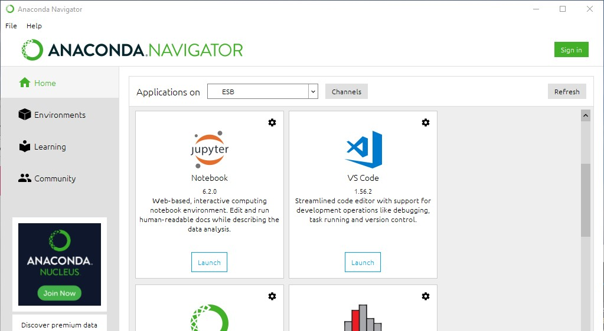
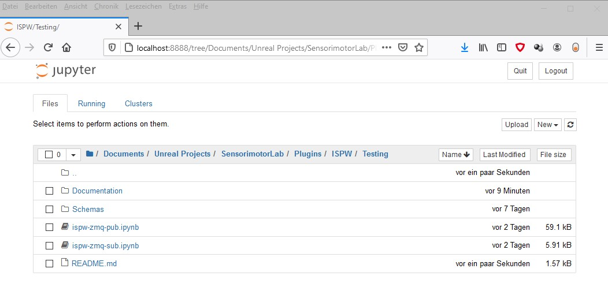
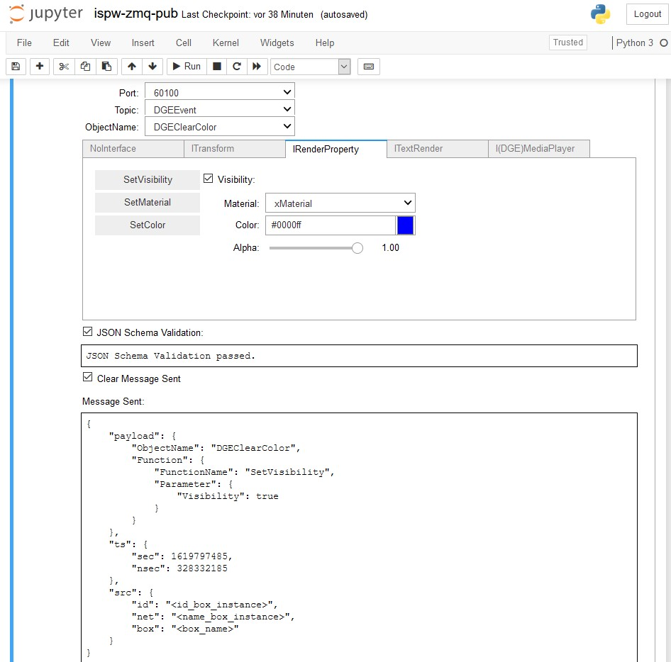

[<< Back](..)

# Unreal Engine Plugin: ISPW - Testing

## Document Outline
<!-- Start Document Outline -->

* [1. Install Anaconda](#1-install-anaconda)
* [2. Create Virtual Environment and Install jupyter Notebook](#2-create-virtual-environment-and-install-jupyter-notebook)
* [3. Startup jupyter Notebook](#3-startup-jupyter-notebook)

<!-- End Document Outline -->

## 1. Install Anaconda

Choose one of these installation methods:

* Via Download; [Anaconda Individual Edition](https://www.anaconda.com/products/individual) or
* Via PowerShell using [chocolatey](https://chocolatey.org/packages/anaconda3): `choco install anaconda3`

## 2. Create Virtual Environment and Install jupyter Notebook

Using Anaconda Navigator:

1. In tab 'Environments', create new environment named 'ESB' (Python 3.8)
2. In tab 'Home', dropdown 'Applications on' select the newly created environment 'ESB'
3. In tab 'Home', from the listed applications install jupyter Notebook
4. In tab 'Environments', 'ESB', install packages: pyzmq, jsonschema, scipy, ipywidgets

## 3. Startup jupyter Notebook

Using Anaconda Navigator:

1. In tab 'Home', dropdown 'Applications on' select the newly created environment 'ESB'
2. In tile 'jupyter Notebook' click button 'Launch'
3. In the browser tab running jupyter, jupyter dashboard tab 'Files' find UE4-Plugin folder 'ISPW/Testing'
4. Start a notebook by clicking on a listed *.ipynb file

[<< Back](..)
