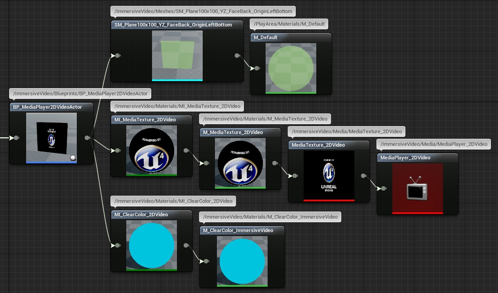
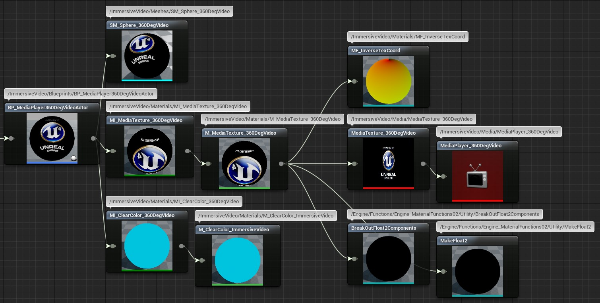
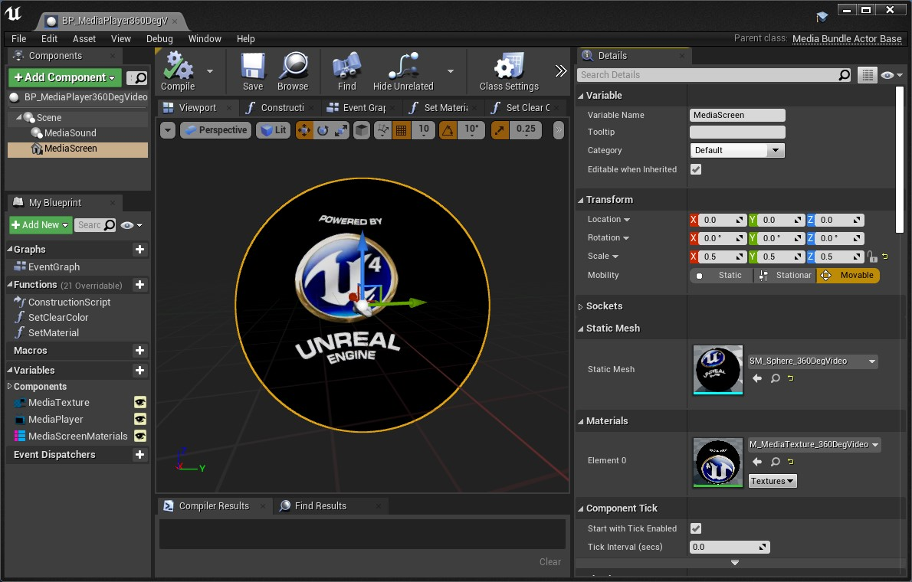
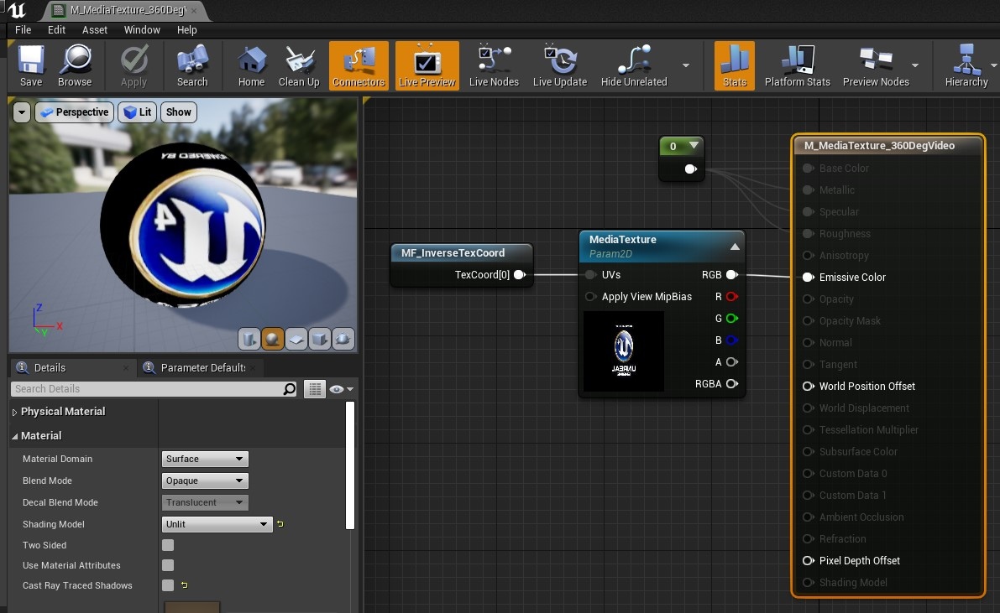

# Unreal Engine Plugin: Immersive Video

Version: v2.0.1
<br>Author: Roland Bruggmann

## Description


A game plugin providing with media content for 2D Planar and 360° Spherical Video playback as well as for Scene Capture (VGA, HD, FullHD).

### Features

* 2D Planar Video Playback Actor
* 360° Spherical Video Playback Actor
* Scene Capture and Render Actors (VGA, HD, FullHD)
* Stream-MediaSources and Precached File-MediaSource
* ColorChecker Actor

### Contents

* Blueprints: 11
* Maps: 3
* Materials: 7
* Material Functions: 1
* Material Instances: 5
* MediaPlayer: 2
* MediaPlaylist: 1
* MediaTexture: 2
* MediaRenderTarget2D: 3
* Meshes: 3
* FileMediaSource: 1
* StreamMediaSource: 3
* Textures: 1

### Dependencies

* Platforms Tested: PC Windows 10 (Win64)
* Supported Engine Versions: 4.26

With using this plugin also engine plugins *BlueprintMaterialTextureNodes*, *MediaIOFramework*, *MediaFrameworkUtilities* and *WmfMedia* will be enabled.

### Usage

Use the plugin as project plugin (folder *MyProject/Plugins*). Add the plugin by downloading and unpackaging an archive or using git clone:

```shell
git clone https://github.com/brugr9/ImmersiveVideo.git
```


---

## Table of contents

<!-- Start Document Outline -->

* [1. Video Playback](#1-video-playback)
* [2. Planar Video Playback](#2-planar-video-playback)
* [3. 360° Spherical Video Playback](#3-360-spherical-video-playback)
* [4. Scene Capture and Render](#4-scene-capture-and-render)
* [5. Color Checker](#5-color-checker)
* [A. References](#a-references)

<!-- End Document Outline -->

<div style='page-break-after: always'></div>

## 1. Video Playback

List of general purpose video playback assets:

* Materials: M_ImmersiveVideo_ClearColor
* Media: MediaPlaylistPrecached
* Movies: FileMediaSourcePrecached, StreamMediaSource_UE_InfiltratorDemo, StreamMediaSource_WmfMedia-http, StreamMediaSource_WmfMedia-mms

## 2. Planar Video Playback

List of Assets:

* Blueprints: BP_MediaPlayer2DVideoActor
* Media: MediaPlayer_2DVideo, MediaTexture_2DVideo
* Materials: M_MediaTexture_2DVideo
* Material Instances: MI_MediaTexture_2DVideo, MI_ClearColor_2DVideo
* Meshes: SM_Plane100x100_YZ_FaceBack_OriginCentre, SM_Plane100x100_YZ_FaceBack_OriginLeftBottom
* Demo: BP_MediaPlayer2DVideo_DemoActor and Map_2DVideo_Demo

Screenshot of Blueprint BP_MediaPlayer2DVideoActor in Reference Viewer:



## 3. 360° Spherical Video Playback

List of Assets:

* Blueprints: BP_MediaPlayer360DegVideoActor
* Meshes: SM_Sphere_360DegVideo (200x200x200, 16'128 Triangles, 32'512 Vertices, inverted normals)
* Material Instances: MI_MediaTexture_360DegVideo, MI_ClearColor_360DegVideo
* Materials: M_MediaTexture_360DegVideo, M_ImmersiveVideo_ClearColor
* Material Functions: MF_InverseTexCoord
* Media: MediaTexture_360DegVideo, MediaPlayer_360DegVideo
* Demo: BP_MediaPlayer360Video_DemoActor and Map_360DegVideo_Demo

Screenshot of Blueprint BP_MediaPlayer360DegVideoActor in Reference Viewer:



Blueprint 'BP_MediaPlayer360DegVideoActor':

* Static Mesh Component 'MediaScreen':
  * Mesh is 'SM_Sphere_360DegVideo' which is of size 200x200x200 UU
  * Scale is (X=0.500000,Y=0.500000,Z=0.500000)
* Scene, Scale is (X=1.000000,Y=1.000000,Z=1.000000)
* Result: Sphere size is 100x100x100 UU

Screenshot of Blueprint BP_MediaPlayer360DegVideoActor:



The Material 'M_MediaTexture_360DegVideo' with Material-Function 'MF_InverseTexCoord' (Inverse Texture Coordinates) is used in Static Mesh Sphere 360 Degree Video 'SM_Sphere_360DegVideo'.

Screenshot of Material M_MediaTexture_360DegVideo:



Screenshot of Material-Function MF_InverseTexCoord:


Screenshot of Static Mesh SM_Sphere_360DegVideo:


## 4. Scene Capture and Render

List of Assets:

* Blueprints, Capture: BP_SceneCaptureActor_VGA, BP_SceneCaptureActor_HD, BP_SceneCaptureActor_FullHD
* Blueprints, Render: BP_SceneCaptureRenderActor_VGA, BP_SceneCaptureRenderActor_HD, BP_SceneCaptureRenderActor_FullHD
* Media: TextureRenderTarget2D_SceneCapture_VGA (640x480), TextureRenderTarget2D_SceneCapture_HD (1280x720), TextureRenderTarget2D_SceneCapture_FullHD (1920x1080)
* Demo: Map_SceneCapture_Demo

## 5. Color Checker

List of Assets:

* Blueprints: BP_ColorChecker
* Material Instances: MI_ColorChecker
* Textures: T_ColorChecker (512x512)

## A. References

Unreal Engine 4 Documentation, WorkingWithMedia: [BlueprintAPI: MediaPlayer](https://docs.unrealengine.com/en-US/BlueprintAPI/Media/MediaPlayer/index.html), [MediaFramework](https://docs.unrealengine.com/en-US/WorkingWithMedia/MediaFramework/index.html), [MediaFramework TechReference](https://docs.unrealengine.com/en-US/WorkingWithMedia/MediaFramework/TechReference/index.html)
