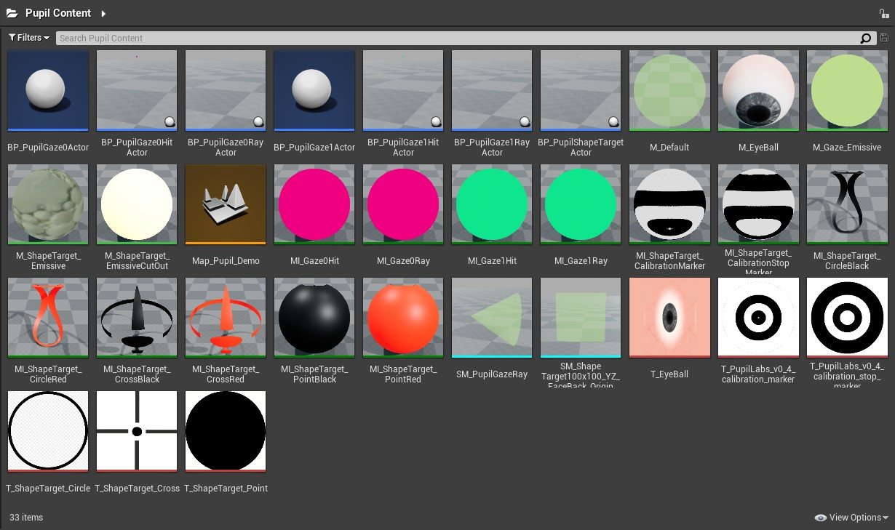
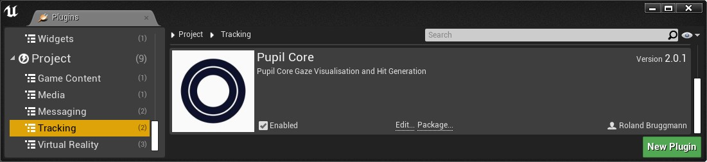
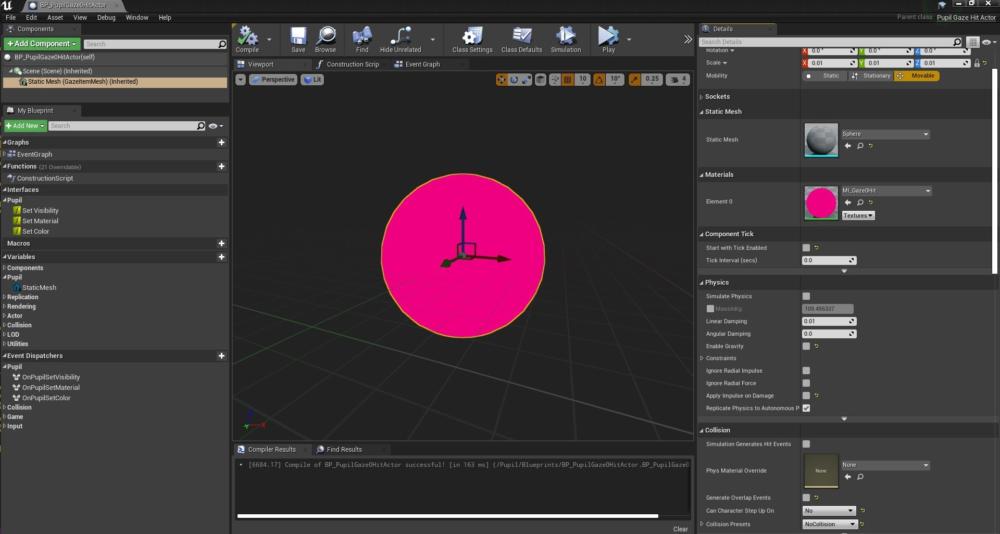
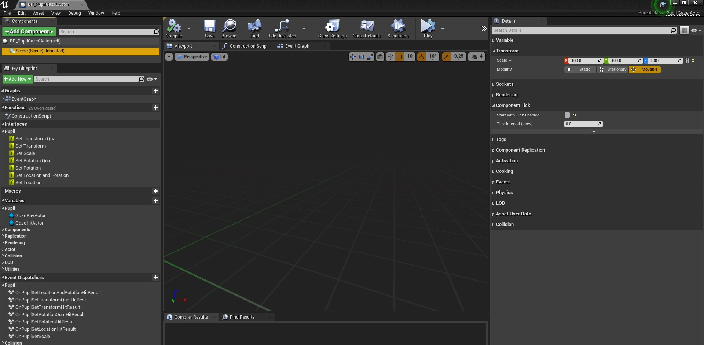
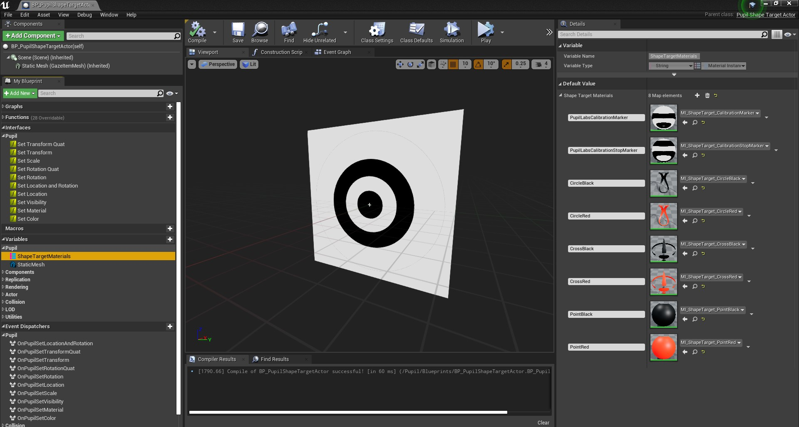

# Unreal Engine Plugin: Pupil Core

Version: v2.0.1
<br>Author: Roland Bruggmann

## Description




A plugin providing with eye tracking gaze ray visualisation, hit generation and gaze hit visualisation assets.

### Features

* Eye Gaze, Gaze Ray and Gaze Hit
* Shape Targets: PupilLabs Calibration Marker, Circle, Point, Cross
* Bundled AprilTag Images

<div style='page-break-after: always'></div>

### Contents

* Blueprints: 7
* Materials: 5
* Material Instances: 12
* Maps: 1
* Meshes: 2
* Textures: 6

### C++ Classes

* PluginSettings: 1
* BPFunctionLibrary: 1
* Interfaces: 2
* Actors: 5

### Dependencies

* Platforms Tested: PC Windows 10
* Supported Engine Versions: 4.26

The plugin was developed using Visual Studio 2019 and an UE4 Project enhanced as C++ code project.

### Usage

Use the plugin as project plugin (folder *MyProject/Plugins*) or engine plugin (folder */Engine/Plugins/Tracking*). Add the plugin by downloading and unpackaging an archive or using git clone:

```shell
git clone https://github.com/brugr9/Pupil.git
```

Find the file `MyProject/Plugins/Pupil/Config/DefaultPupil.ini` and copy-paste its lines to file `MyProject/Config/DefaultEngine.ini`.



<div style='page-break-after: always'></div>

---

## Table of contents

<!-- Start Document Outline -->

* [1. Plugin Settings and BP Function Library](#1-plugin-settings-and-bp-function-library)
	* [1.1. Plugin Settings](#11-plugin-settings)
	* [1.2. BP Function Library](#12-bp-function-library)
* [2. C++ Classes](#2-c-classes)
	* [2.1. Pupil Gaze Item Actor](#21-pupil-gaze-item-actor)
	* [2.2. Pupil Gaze Ray Actor](#22-pupil-gaze-ray-actor)
	* [2.3. Pupil Gaze Hit Actor](#23-pupil-gaze-hit-actor)
	* [2.4. Pupil Gaze Actor](#24-pupil-gaze-actor)
		* [2.4.1. Trace for Hit Generation](#241-trace-for-hit-generation)
	* [2.5. Pupil Shape Target Actor](#25-pupil-shape-target-actor)
* [3. Blueprints](#3-blueprints)
	* [3.1. BP Pupil Gaze Ray Actor](#31-bp-pupil-gaze-ray-actor)
	* [3.2. BP Pupil Gaze Hit Actor](#32-bp-pupil-gaze-hit-actor)
	* [3.3. BP Pupil Gaze Actor](#33-bp-pupil-gaze-actor)
	* [3.4. BP Pupil Shape Target Actor](#34-bp-pupil-shape-target-actor)
* [4. Demo](#4-demo)
* [A. References](#a-references)

<!-- End Document Outline -->

<div style='page-break-after: always'></div>

## 1. Plugin Settings and BP Function Library

### 1.1. Plugin Settings

The Plugin Settings provides with values as follows (cp. screenshot of Plugin Settings):

* Transport
  * Pupil Remote IP (default 127.0.0.1)
  * Pupil Remote Port (default 50020)
* Trace
  * Trace Offset from Gaze (default 0.0 UU)
  * Trace Distance (30000.0 UU)

||
|:--:|
|<b>Fig. 1: Screenshot of Plugin Settings</b>|

### 1.2. BP Function Library

The Blueprint Function-Library provides with function nodes to access the plugin settings values (cp. screenshot BP Function-Library):

* Context-Menu *Pupil > Transport*:
  * Get Pupil Remote IP (FString)
  * Get Pupil Remote Port (FString)
* Context-Menu *Pupil > Trace*:
  * Get Trace Offset from Gaze (float)
  * Get Trace Distance (float)

||
|:--:|
|<b>Fig. 2: Screenshot Blueprint Function-Library</b>|

<div style='page-break-after: always'></div>

## 2. C++ Classes

||
|:--:|
|<b>Fig. 3: Pupil Class Diagram</b>|

### 2.1. Pupil Gaze Item Actor

C++ Class `PupilGazeItemActor`:

* Inherits from `Actor`
* Has a `StaticMesh` Component
* Implements `PupilRenderPropertyInterface`:
  * SetColor (Target: `StaticMesh->SetVectorParameterValueOnMaterials`)
  * SetMaterial (default: Message 'Function not implemented')
  * SetVisibility (Target: Scene Root Component)
* Event Dispatchers (Delegates):
  * OnPupilSetColor (PupilMessageLevelType MessageLevel, FString Message)
  * OnPupilSetMaterial (PupilMessageLevelType MessageLevel, FString Message)
  * OnPupilSetVisibility (PupilMessageLevelType MessageLevel, FString Message)

<div style='page-break-after: always'></div>

### 2.2. Pupil Gaze Ray Actor

C++ Class `PupilGazeRayActor` inherits from `PupilGazeItemActor`. Its StaticMesh is intended to visualise a gaze ray.

### 2.3. Pupil Gaze Hit Actor

C++ Class `PupilGazeHitActor` inherits from `PupilGazeItemActor`. Its StaticMesh is intended to visualise the point where a gaze ray has hit an object.

### 2.4. Pupil Gaze Actor

C++ Class `PupilGazeActor` serves as a container for a ray and a hit and handles those as components:

* Inherits from `Actor`
* Has a *Variable* `GazeRayActor` (Object Reference to `PupilGazeRayActor`)
* Has a *Variable* `GazeHitActor` (Object Reference to `PupilGazeHitActor`)
* Has a *Variable* `TraceDistance` (float, Value from Plugin Settings)
* Has a *Variable* `TraceOffset` (float, Value from Plugin Settings)
* Implements a Function `Trace`
* Implements `PupilTransformInterface`:
  * SetLocationAndRotation
  * SetLocation
  * SetRotation
  * SetRotationQuat
  * SetTransform
  * SetTransformQuat
  * SetScale
* Event Dispatchers (Delegates):
  * OnPupilSetLocationAndRotationHitResult (MessageLevel, Message, PupilHitResult)
  * OnPupilSetLocationHitResult (MessageLevel, Message, PupilHitResult)
  * OnPupilSetRotationHitResult (MessageLevel, Message, PupilHitResult)
  * OnPupilSetRotationQuatHitResult (MessageLevel, Message, PupilHitResult)
  * OnPupilSetTransformHitResult (MessageLevel, Message, PupilHitResult)
  * OnPupilSetTransformQuatHitResult (MessageLevel, Message, PupilHitResult)
  * OnPupilSetScale (MessageLevel, Message)

#### 2.4.1. Trace for Hit Generation

On calling function *SetLocationAndRotation*, *SetTransformQuat*, *SetTransform*, *SetLocation*, *SetRotation* or *SetRotationQuat*, the function `Trace` is triggered which performs a ray-tracing trying to generate a hit (channel visibility) and updates following ChildActorComponent values:

* `PupilGazeRayActor`: Location , Rotation, Scale (X only, distance from GazeActor to GazeHitActor)
* `PupilGazeHitActor`: Location, Rotation

In case of a hit the objects are updated using values from the hit-result. If no hit was obtained, the objects are updated with values from the trace end.

<div style='page-break-after: always'></div>

### 2.5. Pupil Shape Target Actor

C++ Class `PupilShapeTargetActor`:

* Inherits from `PupilGazeItemActor`
* Has a *Variable* `ShapeTargetMaterials` (`TMap<FString, UMaterialInstance*`, maps a name to a Material Instance reference)
* Overrides PupilRenderPropertyInterface
  * SetColor (Message 'Function not implemented')
  * SetMaterial
* Implements `PupilTransformInterface`:
  * SetLocationAndRotation
  * SetLocation
  * SetRotation
  * SetRotationQuat
  * SetTransform
  * SetTransformQuat
  * SetScale
* Event Dispatchers (Delegates):
  * OnPupilSetColor (MessageLevel, Message)
  * OnPupilSetMaterial (MessageLevel, Message)
  * OnPupilSetVisibility (MessageLevel, Message)
  * OnPupilSetLocationAndRotation (MessageLevel, Message)
  * OnPupilSetLocation (MessageLevel, Message)
  * OnPupilSetRotation (MessageLevel, Message)
  * OnPupilSetRotationQuat (MessageLevel, Message)
  * OnPupilSetTransform (MessageLevel, Message)
  * OnPupilSetTransformQuat (MessageLevel, Message)
  * OnPupilSetScale (MessageLevel, Message)

<div style='page-break-after: always'></div>

## 3. Blueprints

### 3.1. BP Pupil Gaze Ray Actor

BP_PupilGaze0RayActor and BP_PupilGaze1RayActor:

* Parent Class: `PupilGazeRayActor`
* Customized Values:
  * Scene: Scale (X=100.000000,Y=100.000000,Z=100.000000)
  * StaticMesh is a Cone `SM_PupilGazeRay`
    * Scale (X=0.010000,Y=0.010000,Z=0.010000)
    * Material MI_Gaze0Ray or MI_Gaze1Ray resp.
    * Component Tick:  Start with Tick Enabled: false
    * Physics
      * Enable Gravity: false
      * Apply Immpulse on Damage: false
    * Collision:
      * Generate Overlap Events: false
      * Can Character Step Up On: No
      * Collision Presets: NoCollision

* Please consider: SetColor, Alpha value is not respected by the gaze ray material

||
|:--:|
|<b>Fig. 4: Screenshot BP_PupilGaze0RayActor</b>|

<div style='page-break-after: always'></div>

### 3.2. BP Pupil Gaze Hit Actor

BP_PupilGaze0HitActor and BP_PupilGaze1HitActor:

* Parent Class: `PupilGazeHitActor`
* Customized Values:
  * Scene, Scale (X=100.000000,Y=100.000000,Z=100.000000)
  * StaticMesh is a Sphere (from UE BasicShapes)
    * Scale (X=0.010000,Y=0.010000,Z=0.010000)
    * Material MI_Gaze0Hit or MI_Gaze1Hit resp.
    * Component Tick:  Start with Tick Enabled: false
    * Physics
      * Enable Gravity: false
      * Apply Immpulse on Damage: false
    * Collision:
      * Generate Overlap Events: false
      * Can Character Step Up On: No
      * Collision Presets: NoCollision

* Please consider: SetColor, Alpha value is not respected by the gaze hit material

||
|:--:|
|<b>Fig. 5: Screenshot BP_PupilGaze0HitActor</b>|

<div style='page-break-after: always'></div>

### 3.3. BP Pupil Gaze Actor

BP_PupilGaze0Actor and BP_PupilGaze1Actor:

* Parent Class: `PupilGazeActor`
* Customized Values:
  * Scene, Scale (X=100.000000,Y=100.000000,Z=100.000000)
  * Component Tick:  Start with Tick Enabled: false

||
|:--:|
|<b>Fig. 6: Screenshot BP_PupilGaze0Actor</b>|

<div style='page-break-after: always'></div>

### 3.4. BP Pupil Shape Target Actor

* Parent Class: `PupilShapeTargetActor`
* Customized Values:
  * Scene, Scale (X=100.000000,Y=100.000000,Z=100.000000)
  * StaticMesh is `SM_ShapeTarget100x100_YZ_FaceBack_OriginCenter`
    * Scale (X=0.010000,Y=0.010000,Z=0.010000)
    * Material `MI_ShapeTarget_CalibrationMarker` (default)
    * Component Tick:  Start with Tick Enabled: false
    * Physics
      * Enable Gravity: false
      * Apply Immpulse on Damage: false
    * Collision, Can Character Step Up On: No
  * *Variable* `ShapeTargetMaterials` maps a name to a Material Instance reference:
    * Name: 'PupilLabsCalibrationMarker'; Material Instance reference: `MI_ShapeTarget_CalibrationMarker`
    * Name: 'PupilLabsCalibrationStopMarker'; Material Instance reference: `MI_ShapeTarget_CalibrationStopMarker`
    * Name: 'CircleBlack'; Material Instance reference: `MI_ShapeTarget_CircleBlack`
    * Name: 'CircleRed'; Material Instance reference: `MI_ShapeTarget_CircleRed`
    * Name: 'CrossBlack'; Material Instance reference: `MI_ShapeTarget_CrossBlack`
    * Name: 'CrossRed'; Material Instance reference: `MI_ShapeTarget_CrossRed`
    * Name: 'PointBlack'; Material Instance reference: `MI_ShapeTarget_PointBlack`
    * Name: 'PointRed'; Material Instance reference: `MI_ShapeTarget_PointRed`

||
|:--:|
|<b>Fig. 7: Screenshot of BP_PupilShapeTargetActor with PupilLabs Calibration-Marker Material</b>|

<div style='page-break-after: always'></div>

## 4. Demo

||
|:--:|
|<b>Fig. 8: Screenshot of Demo Map</b>|

||
|:--:|
|<b>Fig. 9: Screenshot of Demo Map LevelBlueprint</b>|

## A. References

* Official Homepage of [Pupil Labs](https://pupil-labs.com/)
* [Pupil Core Network API](https://docs.pupil-labs.com/developer/core/network-api/#pupil-remote)
* [Pupil -- Open source eye tracking platform](https://github.com/pupil-labs/pupil) on github
