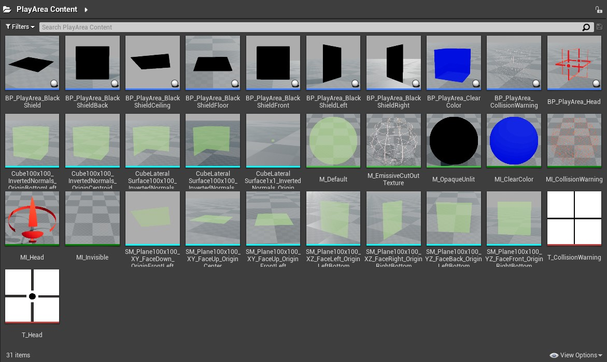
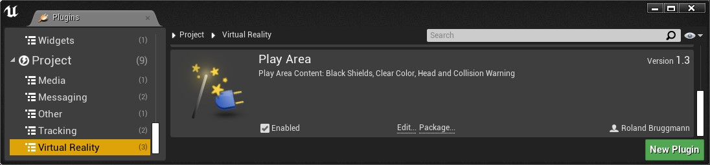
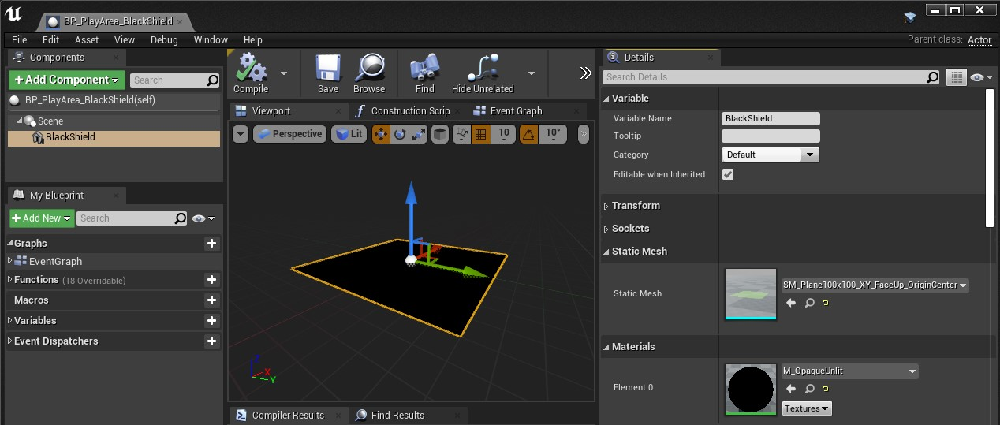
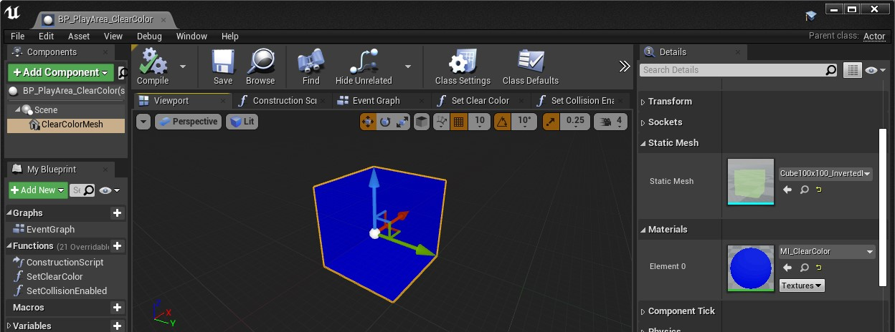
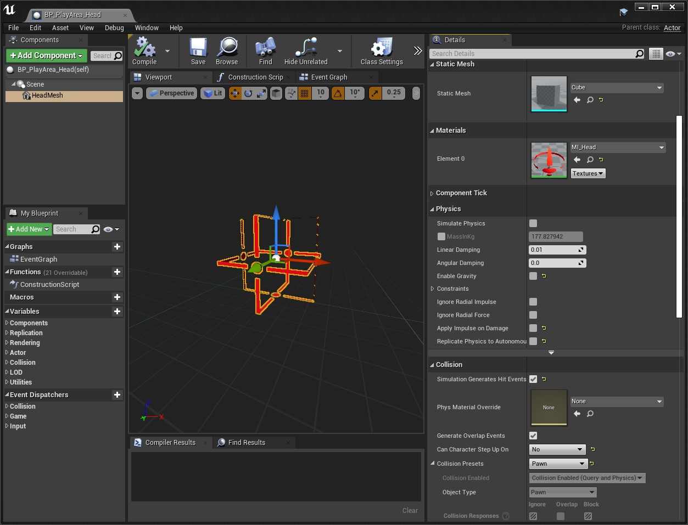
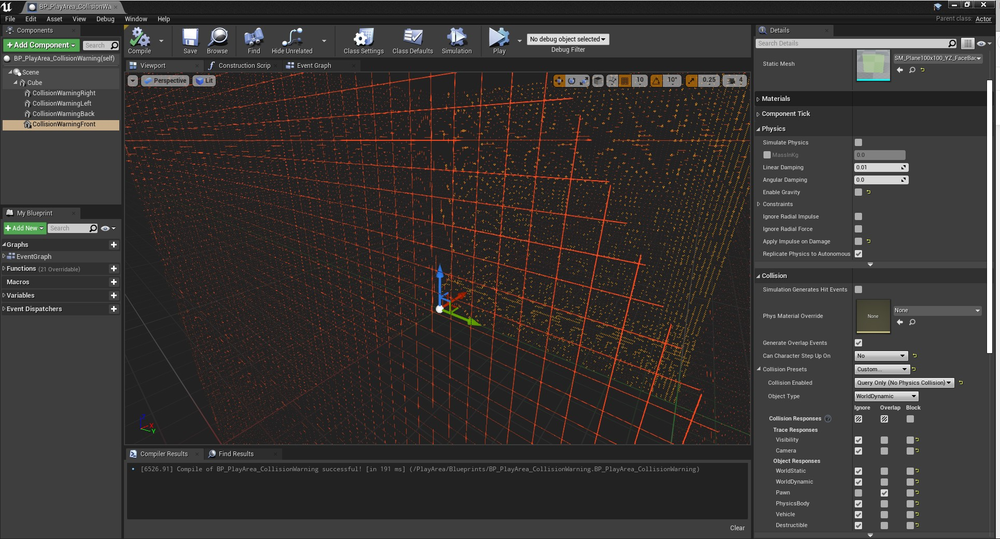
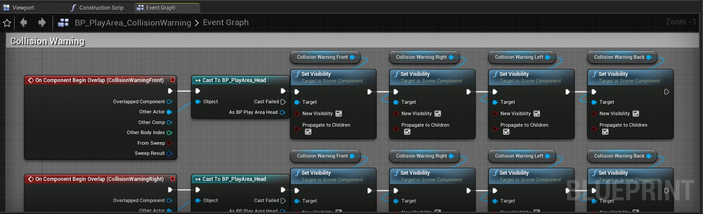

# Unreal Engine Plugin: Play Area

Version: v2.0.1
<br>Author: Roland Bruggmann

## Description



A plugin providing with virtual or augmented reality VR/AR play area content: Some black shields, a clear color cube, a head and a collision warning cube. These are mainly Blueprints, each with a StaticMesh component holding a plane or cube mesh.

### Features

* Planes: Black Shields (Front, Back, Left, Right, Floor, Ceiling)
* Cubes: Clear Color, Head, Collision Warning

### Contents

* Blueprints: 10
* Materials: 3
* Material Instances: 4
* Meshes: 12
* Textures: 2

### Dependencies

* Platforms Tested: PC Windows 10
* Supported Engine Versions: 4.26
* See also [Changelog](CHANGELOG.md)

### Usage

Use the plugin as project plugin (folder *MyProject/Plugins*) or engine plugin (folder */Engine/Plugins/VirtualReality*). Add the plugin by downloading and unpackaging an archive or using git clone:

```shell
git clone https://github.com/brugr9/PlayArea.git
```



---

## Table of contents

<!-- Start Document Outline -->

* [1. Black Shields](#1-black-shields)
* [2. Clear Color](#2-clear-color)
* [3. Head](#3-head)
* [4. Collision Warning](#4-collision-warning)
* [A. References](#a-references)

<!-- End Document Outline -->

## 1. Black Shields

The Blueprint 'BP_PlayArea_BlackShield' holds a Static Mesh Component named 'BlackShield' and serves as parent class to all the 'BP_PlayArea_BlackShield*' Blueprints. These Blueprints differ only in which Static Mesh plane they use:

* Face +/- X, Plane in YZ-Space (0x100x100 UU):
  * BP_PlayArea_BlackShieldFront: SM_Plane100x100_YZ_FaceBack_OriginLeftBottom
  * BP_PlayArea_BlackShieldBack: SM_Plane100x100_YZ_FaceFront_OriginRightBottom
* Face +/- Y, Plane in XZ-Space (100x0x100 UU):
  * BP_PlayArea_BlackShieldLeft: SM_Plane100x100_XZ_FaceRight_OriginRightBottom
  * BP_PlayArea_BlackShieldRight: SM_Plane100x100_XZ_FaceLeft_OriginLeftBottom
* Face +/- Z, Plane in XY-Space (100x100x0 UU):
  * BP_PlayArea_BlackShieldFloor: SM_Plane100x100_XY_FaceUp_OriginFrontLeft
  * BP_PlayArea_BlackShieldCeiling: SM_Plane100x100_XY_FaceDown_OriginFrontLeft

Screenshot of Blueprint Black Shield:



## 2. Clear Color

* Static Mesh: 'Cube100x100_InvertedNormals_OriginBottomLeft' (100x100x100 UU) with inverted normals
* Material: 'MI_ClearColor' with Vector Parameter 'Color'
* Functions:
  * SetClearColor
  * SetCollisionEnabled

Screenshot of Blueprint Clear Color:



<div style='page-break-after: always'></div>

## 3. Head

* Static Mesh: Cube (100x100x100 UU)
* Pivot point: Centre
* Material: Material Instance 'MI_Head' based on Material 'M_EmissiveCutOutTexture'

Screenshot of Blueprint Head:



<div style='page-break-after: always'></div>

## 4. Collision Warning

* Static Mesh Component 'Cube' with Static Mesh 'Cube100x100_InvertedNormals_OriginBottomLeft'
* Subordinated Static Mesh Components 'CollisionWarning(Right/Left/Back/Front)' with Static Meshes 'SM_Plane100x100_Face\*_Origin\*'
* EventGraph:
  * OnComponentBeginOverlap: If other Actor cast to 'BP_PlayArea_Head' is a success, the Static Mesh Components 'CollisionWarningFront/Right/Left/Back' NewVisibility is set to *true*
  * OnComponentEndOverlap: If other Actor cast to 'BP_PlayArea_Head' is a success, the Static Mesh Components 'CollisionWarningFront/Right/Left/Back' NewVisibility is set to *false*

Screenshot of Blueprint Collision Warning:



Screenshot of Blueprint Collision Warning EventGraph:



## A. References

Unreal Engine Documentation: Interactive Experiences > Physics > Collision > [Collision Overview](https://docs.unrealengine.com/en-US/InteractiveExperiences/Physics/Collision/Overview/index.html)
