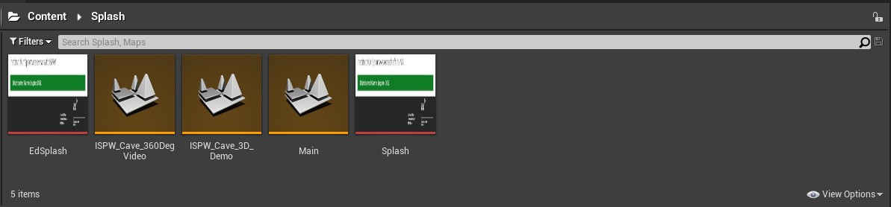
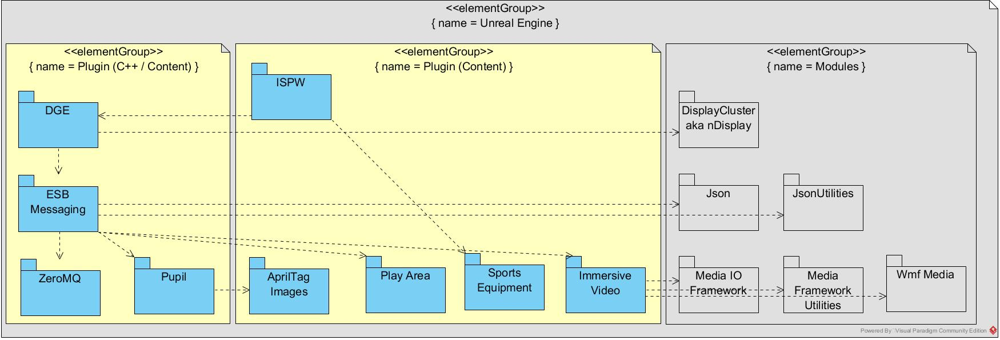
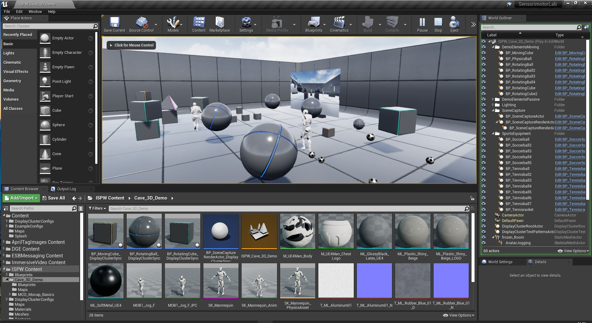
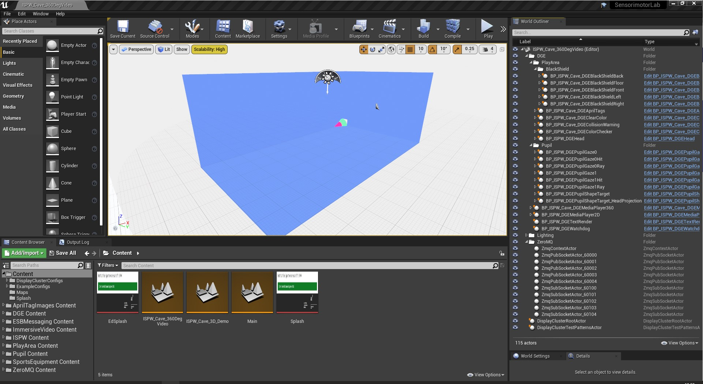
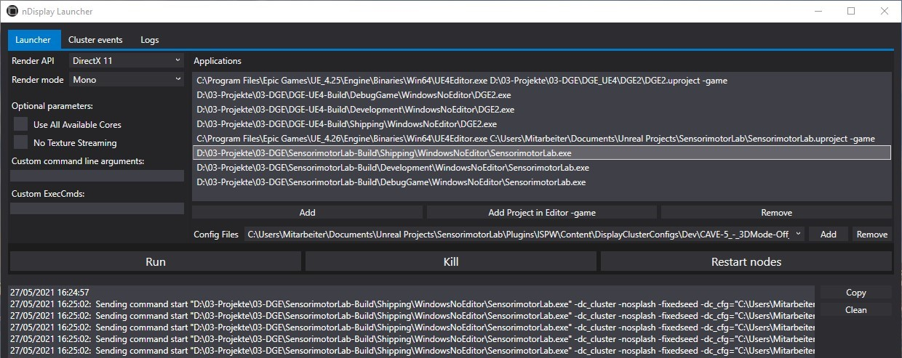
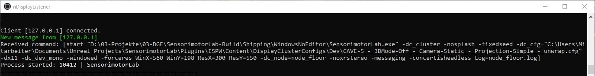
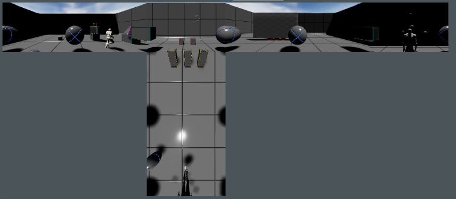
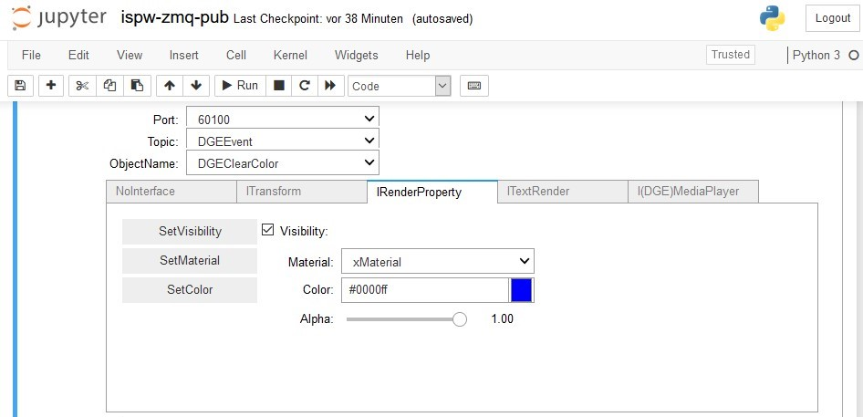

[<< Back to Main Page](..)

# Unreal Engine Project: Sensorimotor Lab

Version: v2.0.1
<br>Author: Roland Bruggmann

## Description



A project based on UE Display Cluster template aka 'nDisplay' providing with Institute of Sport Science ISPW related maps, more precise for the sensorimotor laboratory with its five sided CAVE. The laboratory integration is enabled by a messaging layer which is used to interact with an enterprise service bus ESB or the laboratory's experiment management system repectively. This project was elaborated in TPF approved project 'Distributed Game Engine DGE' and subsequent projects.

### Features

* ISPW CAVE Maps: 3D Demo and 360° Video Playback (copies from Plugin ISPW)
* Display Cluster Configurations with simple projection for development and with EasyBlend for production (copies from Plugin ISPW)

### Contents

* Maps: 3
* Textures: 2
* Display Cluster Configurations: 7 (no asset but *.cfg)

### Important Notes

* Platforms Tested: PC Windows
* Supported Engine Versions: 4.26
* To create a new SenorimotorLab CAVE level copy the ISPW template map ISPW_Cave_360DegVideo to the project content folder

<div style='page-break-after: always'></div>

---

## Table of Contents

<!-- Start Document Outline -->

* [1. Usage](#1-usage)
  * [1.1. Dependencies](#11-dependencies)
  * [1.2. Installation](#12-installation)
* [2. Project Settings](#2-project-settings)
  * [2.1. Handedness](#21-handedness)
  * [2.2. Units](#22-units)
  * [2.3. IPs](#23-ips)
* [3. Maps](#3-maps)
  * [3.1. Map ISPW Cave 3D Demo](#31-map-ispw-cave-3d-demo)
  * [3.2. Map ISPW Cave 360DegVideo](#32-map-ispw-cave-360degvideo)
* [4. Display Cluster](#4-display-cluster)
  * [4.1. nDisplay Configurations](#41-ndisplay-configurations)
  * [4.2. Packaging](#42-packaging)
  * [4.3. nDisplay Launcher](#43-ndisplay-launcher)
    * [4.3.1. Load Non Default Map](#431-load-non-default-map)
    * [4.3.2. Test Pattern](#432-test-pattern)
* [5. Integration](#5-integration)
* [A. References](#a-references)

<!-- End Document Outline -->

<div style='page-break-after: always'></div>

## 1. Usage

### 1.1. Dependencies

The project was developed using

* Windows 10
* Visual Studio 2019
* Unreal Engine 4.26
* UE4 Project from nDisplay Template, enhanced as C++ code project

The project makes use of plugin [ISPW](../ISPW) and its depepndencies (cp. package diagram):

* [SportsEquipment](../SportsEquipment)
* [AprilTagImages](../AprilTagImages)
* [Distributed Game Engine DGE](../DGE) and its depepndencies:
  * [ESB Messaging](../ESBMessaging) and its depepndencies:
    * [ZeroMQ](../ZeroMQ)
    * [Pupil](../Pupil)
    * [PlayArea](../PlayArea)
    * [ImmersiveVideo](../ImmersiveVideo)

Package Diagram:



### 1.2. Installation

Download the project using git -- the plugins are included as git submodules:

```shell
git clone --recursive https://github.com/brugr9/SensorimotorLab.git
cd SensorimotorLab
git submodule update --recursive
```

<div style='page-break-after: always'></div>

## 2. Project Settings

Screenshot of Project Settings, Plugin ESBMessaging:


Hint: See also documentation of Plugin ISPW, [Handedness and Units](../ISPW/README.md#11-handedness-and-units).

### 2.1. Handedness

* Enterprise Service Bus ESB:
  * The (orthonormal) basis of ESB is a right handed coordinate system RHS (by ISPW convention); Therefore: Project Settings > Plugins > ESB Messaging > Transformation > Input Coordinate System Type: RHS
  * RHS: X+ is 'Front', Y+ is 'Left', Z+ is 'Up' (by ISPW convention)
* Unreal Engine:
  * The (orthonormal) basis of UE is a left handed coordinate system LHS
  * LHS: X+ is 'Front', Y+ is 'Right', Z+ is 'Up' (by ISPW convention)

### 2.2. Units

* Location / Rotation / Scale in Unreal Units UU
* 1m in reality is represented by 100 UU (by ISPW convention); Therefore: Project Settings > Plugins > ESB Messaging > Transformation > Input Unit Factor: 100.0

### 2.3. IPs

* To run the map ISPW_Cave_360DegVideo locally (localhost) temporarily change the IP settings from `10.27.0.2` to `127.0.0.1` (cp. Screenshot of Project Settings, Plugin ESB Messaging).

<div style='page-break-after: always'></div>

## 3. Maps

### 3.1. Map ISPW Cave 3D Demo

The map `ISPW_Cave_3D_Demo` which is a copy from plugin ISPW is intended to demonstrate the real-time rendering of 3D content in mono but also in stereo mode and the perception of the same using shutter glasses in the ISPW SenorimotorLab CAVE:

* Six 'RotatingBall's and 'RotatingCube's were placed in the CAVE's corners or in the left and right side wall halfes respectively to test or demonstrate the display cluster synchronization. 
* The map also demonstrates real-time physics rendering when an active 'MovingCube' collides with a passive 'PhysicsBall' - both are fixed to move in the YZ-plane. The soccerballs and tennisballs from the plugin 'SportsEquipment' are jumping individually due to their physical materials.
* Furthermore the map demonstrates animation by one avatar walking and a second one running.
* The possibilities of screen capture and rendering from the 'ImmersiveVideo' plugin are also demonstrated by pointing a camera into the room from the front and projecting the image onto a virtual screen on the right.

Screenshot of Map `ISPW_Cave_3D_Demo`:



<div style='page-break-after: always'></div>

### 3.2. Map ISPW Cave 360DegVideo

The map `ISPW_Cave_360DegVideo` which is a copy from plugin ISPW provides with lab integration enabled by a newly developed messaging layer which allow VR-objects to be controlled by the lab's experiment management system and CAVE-specific content to be rendered:

* DGE-Plugin Blueprints customized to ISPW setup: MediaPlayer2D, MediaPlayer360, TextRender, Watchdog
* Pupil-Plugin Blueprints customized to ISPW setup: Pupil Shape Targets, Gaze, Gaze Ray and Gaze Hit
* Play-Area-Plugin Blueprints customized to ISPW CAVE setup: Black Shields, Clear Color, Head and Collision Warning
* Further Blueprints customized to ISPW CAVE setup: April Tags, Color Checker

Screenshot of `Map ISPW_Cave_360DegVideo`:



<div style='page-break-after: always'></div>

## 4. Display Cluster

### 4.1. nDisplay Configurations

Edit nDisplay config file *.cfg (host IPs, master etc.) using a text editor of choice. For further information see plugin 'ISPW'.

### 4.2. Packaging

Brief instruction for packaging a shipping build (cp. Unreal Engine Documentation, [Packaging Projects](https://docs.unrealengine.com/en-US/Basics/Projects/Packaging/)):

1. In Project Settings set ISPW_Cave_360DegVideo as Game Default Map
2. File > Package Project > Build Configuration > Shipping
3. File > Package Project > Windows (64-bit)
4. Point to a folder of your choice

In the folder of your choice a folder 'WindowsNoEditor' is created containing the executable file (*.exe).

### 4.3. nDisplay Launcher

Brief instruction to run an ISPW-CAVE game unwrapped locally on your machine (cp. Unreal Engine Documentation, [nDisplay Quick Start](https://docs.unrealengine.com/en-US/WorkingWithMedia/IntegratingMedia/nDisplay/QuickStart/)):

1. Find and launch nDisplay Listener and nDisplay Launcher (folder 'C: \Program Files \Epic Games \UE\_4.26 \Engine \Binaries \DotNET' or similar)
2. In nDisplay Launcher, Tab 'Launcher', List of Applications > Click Button 'Add': Point to the shipping build executable '*.exe' in folder 'WindowsNoEditor'
3. In nDisplay Launcher, Tab 'Launcher', Config Files Dropdown > Click Button 'Add': Point to a Display Config, e.g., '\WindowsNoEditor \SensorimotorLab \Content \DisplayClusterConfigs \Dev \CAVE-5\_-\_3DMode-Off\_-\_Camera-Static\_-\_Projection-Simple\_-\_unwrap.cfg'
4. Click Button 'Run'

Screenshot nDisplay Launcher:



Screenshot nDisplay Listener:



Screenshot of nDisplay Unwrap:


#### 4.3.1. Load Non Default Map

To load a map other than the default one, e.g., map "ISPW_Cave_3D_Demo", in nDisplay Launcher enter the custom command line argument `/Game/Maps/ISPW_Cave_3D_Demo` (cp. Unreal Engine Documentation, [Command Line Arguments](https://docs.unrealengine.com/en-US/Programming/Basics/CommandLineArguments/index.html)).

Screenshot of nDisplay Unwrap, map ISPW_Cave_3D_Demo:



#### 4.3.2. Test Pattern

To load a test pattern make use of Cluster Events (cp. Unreal Engine Documentation, [Test-Patterns](https://docs.unrealengine.com/en-US/Engine/Rendering/nDisplay/TestPatterns/index.html)).

<div style='page-break-after: always'></div>

## 5. Integration

For testing purpose plugin ISPW provides with Jupyter Notebooks:

* ispw-zmq-pub.ipynb: Sending messages using ZeroMQ PUB-Socket(s)
* ispw-zmq-sub.ipynb: Receiving messages using ZeroMQ SUB-Socket(s)

Please in folder [ISPW/Testing](../ISPW/Testing) find instructions on how to install Anaconda and setup Jupyter Notebook.

Screenshot of Jupyter Notebook ISPW ZeroMQ Publish:



## A. References

* <a href="https://www.tpf.philhum.unibe.ch/portfolio/ue4DisplayCluster" target="_blank">*UE Display Cluster in CAVE*</a>. In: Online-Portfolio of Technology Platform for Research TPF, Faculty of Human Sciences, University of Bern
* <a href="https://www.ispw.unibe.ch/research/research_equipment/sensorimotor_lab/index_eng.html" target="_blank">*Research Equipment: Sensorimotor Lab*</a>. In: Website of the Institute of Sport Science, University of Bern
* Santina Russe: <a href="https://www.horizonte-magazin.ch/2021/09/02/einblick-in-den-blick-von-topathletinnen/" target="_blank">*Der Blick von Topathletinnen wird optimiert*</a>. In: Horizonte - Das Schweizer Forschungsmagazin, Fokus: Sport im Labor (Online), Hrsg: Schweizerischer Nationalfonds zur Förderung der wissenschaftlichen Forschung (SNF), 02. September 2021
* Gian Paul Lozza: <a href="https://www.horizonte-magazin.ch/2021/09/02/bildreportage-vermessene-bewegungen/" target="_blank">*Fotoreportage: Die Vermessung der kleinsten Bewegungen*</a>. In: Horizonte - Das Schweizer Forschungsmagazin, Fokus: Sport im Labor (Online), Hrsg: Schweizerischer Nationalfonds zur Förderung der wissenschaftlichen Forschung (SNF), 02. September 2021
* [*Rendering to Multiple Displays with nDisplay*](https://docs.unrealengine.com/en-US/WorkingWithMedia/IntegratingMedia/nDisplay/index.html). In: Unreal Engine Documentation

[<< Back to Main Page](..)
