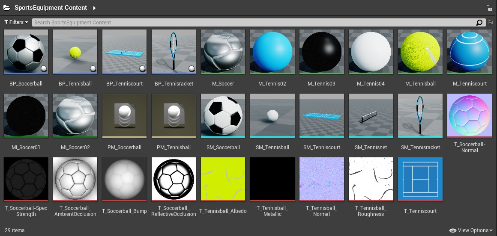
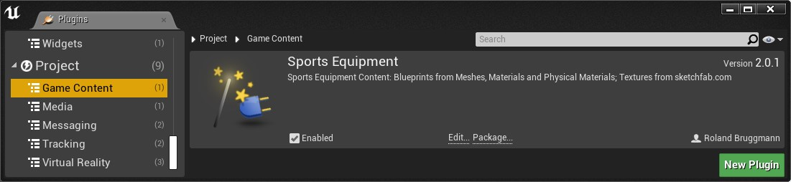
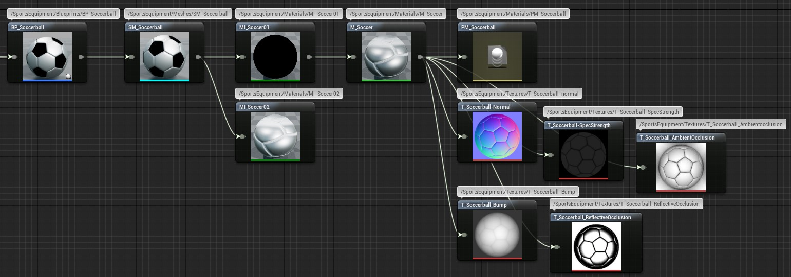

# Unreal Engine Plugin: Sports Equipment

Version: v2.0.1
<br>Author: Roland Bruggmann

## Description



A plugin providing with sports equipment content based on 3D models from Sketchfab and partly enhanced by physical materials.

### Features

* Soccerball with Physical Material
* Tennisball with Physical Material
* Tennisracket
* Tenniscourt with Tennisnet

### Contents

* Blueprints: 4
* Materials: 6
* Material Instances: 2
* Physical Materials: 2
* Meshes: 5
* Textures: 10

### Dependencies

* Platforms Tested: PC Windows 10
* Supported Engine Versions: 4.26

### Usage

Use the plugin as project plugin (folder *MyProject/Plugins*). Add the plugin by downloading and unpackaging an archive or using git clone:

```shell
git clone https://github.com/brugr9/SportsEquipment
```



---

## Table of Contents

<!-- Start Document Outline -->

* [1. Soccerball](#1-soccerball)
* [2. Tennisball](#2-tennisball)
* [A. References](#a-references)

<!-- End Document Outline -->

<div style='page-break-after: always'></div>

## 1. Soccerball

Blueprint `BP_Soccerball` holds a Static Mesh component `SM_Soccerball`. The mesh uses Material Instances parenting Material `M_Soccer` which is enhanced by a Physical Material `PM_Soccerball` with values as follows:

* Physical Material:
  * **Friction: 0.3**
  * **Restitution: 0.9**
  * Restitution Combine Mode: Max
  * Override Restitution Combine Mode: true
  * **Density: 0.1**
* Advanced:
  * Raise Mass to Power: 0.1

Screenshot of Soccerball Reference Viewer:



<div style='page-break-after: always'></div>

## 2. Tennisball

Blueprint `PM_Tennisball` holds a Static Mesh component `SM_Tennisball`. The mesh uses a Material `M_Tennisball` which is enhanced by Physical Material `PM_Tennisball` with values as follows:

* Physical Material:
  * **Friction: 0.4**
  * **Restitution: 0.85**
  * Restitution Combine Mode: Max
  * Override Restitution Combine Mode: true
  * **Density: 0.084**
* Advanced:
  * Raise Mass to Power: 0.1

Screenshot of Tennisball Reference Viewer:


## A. References

* 3D Models on Sketchfab: [Soccerball](https://sketchfab.com/3d-models/soccer-ball-d4c560493a0846c5943f3aeea58acb72), [Tennisball](https://sketchfab.com/3d-models/tennisball-83915826ee2d4fb79a6a28ee8ea4d0dc), [Tennisracket](https://sketchfab.com/3d-models/tennis-racket-c314dcce06ba488ca624957f579b8196), [Tenniscourt](https://sketchfab.com/3d-models/tennis-court-animation-fab5950b1b6f441da6a73c314f0cd04e)
* Unreal Engine 4 Documentation: Making Interactive Experiences > Physics > [Physical Materials](https://docs.unrealengine.com/en-US/InteractiveExperiences/Physics/PhysicalMaterials/index.html?utm_source=editor&utm_medium=docs&utm_campaign=rich_tooltips)
