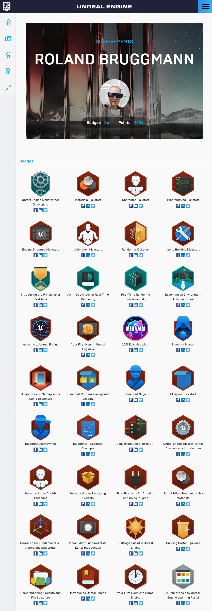

[<< Back to Main Page](..)

# A. Unreal Online Learning: Achievements

List of completed on-line learning courses (links go to Epic Games):

## Basic Courses

* *<a href="https://www.unrealengine.com/en-US/onlinelearning-courses/a-tour-of-the-new-unreal-engine-learning-portal" target="_blank">A Tour of the new Unreal Engine Learning Portal</a>*
* *<a href="https://www.unrealengine.com/en-US/onlinelearning-courses/unreal-editor-fundamentals---editor-introduction" target="_blank">Unreal Editor Fundamentals - Editor Introduction</a>*
* *<a href="https://www.unrealengine.com/en-US/onlinelearning-courses/unreal-editor-fundamentals---actors-and-blueprints" target="_blank">Unreal Editor Fundamentals - Actors and Blueprints</a>*
* *<a href="https://www.unrealengine.com/en-US/onlinelearning-courses/unreal-editor-fundamentals---materials" target="_blank">Unreal Editor Fundamentals - Materials</a>*

## Learning Paths

* ***<a href="https://www.unrealengine.com/en-US/onlinelearning-courses/welcome-to-game-development" target="_blank">Welcome to Game Development</a>***
  * *<a href="https://www.unrealengine.com/en-US/onlinelearning-courses/your-first-hour-in-unreal-engine-4" target="_blank">Your First Hour in Unreal Engine 4</a>*
  * *<a href="https://www.unrealengine.com/en-US/onlinelearning-courses/introducing-unreal-engine" target="_blank">Introducing Unreal Engine 4</a>*
  * *<a href="https://www.unrealengine.com/en-US/onlinelearning-courses/comprehending-projects-and-file-structure" target="_blank">Comprehending Projects and File Structure</a>*
  * *<a href="https://www.unrealengine.com/en-US/onlinelearning-courses/blueprints-and-gameplay-for-game-designers" target="_blank">Blueprints and Gameplay for Game Designers</a>*
  * *<a href="https://www.unrealengine.com/en-US/onlinelearning-courses/becoming-an-environment-artist-in-unreal" target="_blank">Becoming an Environment Artist in Unreal</a>*
* ***<a href="https://www.unrealengine.com/en-US/onlinelearning-courses/2021-epic-megajam" target="_blank">2021 Epic MegaJam</a>***
  * *<a href="https://www.unrealengine.com/en-US/onlinelearning-courses/introducing-unreal-engine" target="_blank">Introducing Unreal Engine 4</a>*
  * *<a href="https://www.unrealengine.com/en-US/onlinelearning-courses/blueprints---essential-concepts" target="_blank">Blueprints - Essential Concepts</a>*
  * *<a href="https://www.unrealengine.com/en-US/onlinelearning-courses/blueprints-and-gameplay-for-game-designers" target="_blank">Blueprints and Gameplay for Game Designers</a>*
  * *<a href="https://www.unrealengine.com/en-US/onlinelearning-courses/introduction-to-packaging-projects" target="_blank">Introduction to Packaging Projects</a>*
* ***<a href="https://www.unrealengine.com/en-US/blog/become-a-blueprint-master-by-taking-this-online-learning-challenge" target="_blank">2021 Blueprint Ninja Challenge</a>***
  * Journeyman: *<a href="https://www.unrealengine.com/en-US/onlinelearning-courses/blueprints---essential-concepts" target="_blank">Blueprints - Essential Concepts</a>*
  * Ninja: *<a href="https://www.unrealengine.com/en-US/onlinelearning-courses/unreal-editor-fundamentals---actors-and-blueprints" target="_blank">Unreal Editor Fundamentals - Actors and Blueprints</a>*, *<a href="https://www.unrealengine.com/en-US/onlinelearning-courses/blueprint-kickstart" target="_blank">Blueprint Kickstart</a>*
  * Master: *<a href="https://www.unrealengine.com/en-US/onlinelearning-courses/blueprint-runtime-saving-and-loading" target="_blank">Blueprint Runtime Saving and Loading</a>*, *<a href="https://www.unrealengine.com/en-US/onlinelearning-courses/blueprints-and-gameplay-for-game-designers" target="_blank">Blueprints and Gameplay for Game Designers</a>*
* ***<a href="https://www.unrealengine.com/en-US/onlinelearning-courses/introducing-the-principles-of-real-time" target="_blank">Introducing the Principles of Real-time</a>***
  * *<a href="https://www.unrealengine.com/en-US/onlinelearning-courses/real-time-rendering-fundamentals" target="_blank">Real-Time Rendering Fundamentals</a>*
  * *<a href="https://www.unrealengine.com/en-US/onlinelearning-courses/an-in-depth-look-at-real-time-rendering" target="_blank">An In-Depth Look at Real-Time Rendering</a>*

## Advanced Courses

* *<a href="https://www.unrealengine.com/en-US/onlinelearning-courses/introduction-to-ai-with-blueprints" target="_blank">Introduction to AI with Blueprint</a>*
* *<a href="https://www.unrealengine.com/en-US/onlinelearning-courses/building-better-pipelines" target="_blank">Building Better Pipelines</a>*
* *<a href="https://www.unrealengine.com/en-US/onlinelearning-courses/converting-blueprints-to-c" target="_blank">Converting Blueprints to C++</a>*
* *<a href="https://www.unrealengine.com/en-US/onlinelearning-courses/best-practices-for-creating-and-using-plugins" target="_blank">Best Practices for Creating and Using Plugins</a>*
* *<a href="https://www.unrealengine.com/en-US/onlinelearning-courses/creating-marketplace-content" target="_blank">Creating Marketplace Content</a>*

Screenshot of Unreal Online Learning, section "Achievements":

[<< Back to Main Page](..)