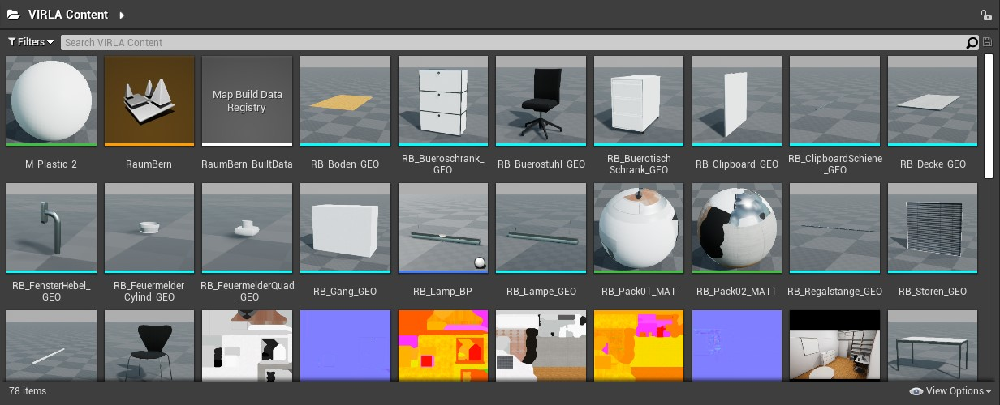
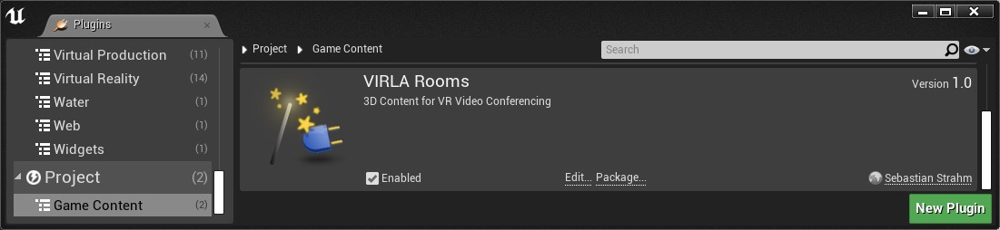

[<< Back to Main Page](..)

# Unreal Engine Plugin: Virtual Learning Attendance VIRLA

Version: v1.0.0
 Author: Sebastian Strahm

## Description

A Game Plugin providing with 3D Content for VR Video Conferencing.

From project description (UniDistance Suisse):

"*Distance learning is a source of pleasure for increasing numbers of students each year. Despite its success, distance learning shows higher drop-out rates than attendance-based study. One reason for this is that the physical distance factor is a challenge. The lack of social interaction appears to play a part in students dropping out. There are attempts to counter this problem with interactive online learning environments. We are investigating how virtual reality (VR) and video conferencing differ from a face-to-face situation. In the exercise, the aim is for the test persons to imagine themselves in the role of an employer and to find the best solution from among fictitious job applicants. Each test person within a group is given different information about the applicants in advance. This information is distributed across the small group in such a way that the best solution can be found only if the test persons share their knowledge in the subsequent group discussion.*"

### Features

* Map 'RaumBern': Virtual Twin of Dream Laboratory Room D268 at Institute of Psychology, University Bern
* Meshes Raum Bern (RB): Boden, Bueroschrank, Buerostuhl, BuerotischSchrank, ClipboardSchiene, Clipboard, Decke, FensterHebel, FeuermelderCylind, FeuermelderQuad, Gang, Lampe, Regalstange, Storen, Stromleiste, Stuhl, Tisch, WandH, WandL, WandV, Wandleiste, Wandschrank
* Meshes Raum Zofingen (RZ): Bildschirm, Boden, Bücheregal, Dack, Fensterrahmen, Fenstertisch, Heizregler, Heizung, Heizung_hinten, Lampe, Maus, PC, Schalter_Storen, Schanier, Store, Stuhl, Säule, Tastatur, Tisch, Tischtuch, Türgriff, Wand_hinten, Wand_links, Wand_rechts, Wand_vorne

### Contents

* Blueprints: 5
* Maps: 1
* Map Build Data Registry: 1
* Materials: 7
* Static Meshes: 47
* Textures: 17

### Dependencies

* Platforms Tested: PC Windows 10 (Win64)
* Supported Engine Versions: 4.26

### Usage

Use the plugin as project plugin (folder *MyProject/Plugins*).

## A. References

* [*"VIRLA" project*](https://distanceuniversity.ch/research-e-learning/projects/virla/). In: Research - E-Learning Projects, Distance University Switzerland 'UniDistance Suisse'

[<< Back to Main Page](..)
