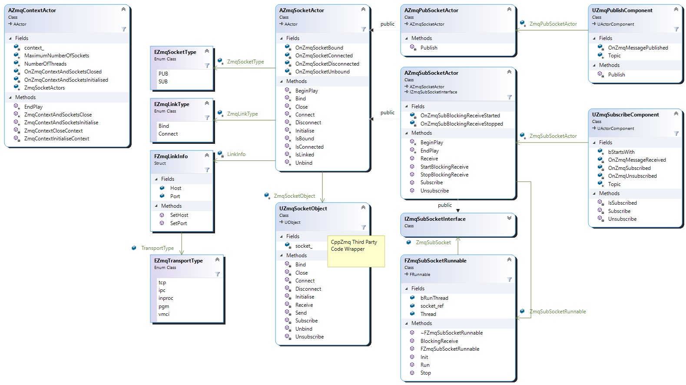
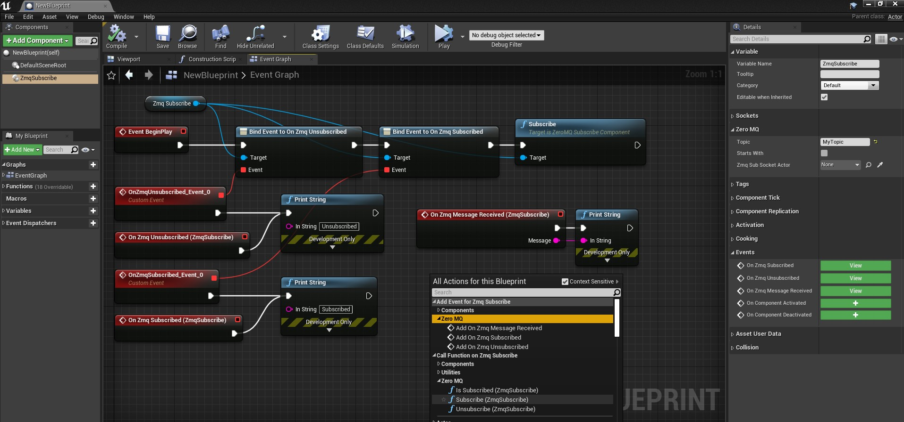

[<< Back to Portfolio Main Page](..)

# Unreal Engine Plugin: ZeroMQ

Version: v2.0.1
<br>Author: Roland Bruggmann

## Description


A game plugin providing with ZeroMQ (aka zmq) assets using C++-bindings from CppZmq. This plugin supports the ZeroMQ PUB/SUB pattern.

### Features

* ZmqContextActor
* PUB/SUB Actors and ActorComponents:
  * ZmqPubSocketActor, ZmqPublishComponent
  * ZmqSubSocketActor, ZmqSubscribeComponent
* Demo Actors and Demo Map

### Contents

* Blueprints: 3
* Maps: 1

### C++ Classes

* Interfaces: 1
* ActorComponents: 2
* Actors: 4
* Objects: 1

### Dependencies

* Platforms Tested: PC Windows 10 (Win64)
* Supported Engine Versions: 4.26

The plugin was developed using Visual Studio 2019 with an UE4 Project enhanced as C++ code project. Third party C++-bindings from CppZmq may be found in directory [/Source/ThirdParty/CppZmq](../Source/ThirdParty/CppZmq).

### Usage

Use the plugin as project plugin (folder *MyProject/Plugins*). Add the plugin by downloading and unpackaging an archive or using git clone:

```shell
git clone https://github.com/brugr9/ZeroMQ.git
```


---

## Table of Contents

<!-- Start Document Outline -->

* [1. C++ Classes](#1-c-classes)
	* [1.1. Zmq Context Actor](#11-zmq-context-actor)
	* [1.2. Zmq Pub Socket Actor](#12-zmq-pub-socket-actor)
	* [1.3. Zmq Sub Socket Actor](#13-zmq-sub-socket-actor)
	* [1.4. Zmq Publish Component](#14-zmq-publish-component)
	* [1.5. Zmq Subscribe Component](#15-zmq-subscribe-component)
* [2. Demo](#2-demo)
* [A. References](#a-references)

<!-- End Document Outline -->

<div style='page-break-after: always'></div>

## 1. C++ Classes

Screenshot of ZmqActors in Unreal Editor, tab 'Place Actors':


Class Diagram ZeroMQ:



<div style='page-break-after: always'></div>

### 1.1. Zmq Context Actor

ZmqContextActor has:

* Variables:
  * Number of Threads: Number of I/O threads for this context: 0 to 255 (`uint8`), default is 1 (`ZMQ_IO_THREADS_DFLT`). From [ZeroMQ Wiki FAQ](http://wiki.zeromq.org/area:faq#toc6) : "What is the optimal number of I/O threads for best performance? The basic heuristic is to allocate 1 I/O thread in the context for every gigabit per second of data that will be sent and received (aggregated). Further, the number of I/O threads should not exceed (number_of_cpu_cores - 1)."
  * Maximum Number of Sockets: Maximum number of sockets allowed for this context: 1 to 2,147,483,647 (`int32`, but minimum is 1), default is 1023 (`ZMQ_MAX_SOCKETS_DFLT`)
  * Array of ZmqSocketActors: Sockets handled by this context.

* Functions:
  * ZmqContextAndSocketsInitialise, ZmqContextAndSocketsClose

* Event Dispatchers (Delegates):
  * OnZmqContextAndSocketsInitialised, OnZmqContextAndSocketsClosed

Screenshot of ZmqContextActor details panel with variables:


Screenshot of ZmqContextActor function and event dispatcher nodes:


<div style='page-break-after: always'></div>

### 1.2. Zmq Pub Socket Actor

ZmqPubSocketActor has:

* Variables, Link Info:
  * Transport Type (tcp, ipc, inproc, pgm, vmci), Host, Port

* Functions:
  * Bind, IsBound (IsBound Boolean), Unbind
  * Connect, IsConnected (IsConnected Boolean), Disconnect

* Event Dispatchers (Delegates):
  * OnZmqSocketBound, OnZmqSocketUnbound
  * OnZmqSocketConnected, OnZmqSocketDisconnected

Screenshot of ZmqPubSocketActor details panel with variables from Link Info:


Screenshot of ZmqPubSocketActor function and event dispatcher nodes:


<div style='page-break-after: always'></div>

### 1.3. Zmq Sub Socket Actor

ZmqSubSocketActor has:

* Variables, Link Info:
  * Transport Type (tcp, ipc, inproc, pgm, vmci), Host, Port

* Functions:
  * Bind, IsBound (IsBound Boolean), Unbind
  * Connect, IsConnected (IsConnected Boolean), Disconnect
  * Receive
  * StartBlockingReceive, StopBlockingReceive

* Event Dispatchers (Delegates):
  * OnZmqSocketBound, OnZmqSocketUnbound
  * OnZmqSocketConnected, OnZmqSocketDisconnected
  * OnZmqSubMessageReceived (OutTopic String, OutMessage String)
  * OnZmqSubBlockingReceiveStarted, OnZmqSubBlockingReceiveStopped

Screenshot of ZmqSubSocketActor panel with variables from Link Info:


Screenshot of ZmqSubSocketActor function and event dispatcher nodes:


<div style='page-break-after: always'></div>

### 1.4. Zmq Publish Component

ZmqPublishComponent has:

* Functions:
  * Publish

* Event Dispatchers (Delegates):
  * OnZmqMessagePublished

Screenshot of ZmqPublishComponent:


<div style='page-break-after: always'></div>

### 1.5. Zmq Subscribe Component

ZmqSubscribeComponent has:

* Functions:
  * Subscribe
  * Unsubscribe

* Event Dispatchers (Delegates):
  * OnZmqSubscribed
  * OnZmqUnsubscribed
  * OnZmqMessageReceived

Screenshot of ZmqSubscribeComponent:



<div style='page-break-after: always'></div>

## 2. Demo

As a demo, a cyan and a yellow cube each loops publishing a message 'Hello from Cube Cyan' with topic 'Cyan' or 'Hello from Cube Yellow' with topic 'Yellow' respectively using an instance of ZmqPubSocketActor. A third, green cube subscribes both topics 'Cyan' and 'Yellow' using an instance of ZmqSubSocketActor and prints the received messages to the Viewport and to the Output Log.

Screenshot of Demo Map:


Screenshot of Demo Level Blueprint:


<div style='page-break-after: always'></div>

Screenshot of Demo Actor BP_ZmqPubDemoActor_CubeCyan:


Screenshot of Demo Actor BP_ZmqPubDemoActor_CubeYellow:


<div style='page-break-after: always'></div>

Screenshot of Demo Actor BP_ZmqSubDemoActor_CubeGreen:


<div style='page-break-after: always'></div>

Screenshot of Demo Map Playing:


Demo map, starting PIE, output log:

```log
LogZeroMQ: ZmqContextActor_2 Initialise context and socket(s) ...
LogZeroMQ: ZmqContextActor_2 Initialise context ...
LogZeroMQ: Number of I/O threads for this context: 1 threads.
LogZeroMQ: Maximum number of sockets allowed for this context: 10 sockets.
LogZeroMQ: Initialise socket ZmqPubSocketActor_1 ...
LogZeroMQ: ZmqPubSocketActor_1: Initialise socket ...
LogZeroMQ: ZmqSocketObject_6: Create socket ...
LogZeroMQ: ZmqSocketObject_6: Create socket done.
LogZeroMQ: ZmqPubSocketActor_1: Initialise socket done.
LogZeroMQ: Initialise socket ZmqPubSocketActor_1 done.
LogZeroMQ: Initialise socket ZmqSubSocketActor_1 ...
LogZeroMQ: ZmqSubSocketActor_1: Initialise socket ...
LogZeroMQ: ZmqSocketObject_7: Create socket ...
LogZeroMQ: ZmqSocketObject_7: Create socket done.
LogZeroMQ: ZmqSubSocketActor_1: Initialise socket done.
LogZeroMQ: Initialise socket ZmqSubSocketActor_1 done.
LogZeroMQ: ZmqPubSocketActor_1: Bind address tcp://127.0.0.1:5555 ...
LogZeroMQ: ZmqPubSocketActor_1: Bind address tcp://127.0.0.1:5555 done.
LogZeroMQ: ZmqSubSocketActor_1: Connect address tcp://127.0.0.1:5555 ...
LogZeroMQ: ZmqSubSocketActor_1: Connect address tcp://127.0.0.1:5555 done.
LogZeroMQ: BP_ZmqSubDemoActor_CubeGreen_2.ZmqSubscribe_Cyan Subscribe topic Cyan ...
LogZeroMQ: ZmqSubSocketActor_1 Subscribe topic Cyan ...
LogZeroMQ: BP_ZmqSubDemoActor_CubeGreen_2.ZmqSubscribe_Yellow Subscribe topic Yellow ...
LogZeroMQ: ZmqSubSocketActor_1 Subscribe topic Yellow ...
LogZeroMQ: ZmqContextActor_2 Initialise context and socket(s) done.
PIE: Server logged in
PIE: Play in editor total start time 0.103 seconds.
LogBlueprintUserMessages: [BP_ZmqSubDemoActor_CubeGreen_2] Received from Yellow: Hello from Cube Yellow #0
LogBlueprintUserMessages: [BP_ZmqSubDemoActor_CubeGreen_2] Received from Cyan: Hello from Cube Cyan #0
LogBlueprintUserMessages: [BP_ZmqSubDemoActor_CubeGreen_2] Received from Cyan: Hello from Cube Cyan #1
LogBlueprintUserMessages: [BP_ZmqSubDemoActor_CubeGreen_2] Received from Yellow: Hello from Cube Yellow #1
LogBlueprintUserMessages: [BP_ZmqSubDemoActor_CubeGreen_2] Received from Yellow: Hello from Cube Yellow #2
LogBlueprintUserMessages: [BP_ZmqSubDemoActor_CubeGreen_2] Received from Cyan: Hello from Cube Cyan #2
LogBlueprintUserMessages: [BP_ZmqSubDemoActor_CubeGreen_2] Received from Cyan: Hello from Cube Cyan #3
LogBlueprintUserMessages: [BP_ZmqSubDemoActor_CubeGreen_2] Received from Yellow: Hello from Cube Yellow #3
LogBlueprintUserMessages: [BP_ZmqSubDemoActor_CubeGreen_2] Received from Yellow: Hello from Cube Yellow #4
LogBlueprintUserMessages: [BP_ZmqSubDemoActor_CubeGreen_2] Received from Cyan: Hello from Cube Cyan #4
LogBlueprintUserMessages: [BP_ZmqSubDemoActor_CubeGreen_2] Received from Cyan: Hello from Cube Cyan #5
LogBlueprintUserMessages: [BP_ZmqSubDemoActor_CubeGreen_2] Received from Yellow: Hello from Cube Yellow #5
LogBlueprintUserMessages: [BP_ZmqSubDemoActor_CubeGreen_2] Received from Yellow: Hello from Cube Yellow #6
LogBlueprintUserMessages: [BP_ZmqSubDemoActor_CubeGreen_2] Received from Cyan: Hello from Cube Cyan #6
[...]
```

Demo map, stopping PIE, output log:

```log
LogWorld: BeginTearingDown for /ZeroMQ/Demo/Maps/UEDPIE_0_Zmq_Demo
LogZeroMQ: ZmqContextActor_2 Close context and socket(s) ...
LogZeroMQ: ZmqPubSocketActor_1: Unbind address tcp://127.0.0.1:5555 ...
LogZeroMQ: ZmqPubSocketActor_1: Unbind address tcp://127.0.0.1:5555 done.
LogZeroMQ: ZmqPubSocketActor_1: Close socket ...
LogZeroMQ: ZmqPubSocketActor_1: Close socket done.
LogZeroMQ: ZmqSubSocketActor_1: Disconnect address tcp://127.0.0.1:5555 ...
LogZeroMQ: ZmqSubSocketActor_1: Disconnect address tcp://127.0.0.1:5555 done.
LogZeroMQ: ZmqSubSocketActor_1: Close socket ...
LogZeroMQ: ZmqSubSocketActor_1: Close socket done.
LogZeroMQ: ZmqContextActor_2 Close context ...
LogZeroMQ: ZmqContextActor_2 Close context done.
LogZeroMQ: ZmqContextActor_2 Close context and socket(s) done.
```

## A. References

* Official Homepage of [ZeroMQ](https://zeromq.org/)
* Gregor Hohpe, Bobby Woolf (2003, 2019): [*Messaging Patterns: Publish-Subscribe Channel*](https://www.enterpriseintegrationpatterns.com/patterns/messaging/PublishSubscribeChannel.html); In: *Enterprise Integration Patterns*, access 2021/06/01

[<< Back to Portfolio Main Page](..)
