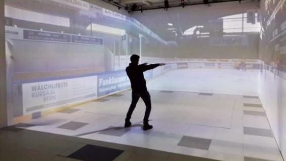
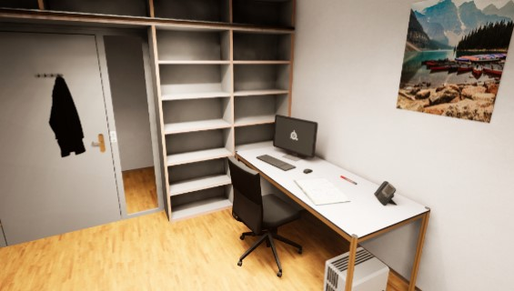
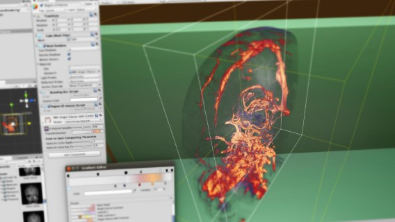

# Unreal Engine Projects and Plugins

## Sensorimotor Lab

* [UE Display Cluster Project "Sensorimotor Lab"](SensorimotorLab)
  * [Blueprint Plugin "Play Area"](PlayArea)
  * [Blueprint Plugin "Immersive Video"](ImmersiveVideo)
  * [Blueprint Plugin "Sports Equipment"](SportsEquipment)
  * [Blueprint Plugin "AprilTag Images"](AprilTagImages)
  * [Code Plugin "Pupil Core"](Pupil)
  * [Code Plugin "ZeroMQ"](ZeroMQ)
  * [Code Plugin "ESB Messaging"](ESBMessaging)
  * [Code Plugin "Distributed Game Engine DGE"](DGE)
  * [Blueprint Plugin "Institute of Sport Science ISPW"](ISPW)
* [Testing of Messaging using Jupyter Notebook as Endpoint)](ISPW/Testing/)

<em>Fig.1: 360° Spherical Video Playback of Ice Hockey Scene in Sensorimotor Laboratory CAVE</em>

August 2019 - June 2021, Technology Platform for Research approved project "Distributed Game Engine DGE" aka [*UE4 Display Cluster in CAVE*](https://www.tpf.philhum.unibe.ch/portfolio/ue4DisplayCluster) at Faculty of Human Sciences on behalf of the Institute of Sport Science ISPW, Department of Movement and Exercise Science at University of Bern. Only the documentation is publicly available.

## Dream Simulation Lab

* [UE Virtual Reality Project "Dream Simulation Lab"](DreamSimLab)
  <!-- * [Content Plugin "Virtual Learning Attendance VIRLA"](VIRLA) -->
  * [Code Plugin "Bizarre BZR"](BZR)

<em>Fig.2: Screenshot UE Virtual Reality Project "DreamSimLab"</em>

January-July 2019, Technology Platform for Research approved project [*3D Content for Dream-Like VR*](https://www.tpf.philhum.unibe.ch/portfolio/dreamLikeVR) at Faculty of Human Sciences on behalf of the Institute of Psychology, Department of Cognitive Psychology, Perception and Research Methods at University of Bern. Only the documentation is publicly available.

# Unity® Projects and Plugins

## Volume Rendering

In the context of my Bachelor's Thesis I implemented a Unity® plug-in for 3D visualisation of MRI/CT data which can be used in VR/AR applications. Therefore a raycaster pixel-shader running on GPUs was developed.

* ["Unity® Volume Rendering—Plug-in for Rendering of Medical Data"](https://www.linkedin.com/pulse/unity-volume-rendering-roland-bruggmann/), In: LinkedIn.

<em>Fig.3: Real-Time Rendering of a Neurovascular Angiography in Unity® Editor</em>

January-June 2016, Institute for Human Centered Engineering HuCE, Laboratory for Computer Perception and Virtual Reality, Bern University of Applied Sciences BUAS. Only the documentation is publicly available.
