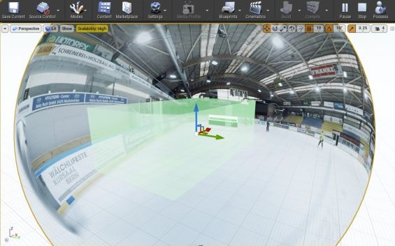
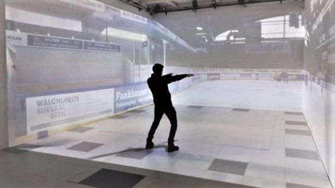

# Roland Bruggmann — Portfolio

*Unreal Engine UE and Unity® Game Engine Projects and Plugins*

## Document Outline
<!-- Start Document Outline -->

* [1. UE Display Cluster in CAVE](#1-ue-display-cluster-in-cave)
	* [1.1. Short Summary](#11-short-summary)
	* [1.2. Documentation](#12-documentation)
	* [1.3. External References](#13-external-references)
* [2. UE Content for Dream-Like VR](#2-ue-content-for-dream-like-vr)
	* [2.1. Short Summary](#21-short-summary)
	* [2.2. Documentation](#22-documentation)
	* [2.3. External References](#23-external-references)
* [3. Unity® Rigged Body Animation](#3-unity-rigged-body-animation)
	* [3.1. Short Summary](#31-short-summary)
	* [3.2. External References](#32-external-references)
* [4. Unity® Volume Rendering](#4-unity-volume-rendering)
	* [4.1. Short Summary](#41-short-summary)
	* [4.2. External References](#42-external-references)

<!-- End Document Outline -->

## 1. UE Display Cluster in CAVE

<em>Fig. 1.1.: Distributed Real-Time Rendering in Sensorimotor Laboratory CAVE.</em>

### 1.1. Short Summary

An Unreal Engine project based on the display cluster template "nDisplay" providing game-levels related to the Institute of Sports Science ISPW at University of Bern, more precisely for the sensorimotor lab of the institute with its five-sided CAVE. The lab integration is enabled by a newly developed messaging layer that is used to interact with an Enterprise Service Bus ESB. Custom-developed Unreal Engine plugins are used to control VR objects via the lab's experiment management system and render 360° videos and CAVE-specific 3D content. Due to the plugin-based architecture, the integration solution is modular and can also be used in other laboratories of the faculty.

* **Index Terms:** Virtual Reality, Cluster Rendering, Parallel Rendering, Real-time Rendering, CAVE, 3D, Steroscopy, 360° Video, Motion Capture, Eye Tracking, Integration

* **Technology:** Unreal Engine, UE Blueprint, UE C++-Plugin Development, UE nDisplay, Nvidia Mosaic, Nvidia Quadro with Sync, OptiTrack, PupilLabs, JSON, ZeroMQ

August 2019 - June 2021, Technology Platform for Research approved project "Distributed Game Engine DGE" aka "UE4 Display Cluster in CAVE" and subsequent projects at Faculty of Human Sciences on behalf of Prof. Dr. Ernst-Joachim Hossner, Institute of Sport Science ISPW, Department of Movement and Exercise Science at University of Bern.

<!-- 

<em>Fig. 1.2.: Screenshot of a 360° Spherical Video Playback Ice Hockey Scene in Unreal Editor.</em>

<em>Fig. 1.3.: Projection of the same 360° Video in the Sensorimotor Laboratory CAVE using Unreal Engine.</em>

-->

### 1.2. Documentation

* [UE Display Cluster Project "Sensorimotor Lab"](SensorimotorLab)
* [Integration Testing by Jupyter Notebook as ESB Messaging Endpoint](ISPW/Testing/)

Plugins:

* [Blueprint Plugin "Play Area"](PlayArea)
* [Blueprint Plugin "Immersive Video"](ImmersiveVideo)
* [Blueprint Plugin "Sports Equipment"](SportsEquipment)
* [Blueprint Plugin "AprilTag Images"](AprilTagImages)
* [Code Plugin "Pupil Core"](Pupil)
* [Code Plugin "ZeroMQ"](ZeroMQ)
* [Code Plugin "ESB Messaging"](ESBMessaging)
* [Code Plugin "Distributed Game Engine DGE"](DGE)
* [Blueprint Plugin "Institute of Sport Science ISPW"](ISPW)

### 1.3. External References

* <a href="https://www.slideshare.net/secret/lROZ8b2qfVbkso" target="_blank">Project Report (pdf)</a>, on Slide Share
* <a href="https://www.tpf.philhum.unibe.ch/portfolio/ue4DisplayCluster" target="_blank">*UE Display Cluster in CAVE*</a>, In: Online-Portfolio of Technology Platform for Research TPF, Faculty of Human Sciences, University of Bern
* Santina Russe: <a href="https://www.horizonte-magazin.ch/2021/09/02/einblick-in-den-blick-von-topathletinnen/" target="_blank">*Der Blick von Topathletinnen wird optimiert*</a>, 02. September 2021, In: Horizonte - Das Schweizer Forschungsmagazin (Online), Hrsg: Schweizerischer Nationalfonds zur Förderung
der wissenschaftlichen Forschung (SNF)

<!--
* [Project Report (pdf)](https://www.slideshare.net/secret/lROZ8b2qfVbkso) on Slide Share
* [*UE Display Cluster in CAVE*](https://www.tpf.philhum.unibe.ch/portfolio/ue4DisplayCluster), In: Online-Portfolio of Technology Platform for Research TPF, Faculty of Human Sciences, University of Bern
* Santina Russe: [*Der Blick von Topathletinnen wird optimiert*](https://www.horizonte-magazin.ch/2021/09/02/einblick-in-den-blick-von-topathletinnen/), 02. September 2021, In: Horizonte - Das Schweizer Forschungsmagazin (Online), Hrsg: Schweizerischer Nationalfonds zur Förderung
der wissenschaftlichen Forschung (SNF)
-->

## 2. UE Content for Dream-Like VR

<em>Fig. 2.1.: Virtual Twin of the Dream Simulation Lab in Unreal Editor.</em>

### 2.1. Short Summary

*Modelling and Animation of 3D Objects for Use in a Dream-Like Virtual Environment*

Experience of reality is highly flexible and unstable. This becomes apparent during the wake-sleep cycle when dreams appear real to us. To investigate alterations in the experience of reality and its underlying mechanism, a bizarre virtual environment is used to elicit altered experiences. Therefore, 3D objects and environments had to be created.

* **Index Terms:** Dream Simulation, Virtual Reality, 3D Modelling, Animation, Rotating Surface Photography, Cloth Simulation, Fluid Simulation
* **Technology:** HTC VIVE Pro, Unreal Engine, UE C++-Plugin Development, Blender, GIMP, Nikon D80, Cannon EOS 60D, Nvidia Cloth, Nvidia Cataclysm

January-July 2019, Technology Platform for Research approved project "3D Content for Dream-Like VR" at Faculty of Human Sciences on behalf of Prof. Dr. Fred Mast, Institute of Psychology, Department of Cognitive Psychology, Perception and Research Methods at University of Bern.

### 2.2. Documentation

* [UE Virtual Reality Project "Dream Simulation Lab"](DreamSimLab)
* [Code Plugin "Bizarre BZR"](BZR)
<!-- * [Content Plugin "Virtual Learning Attendance VIRLA"](VIRLA) -->

### 2.3. External References

* <a href="https://www.slideshare.net/secret/lUQIwIEFTZYEq" target="_blank">Project Report (pdf)</a>, on Slide Share
* <a href="https://www.tpf.philhum.unibe.ch/portfolio/dreamLikeVR" target="_blank">*3D Content for Dream-Like VR*</a>, In: Online-Portfolio of Technology Platform for Research TPF, Faculty of Human Sciences, University of Bern
* <a href="https://www.rts.ch/play/tv/redirect/detail/12161998?startTime=358)" target="_blank">*Le pouvoir de l'imaginaire*</a>, RTS Radio Télevision Suisse , 01.05.2021 (video playback start time 5:58)

<!--
* [Project Report (pdf)](https://www.slideshare.net/secret/lUQIwIEFTZYEq) on Slide Share
* [*3D Content for Dream-Like VR*](https://www.tpf.philhum.unibe.ch/portfolio/dreamLikeVR), In: Online-Portfolio of Technology Platform for Research TPF, Faculty of Human Sciences, University of Bern
* [*Le pouvoir de l'imaginaire*](https://www.rts.ch/play/tv/redirect/detail/12161998?startTime=358), RTS Radio Télevision Suisse , 01.05.2021 (video playback start time 5:58)
-->

## 3. Unity® Rigged Body Animation

<em>Fig. 3.1.: Real-time Animation of Rigged Avatar by Motion Capture in Sensorimotor Lab.</em>

### 3.1. Short Summary

3D Content Generation and Interactive Real-Time Animation of Rigged Avatar by Motion Capture in Sensorimotor Laboratory.

* **Index Terms:** Virtual Reality, 3D Modelling, Rigging, Motion Capture, Real-Time Animation
* **Technology:** Blender, MakeHuman, Unity Game Engine, OptiTrack, Power-Wall

November – December 2018, Technology Platform for Research approved project "3D Workflow" aka "Rigged Body Animation in Unity" at Faculty of Human Sciences on behalf of Prof. Dr. Ernst-Joachim Hossner, Institute of Sport Science ISPW, Department of Movement and Exercise Science at University of Bern.

### 3.2. External References

* <a href="https://www.tpf.philhum.unibe.ch/portfolio/RiggedBodyAnimation" target="_blank">*Rigged Body Animation in Unity®*</a>, In: Online-Portfolio of Technology Platform for Research TPF, Faculty of Human Sciences, University of Bern

<!--
* [*Rigged Body Animation in Unity®*](https://www.tpf.philhum.unibe.ch/portfolio/RiggedBodyAnimation), In: Online-Portfolio of Technology Platform for Research TPF, Faculty of Human Sciences, University of Bern
-->

## 4. Unity® Volume Rendering

<em>Fig. 4.1.: Real-Time Rendering of a Neurovascular Angiography in the Unity® Editor.</em>

### 4.1. Short Summary

In the context of my Bachelor's Thesis I implemented a Unity® plug-in for 3D-rendering of medical data (MRI/CT) which can be used in VR/AR applications. Therefore I wrote an efficient raycaster pixel-shader running on GPUs.

* **Index Terms:** Medical Imaging, Real-Time Rendering, Raycasting, GPU Programming, Virtual Reality
* **Technology:** Unity® Game Engine, .NET/C#, JSON, Cg/HLSL, VTK, DICOM

January-June 2016, Institute for Human Centered Engineering HuCE, Laboratory for Computer Perception and Virtual Reality, Bern University of Applied Sciences BUAS.

### 4.2. External References

* <a href="https://www.linkedin.com/pulse/unity-volume-rendering-roland-bruggmann/" target="_blank">*Unity® Volume Rendering—Plug-in for Rendering of Medical Data*</a>, Roland Bruggmann, In: LinkedIn.

<!--
* [*Unity® Volume Rendering—Plug-in for Rendering of Medical Data*](https://www.linkedin.com/pulse/unity-volume-rendering-roland-bruggmann/), Roland Bruggmann, In: LinkedIn.
-->