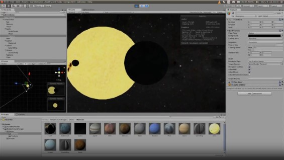
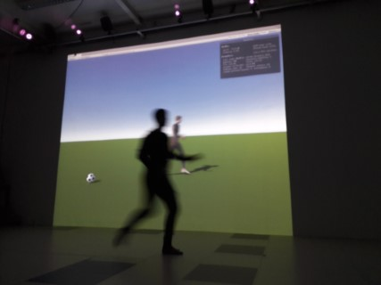
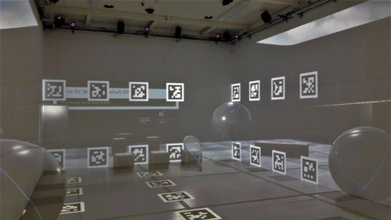

[<< Back to *https://about.me/rbruggmann*](https://about.me/rbruggmann)

# Unity and Unreal Game Engine Projects and Plugins

## Document Outline
<!-- Start Document Outline -->

* [1. Unity Volume Rendering](#1-unity-volume-rendering)
* [2. Unity Solar System](#2-unity-solar-system)
* [3. Unity Rigged Body Animation](#3-unity-rigged-body-animation)
* [4. UE4 Content for Dream-like VR](#4-ue4-content-for-dream-like-vr)
* [5. UE4 Display Cluster in CAVE](#5-ue4-display-cluster-in-cave)
* [A. Unreal Online Learning: Achievements](#a-unreal-online-learning-achievements)

<!-- End Document Outline -->

# 1. Unity Volume Rendering

<em>Fig. 1.1.: Real-Time Rendering of a Neurovascular Angiography in the Unity® Editor.</em>

## 1.1. Short Summary

*Plug-in for Rendering of Medical Data*

In the context of my Bachelor's Thesis I implemented a Unity® plug-in for 3D-rendering of medical data (MRI/CT) which can be used in VR/AR applications. Therefore I wrote an efficient raycaster pixel-shader running on GPUs.

* **Index Terms:** Medical Imaging, Real-Time Rendering, Raycasting, GPU Programming, Virtual Reality
* **Technology:** Unity® Game Engine, .NET/C#, JSON, Cg/HLSL, VTK, DICOM

January-June 2016, Institute for Human Centered Engineering HuCE, Laboratory for Computer Perception and Virtual Reality, Bern University of Applied Sciences BUAS

## 1.2. External References

* Bachelor's Thesis:
  * <a href="https://bfh.easydocmaker.ch/search/abstract/1201/" target="_blank">Abstract</a> on EasyDocmaker
  * <a href="https://www.slideshare.net/RolandBruggmann/unity-volume-rendering-poster" target="_blank">Poster</a>, and <a href="https://www.slideshare.net/RolandBruggmann/unity-volume-rendering" target="_blank">Presentation</a> on SlideShare
  * <a href="https://www.youtube.com/watch?v=-dfjpM1qk3I" target="_blank">Screencast</a> on YouTube
* Article <a href="https://www.linkedin.com/pulse/unity-volume-rendering-roland-bruggmann/" target="_blank">*Unity® Volume Rendering*</a>, Roland Bruggmann on LinkedIn

---

# 2. Unity Solar System

<em>Fig. 2.1.: 3D Solar System in the Unity® Editor.</em>

## 2.1. Short Summary

3D Solar System Simulator as Demo of C#-Scripts Toolset *RotateAroundTarget* - *Rotation*, *Revolution*, *Look at Target*.

* **Index Terms:** 3D Solar System Simulator, Texture Mapping
* **Technology:** Unity® Game Engine, .NET/C#

July 2018, private project of Roland Bruggmann

## 2.2. External References

* <a href="https://youtu.be/KysSDO5oVDU" target="_blank">Screencast</a> on YouTube

---

# 3. Unity Rigged Body Animation

<em>Fig. 3.1.: Real-time Animation of Rigged Avatar by Motion Capture in Sensorimotor Lab.</em>

## 3.1. Short Summary

3D Content Generation and Interactive Real-Time Animation of Rigged Avatar by Motion Capture in Sensorimotor Laboratory.

* **Index Terms:** Virtual Reality, 3D Modelling, Rigging, Motion Capture, Real-Time Animation
* **Technology:** Blender, MakeHuman, Unity Game Engine, OptiTrack, Power-Wall

November – December 2018, Technology Platform for Research approved project "3D Workflow" aka "Rigged Body Animation in Unity" at Faculty of Human Sciences on behalf of Prof. Dr. Ernst-Joachim Hossner, Institute of Sport Science ISPW, Department of Movement and Exercise Science at University of Bern

## 3.2. External References

* <a href="https://youtu.be/FbmcLNf7JQM" target="_blank">Screencast</a> on YouTube
* <a href="https://www.tpf.philhum.unibe.ch/portfolio/RiggedBodyAnimation" target="_blank">*Rigged Body Animation in Unity®*</a>. In: Online-Portfolio of Technology Platform for Research TPF, Faculty of Human Sciences, University of Bern

---

# 4. UE4 Content for Dream-like VR

<em>Fig. 4.1.: Virtual Twin of the Dream Simulation Lab in Unreal Editor.</em>

## 4.1. Short Summary

*Modelling and Animation of 3D Objects for Use in a Dream-like Virtual Environment*

Experience of reality is highly flexible and unstable. This becomes apparent during the wake-sleep cycle when dreams appear real to us. To investigate alterations in the experience of reality and its underlying mechanism, a bizarre virtual environment is used to elicit altered experiences. Therefore, 3D objects and environments had to be created.

* **Index Terms:** Virtual Reality, 3D Modelling, Animation, Rotating Surface Photography, UV Mapping, Cloth Simulation, Fluid Simulation
* **Technology:** HTC VIVE Pro, Unreal Engine, UE C++-Plugin Development, Blender, GIMP, Nikon D80, Cannon EOS 60D, Nvidia Cloth, Nvidia Cataclysm

January-July 2019, Technology Platform for Research approved project "3D Content for Dream-like VR" at Faculty of Human Sciences on behalf of Prof. Dr. Fred Mast, Institute of Psychology, Department of Cognitive Psychology, Perception and Research Methods at University of Bern

## 4.2. Insights

Documentation: **<a href="https://www.slideshare.net/RolandBruggmann/3d-content-for-dreamlike-vr-249969767" target="_blank">Report (pdf)</a>** on SlideShare

Readme:

* UE Project: [Dream Simulation Lab](DreamSimLab)
* UE Code Plugin: [Bizarre BZR](BZR)
* UE Content Plugin: [Virtual Learning Attendance VIRLA](VIRLA)

## 4.3. External References

* <a href="https://www.tpf.philhum.unibe.ch/portfolio/dreamLikeVR" target="_blank">*3D Content for Dream-like VR*</a>. In: Online-Portfolio of Technology Platform for Research TPF, Faculty of Human Sciences, University of Bern
* <a href="https://www.rts.ch/play/tv/redirect/detail/12161998?startTime=358)" target="_blank">*Le pouvoir de l'imaginaire*</a>. In: *Faut pas croire*, émission du 01.05.2021 (video playback start time 5:58), Play RTS, Radio Télevision Suisse
* Denzer, Simone; Diezig, Sarah; Achermann, Peter; König, Thomas; Mast, Fred W. (2022). <a href="https://boris.unibe.ch/165396/" target="_blank">*BizarreVR: Dream-like bizarreness in immersive virtual reality induced changes in conscious experience of reality while leaving spatial presence intact*</a>. In: Consciousness and Cognition, 99, p. 103283. Elsevier <a href="http://dx.doi.org/10.1016/j.concog.2022.103283" target="_blank">10.1016/j.concog.2022.103283</a>

---

# 5. UE4 Display Cluster in CAVE

<em>Fig. 5.1.: UE4 Display Cluster, 3D Scene in Sensorimotor Laboratory CAVE.</em>

## 5.1. Short Summary

*Distributed Real-Time Rendering in Sensorimotor Laboratory CAVE*

An Unreal Engine project based on the display cluster template "nDisplay" providing game-levels related to the Institute of Sports Science ISPW at University of Bern, more precisely for the sensorimotor lab of the institute with its five-sided CAVE. The lab integration is enabled by a newly developed messaging layer that is used to interact with an Enterprise Service Bus ESB. Custom-developed Unreal Engine plugins are used to control VR objects via the lab's experiment management system and render 360° videos and CAVE-specific 3D content. Due to the plugin-based architecture, the integration solution is modular and can also be used in other laboratories of the faculty.

* **Index Terms:** Virtual Reality, Cluster Rendering, Parallel Rendering, Real-time Rendering, CAVE, 3D, Steroscopy, 360° Video, Motion Capture, Eye Tracking, Integration

* **Technology:** Unreal Engine, UE Blueprint, UE C++-Plugin Development, UE nDisplay, Nvidia Mosaic, Nvidia Quadro with Sync, OptiTrack, PupilLabs, JSON, ZeroMQ

August 2019 - June 2021, Technology Platform for Research approved project "Distributed Game Engine DGE" at Faculty of Human Sciences on behalf of Prof. Dr. Ernst-Joachim Hossner, Institute of Sport Science ISPW, Department of Movement and Exercise Science at University of Bern

## 5.2. Insights

Documentation: **<a href="https://www.slideshare.net/RolandBruggmann/ue-display-cluster-in-cave" target="_blank">Report (pdf)</a>** on SlideShare

Readme:

* UE Project: [Sensorimotor Lab](SensorimotorLab)
* UE Blueprint Plugins: [Play Area](PlayArea), [Immersive Video](ImmersiveVideo), [Sports Equipment](SportsEquipment), [AprilTag Images](AprilTagImages), [Institute of Sport Science ISPW](ISPW)
* UE Code Plugins: [Pupil Core](Pupil), [ZeroMQ](ZeroMQ), [ESB Messaging](ESBMessaging), [Distributed Game Engine DGE](DGE)
* Integration Testing: [Jupyter Notebook as ESB Messaging Endpoint](ISPW/Testing/)

## 5.3. External References

* <a href="https://www.tpf.philhum.unibe.ch/portfolio/ue4DisplayCluster" target="_blank">*UE Display Cluster in CAVE*</a>. In: Online-Portfolio of Technology Platform for Research TPF, Faculty of Human Sciences, University of Bern
* <a href="https://www.ispw.unibe.ch/research/research_equipment/sensorimotor_lab/index_eng.html" target="_blank">*Research Equipment: Sensorimotor Lab*</a>. In: Website of the Institute of Sport Science, University of Bern
* Santina Russe: <a href="https://www.horizonte-magazin.ch/2021/09/02/einblick-in-den-blick-von-topathletinnen/" target="_blank">*Der Blick von Topathletinnen wird optimiert*</a>, 02. September 2021. In: Horizonte - Das Schweizer Forschungsmagazin, Fokus: Sport im Labor (Online), Hrsg: Schweizerischer Nationalfonds zur Förderung
der wissenschaftlichen Forschung (SNF)
* Gian Paul Lozza: <a href="https://www.horizonte-magazin.ch/2021/09/02/bildreportage-vermessene-bewegungen/" target="_blank">*Fotoreportage: Die Vermessung der kleinsten Bewegungen*</a>, 02. September 2021. In: Horizonte - Das Schweizer Forschungsmagazin, Fokus: Sport im Labor (Online), Hrsg: Schweizerischer Nationalfonds zur Förderung
der wissenschaftlichen Forschung (SNF)
<!-- * Mattia Beraldi 2017: <a href="https://tube.switch.ch/switchcast/unibe.ch/events/689245f3-1a88-4aa9-a999-cacbb5d9fec9#8:56" target="_blank">*Occhio di falco*</a>, Conservatorio Internationale Scienze Audiovisive CISA &ndash; FILM Academy. A documentary about the challenges of line judges in tennis (Italian, English subtitle). In: SWITCHcast event, Hrsg: 07. August 2020, Institut für Sportwissenschaft ISPW, Universität Bern -->

---

# A. Unreal Online Learning: Achievements

I have the following knowledge:

* Solid understanding of general workflows and artistic works in UE
* Proficient in working with UE Blueprints
* Expert know-how in providing with UE Content- and writing C++-Plugins - also by the use of third-party libraries
* Experience in Real-time Rendering, Motion Capture, Eye Tracking, VR and Virtual Production integration
* Excellent organization skills with adherence to file structures and naming conventions
* [List of completed on-line learning courses](UE-Achievements)

---

[<< Back to *https://about.me/rbruggmann*](https://about.me/rbruggmann)
